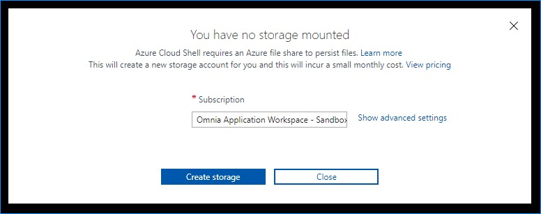

# Azure Cloud Shell

## How to use Azure Cloud Shell
https://docs.microsoft.com/en-us/azure/cloud-shell/quickstart-powershell

## Persist files in Azure Cloud Shell
https://docs.microsoft.com/en-us/azure/cloud-shell/persisting-shell-storage

## Azure Storage Account
 - Use basic settings and select `Omnia Application Workspace - Sandbox` subscription

## How to upload files from local computer
https://docs.microsoft.com/en-us/azure/cloud-shell/using-the-shell-window#upload-and-download-files

