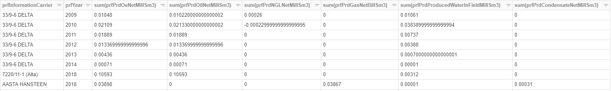

Introduction
============
The main part of the tutorial covers the following points for computing in Azure Databricks:

* Get data from a data lake gen 2
* Basic computing on the data
* Add dummy GDPR data 
* Store the new data into a SQL table

Extra section covers other options you can consider.

Prerequisites
-------------
* User has access to databricks workspace **EDC2019sharedDatabricks**, has own folder created in the workspace.
* User has own SQL server and database created in module **Ingest**. 

Create Notebook in Databricks
-----------------------------
* Open Databricks workspace **EDC2019sharedDatabricks** with URL: https://northeurope.azuredatabricks.net/?o=1561392505117079.

  **Note: Don't launch the workspace from Azure Portal. You don't have access there.**
* Sign in using Azure AD.
* After you login, on the upper right area of the web page, click on the people icon, shown as below:

  .. image:: ./images/compute/peopleicon.PNG
* Accept the invitation from workspace **EDC2019sharedDatabricks**. Make sure you are working in this workspace before you continue.
* Find your user folder under **Workspace**, like below:
  
  .. image:: ./images/compute/userfolder.PNG
* Right click on your folder and choose **Create** -> **Notebook**:

  .. image:: ./images/compute/createnotebook.PNG
* Input the name of you notebook and attach the notebook to a running cluster we have created for you:
  
  .. image:: ./images/compute/createnotebook2.PNG

After the notebook is created, you will jump to the notebook page. And you can start your databricks notebook from there now!

**!!!Before you get started, read the following points for background info:**

  * The target dataset is stored in file system **dls** in Data Lake **edc2019dls** with path **/data/open/npd.no/field_production/field_production_monthly.csv**. 

  * A Service Principal **OmniaEDC2019_DatabricksSPN** has been created and set up to be used here as the client. The application ID (client ID) of this Service Principal is "f0d5bd54-9617-491d-afa1-07c8bd4dc5c1".  

  * There is a secret created for this Service Principal to be used as client secret. The secret is stored in the shared key vault **EDC2019KV** with secret name **databricksSpnClientSecret**. The permissions of this client have been set up for this module. 

  * The connection between the key vault and the databricks workspace has been set up with a secret scope **edc_key_vault_scope** in the databricks. 

Get Data From a Data Lake Gen 2
-------------------------------
In this step, you need to load the .csv file as a dataframe from targeted folder in datalake. 

* Task 1: Reference Databricks documentation `Authenticate to Azure Data Lake Storage with your Azure Active Directory Credentials <https://docs.azuredatabricks.net/spark/latest/data-sources/azure/adls-passthrough.html>`_ for using Azure Passthrough to load targeted .csv file as dataframe from datalake.

**Note: Different types of dataframes can be created with different libraries. Check what type of dataframe you get before proceeding.**

Basic Computing
-------------------------------
In this step, you will do some basic compute on the dataframe you get from the steps above. 

* Task 2: For each Information Carrier and each year, calculate the sum of each column listed below:

  * prfPrdOilNetMillSm3  
  * prfPrdGasNetBillSm3
  * prfPrdNGLNetMillSm3
  * prfPrdCondensateNetMillSm3
  * prfPrdOeNetMillSm3
  * prfPrdProducedWaterInFieldMillSm3

The output dataframe should look like below:

Add Dummy GDPR Data
-------------------------------
In this step, you will add a column to the dataframe you get in the last step. This column will be treated as GDPR data in the next module. 

* Task 3: Add a column named "GDPRColumn" in the dataframe. The content can be any dummy data.

Store Data To a SQL Table
-------------------------------
In this step, the latest dataframe will be stored into a table in the SQL database you created in module **Ingest**. Reference `Connect Azure Databricks to SQL Database & Azure SQL Data Warehouse using a Service Principal <https://thedataguy.blog/connect-azure-databricks-to-sql-database-azure-sql-data-warehouse-using-a-service-principal/>`_ to use client credentials to authenticate against SQL server from databricks.

**Note: Use Service Principal OmniaEDC2019_DatabricksSPN. Don't create own Service Principal.**

* Task 4: Get client secret from key vault in databricks. 
* Task 5: Authenticate against SQL server with client credentials. Connect to SQL Database using JDBC. 
* Task 6: Create a table named **dbo.FieldProduction** in SQL database. Write the dataframe you get from the last step into this table. 

Optional Extras
---------------

Read Data From Datalake Using Client Credentials With Mounting
______________________________________________________________
* Task 7: Redo step **Get Data From Datalake Gen 2**. Instead of using Azure Passthrough, reference Databricks documentation `Azure Data Lake Storage Gen 2 <https://docs.databricks.com/spark/latest/data-sources/azure/azure-datalake-gen2.html>`_ to mount targeted data to databricks with client credentials.

Read Data From Datalake Directly Using Client Credentials
______________________________________________________________
* Task 8: Redo step **Get Data From Datalake Gen 2**. Reference Databricks documentation `Azure Data Lake Storage Gen 2 <https://docs.databricks.com/spark/latest/data-sources/azure/azure-datalake-gen2.html>`_ to access data in datalake directly with client credentials.

Read Data From SQL Database using Client Credentials
_____________________________________________________
* Task 9: Reference `Connect Azure Databricks to SQL Database & Azure SQL Data Warehouse using a Service Principal <https://thedataguy.blog/connect-azure-databricks-to-sql-database-azure-sql-data-warehouse-using-a-service-principal/>`_ to use client credentials to read the table you created in step **Store Data To a SQL Table**.

Write Data Into SQL Database With Username And Password
_______________________________________________________
* Task 10: Redo step **Store Data To a SQL Table**. Instead of using service principal **OmniaEDC2019_DatabricksSPN** to connect to SQL database, use the username and password you created in module **Ingest** to connect from databricks to your database.

Write Data Into Datalake Gen 2 with Azure Passthrough
_____________________________________________________
* Task 11: Reference Databricks documentation `Authenticate to Azure Data Lake Storage with your Azure Active Directory Credentials <https://docs.azuredatabricks.net/spark/latest/data-sources/azure/adls-passthrough.html>`_ for using Azure Passthrough to write the latest dataframe into file system **dls** in datalake **edc2019dls**. The path is **/user/<your-short-name>/yearly_field_production.csv**.

Conclusion
----------
In this tutorial, we went through different ways to authenticate datalake gen 2 and SQL server. We also did some basic computing upon the dataframe we got. Our focus in this module is to show you how the connections between Azure Databricks and Azure Storage work. Thus, instead of doing computing with python, we put more effort on authentication and connection.  

If you managed to complete all tasks, you should be able to read from / write to datalake / SQL database with different authentication methods listed below:

* Read from datalake gen 2 using Azure Passthrough
* Read from datalake gen 2 using client credentials with/without mounting data
* Read from SQL database using client credentials
* Write to datalake gen 2 using Azure Passthrough
* Write to SQL database using client credentials
* Write to SQL database using username and password

What we Didn't Cover
--------------------

In the interest of time and simplicity, the following points have been omitted from this tutorial although should / must be considered when building production ready solutions:

* Automation and DevOps
* Create client, store client secret in key vault, set up client permissions
* ...
