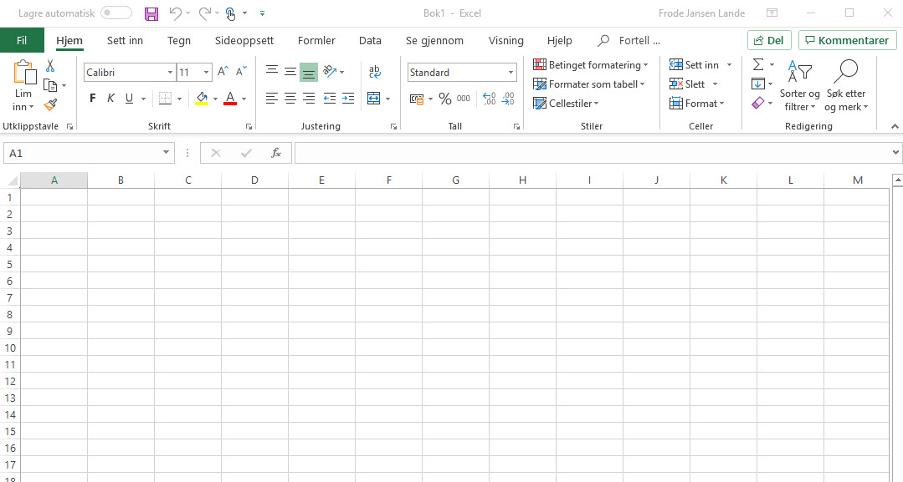
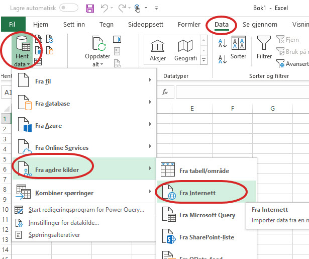
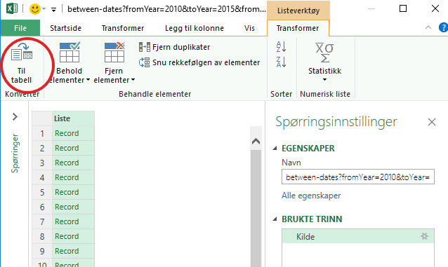
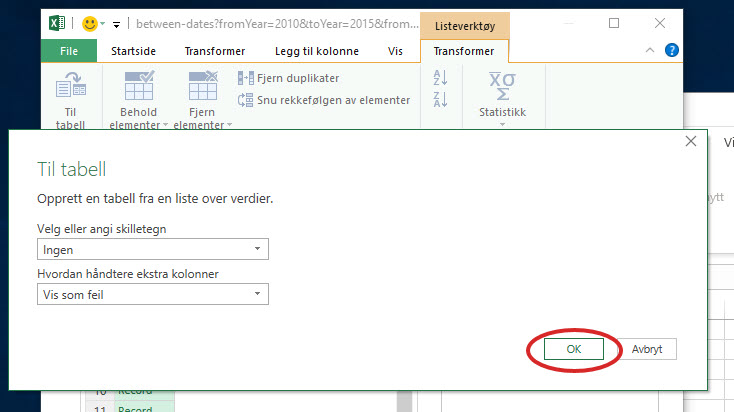
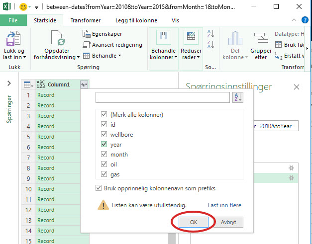

Introduction
============
This part of the tutorial covers XXXXX

When writing up, be sure to consider:

* Alternative url's / sources if they didn't complete previous parts

Prerequisites
-------------

Sub section
-----------
asdf
asdf
asdf

Play around with production data from the new REST API in MS Excel
-----------------------------------------------------------------------
This is a very simple example of how to retrive data from the API to play around and do whatever analysis your heart's desire in Excel. You can do a lot of things in Excel as you migth know, and thus you can connect to data sources, import and play around with data in various ways.
This simple walk through will show you how to connect to the exposed REST API just made and fetch production data into a simple table in Excel. We do not take it any further, because once the data is in Excel you have tons of possibilitites of data analysis, massaging, visualization and so on, and that part you probably know better than us.

We will do this visually by clicking around in the user interface, but of course you can also program this in an Excel module later if you like.

* Open MS Excel 

* Create a new file, an empty workbook

* Add the REST API as a data source

.. image:: ./images/data_source_url.jpg

.. image:: ./images/convert_data_to_table_expand.jpg

.. image:: ./images/convert_data_to_table_expand_and_load.jpg

.. image:: ./images/result_save.jpg

Optional Extras
---------------

Optional Extra 1
________________
The followinga assumes that you have [Visual Studio installed|an Azure DevOps account|...]

What we Didn't Cover
--------------------

In the interest of time and simplicity, the following points have been omitted from this tutorial although should / must be considered when building production ready solutions:

* Automation and DevOps
* Security (Authentication / Authorisation)
* ...
