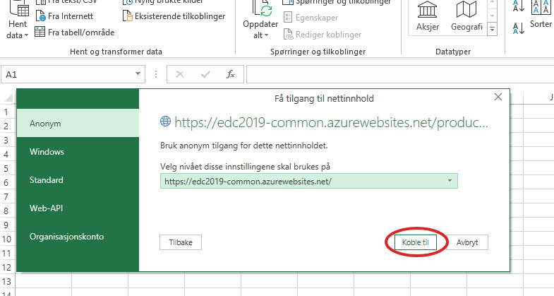

Introduction
============
This part of the tutorial covers XXXXX

When writing up, be sure to consider:

* Alternative url's / sources if they didn't complete previous parts

Prerequisites
-------------
??

Show advanced Power BI report as first "excercise"?
------------------------------------------------------------
Show?

Possible module introduction?
------------------------------------------------------------------
So, here we are. You have all now
* Added data to Omnia
* Done some compute on it
* Exposed it through an API

It is time to consume the data. Obviously this can be done in many ways. Other applications might want to use the data, you might want to pull then into some kind of application, maybe analyze them and so on. As you see the options are many.

Just to give you a taste we would like to extract data from the API into a visualization/analytics tool of some kind. There are many advanced options like QlikView, Lumira, Spotfire and Power BI. However their distribution and installation are not very suitable for a quick workshop like this. Hence we have chosen to simply just use MS Excel. Everyone has it installed and it is easy to use.
However, this also means the excercise is rather simple. 

So what are we doing today? Well, we are going to extract data into MS Excel by using your API as a data source. Let's get started. Take it away folks!

Play around with production data from the new REST API in MS Excel
-----------------------------------------------------------------------
This is a very simple example of how to retrive data from the API to play around and do whatever analysis your heart's desire in Excel. You can do a lot of things in Excel as you probably know, and thus you can connect to data sources, import and play around with data in various ways.

This simple walk through will show you how to connect to the exposed REST API you just made and fetch production data into a simple table in Excel. 

We do not take it any further, because once the data is in Excel you have tons of possibilitites of data analysis, massaging, visualization and so on, and that part you probably know better than us.

We will do this visually by clicking around in the user interface, but of course you can also program this in an Excel module later if you like.

* Open MS Excel 

* Create a new file, an empty workbook
.. image:: ./images/consume/new_workbook.jpg 

* Add the REST API as a data source. NOTE: Use your own API URL if you finished creating one. Otherwise you can use this URL as a fallback that will work |call_link|. It will retrieve production data from January to December 2010 to 2015. The entire API is explained here |swagger_link|.

.. |call_link| raw:: html 
<a href="https://edc2019-common.azurewebsites.net/production-data/between-dates?fromYear=2010&toYear=2015&fromMonth=1&toMonth=12" title="REST API call" target="_blank">LINK</a>

.. |swagger_link| raw:: html
<a href="https://edc2019-common.azurewebsites.net/swagger/index.html" title="REST API defintion in Swagger">LINK</a>S

.. image:: ./images/consume/add_data_source.jpg

* Add service call here
.. image:: ./images/consume/add_data_source_url.jpg

* You can connect anonymously

* The data has been retrieved now in JSON and are listed as records. Convert them to a table. Use default conversion settings and click OK
.. image:: ./images/consume/convert_data_to_table.jpg

.. image:: ./images/consume/convert_data_to_table_ok.jpg

* Expand the JSON records to Excel table columns
.. image:: ./images/consume/convert_data_to_table_expand.jpg

* Use the default of all columns and click OK
.. image:: ./images/consume/convert_data_to_table_expand_ok.jpg

* Close the data source setup and load data into Excel
.. image:: ./images/consume/convert_data_to_table_expand_close_and_load.jpg

* There we are, finished. All the data returned from the servcie is now in an Excel table ready to be played with. Remember to save. The data connection is also saved for you to reuse/refresh later
.. image:: ./images/consume/save_result.jpg

Optional Extras
---------------

Optional Extra 1
________________
The followinga assumes that you have [Visual Studio installed|an Azure DevOps account|...]

What we Didn't Cover
--------------------

In the interest of time and simplicity, the following points have been omitted from this tutorial although should / must be considered when building production ready solutions:

* Automation and DevOps
* Security (Authentication / Authorisation)
* ...
