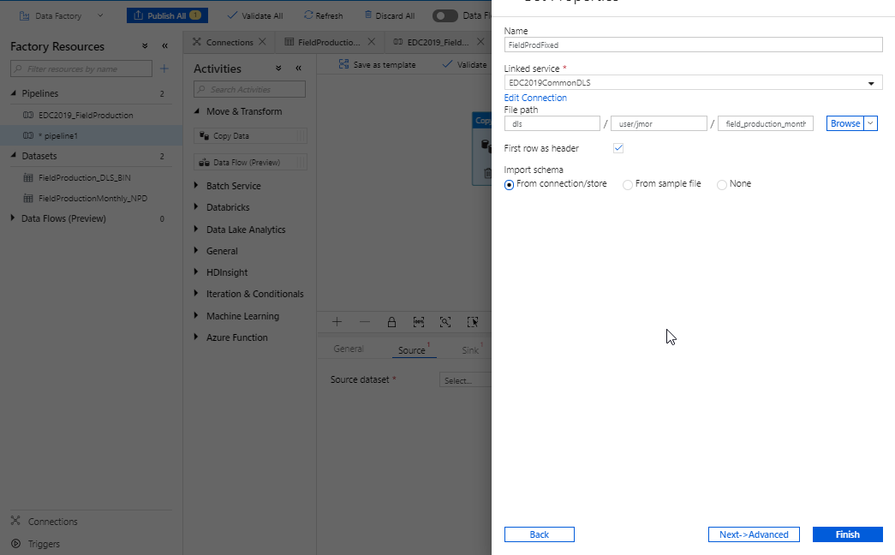

Introduction
============
At a high level, this tutorial involves following steps:

* Create Azure Data Factory Pipeline to Copy data from an HTTP endpoint into Data Lake Storage Gen2
* Create Azure SQL Server, 
* Create Azure SQL Database.
* Create Azure Data Factory Pipeline to Copy data from Data Lake to SQL Database


Prerequisites
-------------
* Azure subscription.
  * Go to your premade resource group through https://portal.azure.com (See [getting started](#getting-started))
* Azure data factory.
  * One has been premade for you; (See [getting started](#getting-started))

NPD Info: 

http://factpages.npd.no/factpages/

wellbore csv:

http://factpages.npd.no/ReportServer?/FactPages/TableView/wellbore_exploration_all&rs:Command=Render&rc:Toolbar=false&rc:Parameters=f&rs:Format=CSV&Top100=false&IpAddress=143.97.2.35&CultureCode=en

production csv:
http://factpages.npd.no/ReportServer?/FactPages/TableView/field_production_monthly&rs:Command=Render&rc:Toolbar=false&rc:Parameters=f&rs:Format=CSV&Top100=false&IpAddress=143.97.2.35&CultureCode=en

Getting started
---------------
screens and stuff? Or move this to introduction...

Data Factory
-----------------

A data factory can have one or more pipelines. A pipeline is a logical grouping of activities that together perform a task. The activities in a pipeline define actions to perform on your data. Now, a dataset is a named view of data that simply points or references the data you want to use in your activities as inputs and outputs. Datasets identify data within different data stores, such as tables, files, folders, and documents.

Before you create a dataset, you must create a linked service to link your data store to the data factory. Linked services are much like connection strings, which define the connection information needed for Data Factory to connect to external resources.


Ingest into Azure Data Lake Storage Gen2
-----------

Open your Azure Data factory.<br/> 
Reference Azure Data factory documentation: https://docs.microsoft.com/en-us/azure/data-factory/quickstart-create-data-factory-portal


In the Get started page, select the Create pipeline to launch the Author tool:


<br/><br/>

 In the Activities toolbox, expand Move & Transform. Drag the Copy Data activity from the Activities toolbox to the pipeline designer surface. You can also search for activities in the Activities toolbox. 


<br/>
Switch to the Source tab in the copy activity settings, and select new dataset


<br/>
Create a new linked service to link to NDP Factpages


Add the URL to the report. <br/>
ReportServer?/FactPages/TableView/field_production_monthly&rs:Command=Render&rc:Toolbar=false&rc:Parameters=f&rs:Format=CSV&Top100=false&IpAddress=143.97.2.35&CultureCode=en


Switch to the Sink tab in the copy activity settings, and select new dataset


Create a new linked service to link to the Data Lake Store, place this in your personal folder.


Set the file path for your destination file in the Data Lake Store: /dls/user/shortname/filename (e.g. /dls/user/jmor/field_production_monthly.csv)


Do a test-run of your newly created pipeline


Check status of the run


Check the DLS for the file ingested


The "Storage Explorer (Preview)" is using the built in explorer within the portal, this is what we will use. See further [below](#azure-storage-explorer) for "Open in Explorer"-option. Double clicking on the actual file will download it to your computer, from here you can view the file in your favorite csv-application.


Open in Explorer
------------------------------

[Azure Storage Explorer](https://azure.microsoft.com/en-us/features/storage-explorer/) is a cross-platform (windows, linux and macOS) client to connect to Azure Storage Accounts.

<br/>

Ingest from Azure Datalake Store into Azure SQL Database
-----------------------------------------

In this step, you first need to Create a Azure SQL Server and Azure SQL Database.

1. Select Azure SQL in the left-hand menu of the Azure portal. If Azure SQL is not in the list, select All services, then type Azure SQL in the search box. (Optional) Select the star next to Azure SQL to favorite it and add it as an item in the left-hand navigation.
2. Select + Add to open the Select SQL deployment option page. You can view additional information about the different databases by selecting Show details on the Databases tile.

3. Select Create:


4. Enter the following values: (Provide a uniqe Server name)


5. Now that you've created the database, go to the the SQL Server and add Firewall details

    If you copy data by using the Azure Data Factory integration runtime, configure an Azure SQL Server firewall so that Azure services can access the server. If you copy data by using a self-hosted integration runtime, configure the Azure SQL Server firewall to allow the appropriate IP range. This range includes the machine's IP that's used to connect to Azure SQL Database.


6. Go the Active Directory admin, and add your @equinor user as admin


7. Go to the database and Query Editor.

    Create table and user


```sql
CREATE TABLE [dbo].[ProductionData](
	[Wellbore] [varchar](50) NOT NULL,
	[Year] [int] NOT NULL,
	[Month] [int] NOT NULL,
	[Oil] [decimal](15, 5) NOT NULL,
	[Gas] [decimal](15, 5) NOT NULL,
	[Id] [int] IDENTITY(1,1) NOT NULL
) ON [PRIMARY]
GO

CREATE USER [NameOfDatafactory] FROM EXTERNAL PROVIDER
GRANT SELECT, INSERT, UPDATE, DELETE, EXECUTE, ALTER ON schema::dbo TO [NameOfDatafactory]
```

<br/><br/><br/>
Create a new pipeline for copy data from Azure Datalake Store to Azure SQL Database

In the Activities toolbox, expand Move & Transform. Drag the Copy Data activity from the Activities toolbox to the pipeline designer surface. You can also search for activities in the Activities toolbox.

Switch to the Source tab in the copy activity settings, and select new dataset.


<br/>


Add the file path to the Datalake store. 



Switch to the Sink tab in the copy activity settings, and select new dataset, Azure SQL Database.


Swith to the Mapping tab, and click Import Schemas


Remove the mapping to the ID column. This is an Idenntity column in the database.


When you download the CSV file from NPD, the file contains a new line in the end of the file. The Datafactory will handle this as a record and give an error. To ignore this error, add "Skip incompatible rows"


Trigger the pipeline.


What we Didn't Cover
--------------------

In the interest of time and simplicity, the following points have been omitted from this tutorial although should / must be considered when building production ready solutions:

* Automation and DevOps


