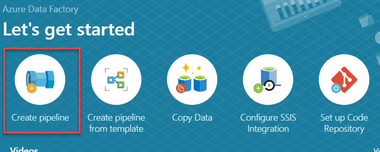
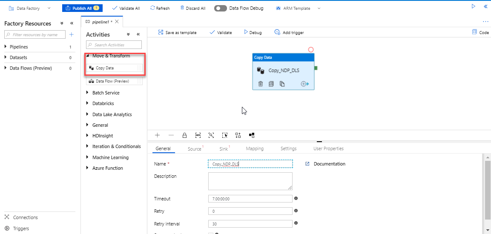
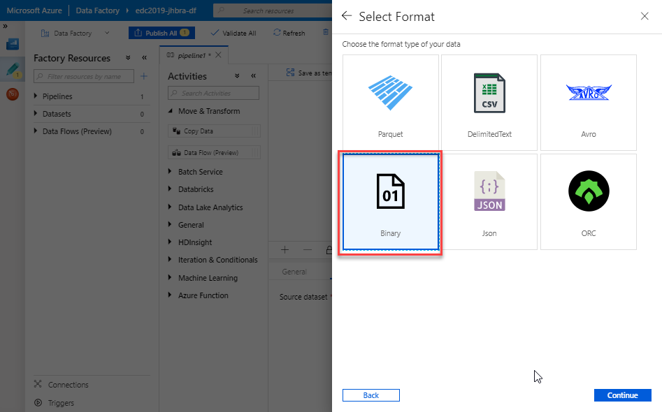
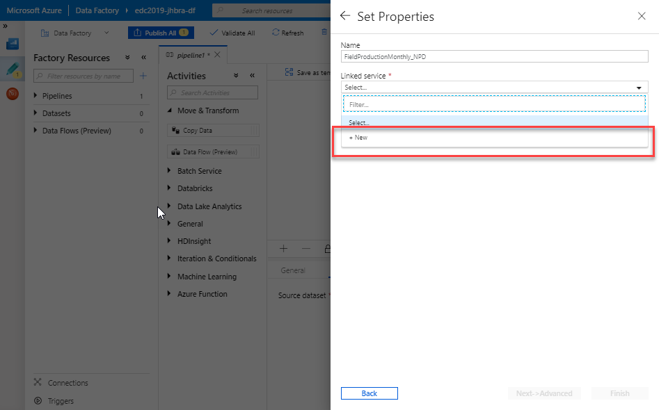
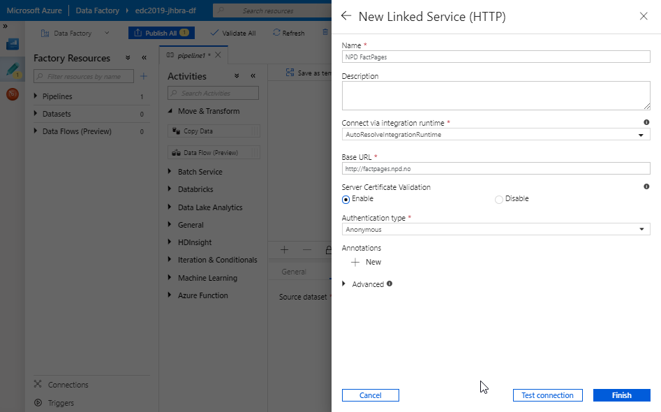
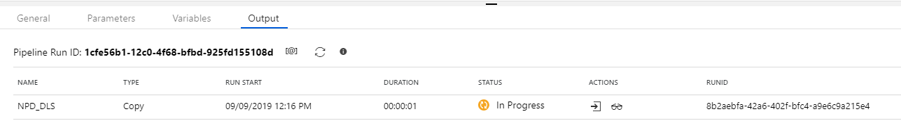
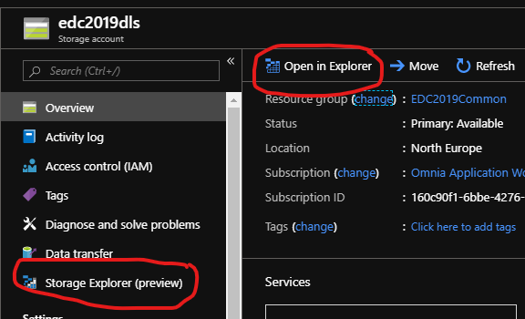
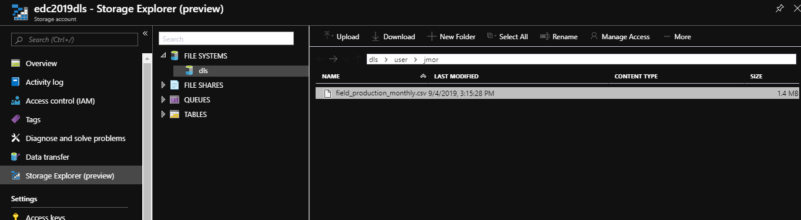
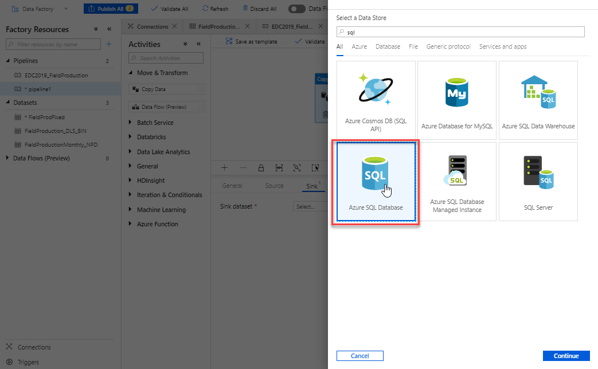
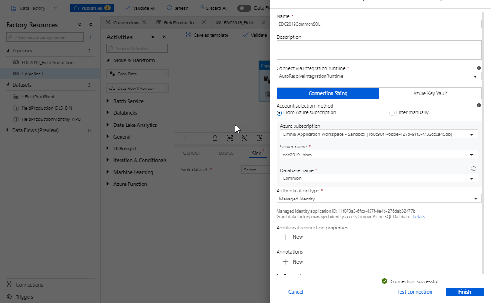

Introduction
============
At a high level, this tutorial covers the following steps:

* Create an Azure Data Factory Pipeline to Copy data from an HTTP endpoint 
  (NPD) into Data Lake Storage Gen2
* Create an Azure SQL Server, 
* Create an Azure SQL Database.
* Create an Azure Data Factory Pipeline to Copy data from Data Lake to SQL 
  Database

Prerequisites
-------------

* Access to azure
* A Data Factory

Information about the Data
--------------------------

We will use public data available from NPD. From the following page you can browse all NPD data: 

http://factpages.npd.no/factpages/

For this exercise we will use the downloadable production csv file from :

http://factpages.npd.no/ReportServer?/FactPages/TableView/field_production_monthly&rs:Command=Render&rc:Toolbar=false&rc:Parameters=f&rs:Format=CSV&Top100=false&IpAddress=143.97.2.35&CultureCode=en

Getting started
---------------

To access data factory you need to locate the data factofy resource in the Azure portal

* Log into http://portal.azure.com 
* Locate the data factory in your resource group either using search (e.g. 
  *edc2019* or *<short name>*) or browsing *all resources*
* In the Overview section of the Data Factory resource, click 
  *Author & Monitor* to open the Data Factory editor.

Data Factory
------------

A data factory has a few concepts that it is useful to be aware of. You will typically create *pipelines* which provide a logical grouping of activities that together perform a task. The activities in a pipeline define actions to perform on your data such as copying or transformation.

*Linked services* provide a connection to different data sources. Linked services are much like connection strings, which define the connection information needed for Data Factory to connect to external resources.

A *dataset* is a named view of data that simply points or references the data you want to use in your activities as inputs and outputs. Datasets identify data within different data stores, such as tables, files, folders, and documents.

*Linked services* can be setup as *sources* or *sinks* from where you gather or send data respectively. 

More information is available at: Reference Azure Data factory documentation: https://docs.microsoft.com/en-us/azure/data-factory/

Ingest into Azure Data Lake Storage Gen2
----------------------------------------

With your Data Factoryopen you should see a *Get started* page. On this select the Create pipeline to launch the Author tool:

In the Activities toolbox, expand Move & Transform. Drag the Copy Data activity from the Activities toolbox to the pipeline designer surface. You can also search for activities in the Activities toolbox. 

Switch to the Source tab in the copy activity settings, and select new dataset

.. image:: images/ingest/3_new_dataset.png

.. image:: images/ingest/4_new_http_dataset.png

In the Set Properties window that pops up use the name EDC2019CommonDLS and from the Linked Service dropdown select new to create a new linked service to link to NDP Factpages

Add the URL to the report.

ReportServer?/FactPages/TableView/field_production_monthly&rs:Command=Render&rc:Toolbar=false&rc:Parameters=f&rs:Format=CSV&Top100=false&IpAddress=143.97.2.35&CultureCode=en

.. image:: images/ingest/8_set_property.png

Switch to the Sink tab in the copy activity settings, and select new dataset

.. image:: images/ingest/9_sink_new_dls_dataset.png

.. image:: images/ingest/10_new_binary.png

Create a new linked service to link to the Data Lake Store, place this in your personal folder.

.. image:: images/ingest/11_new_linkeservice_dls.png

Set the file path for your destination file in the Data Lake Store. This has 3 parts:

1. file system name - *dls*
2. path - *user/<shortname>* (replace <shortname> with your shartname)
3. filename - *field_production_monthly.csv*

You can use the browse button to fill file system name and path, but must enter filename manually as this won't exist from before.

.. image:: images/ingest/12_set_property.png

Do a test-run of your newly created pipeline

.. image:: images/ingest/test-pipeline.png

Check status of the run

Verify the Ingested File in dls
-------------------------------

Data Lake Store is a seperate (shared) resource that has been pre created. We can access this resource to view the file.

There are many ways to access files in Data Lake store including through code, using command line tools, through the Auzre Portal and more.

You will need to find the data lake resource in the Azure Portal. This is called *edc2019dls* (hint: use search).

The web based "Storage Explorer (Preview)" provides a built in explorer within the Azure Portal. You can browse and verify your file has been created. Double clicking on the actual file will download it to your computer, from here you can view the file in your favorite csv-application.

If you work with Azure you may want to install the [Azure Storage Explorer](https://azure.microsoft.com/en-us/features/storage-explorer/) that is a cross-platform (windows, linux and macOS) client to connect to and work with Azure Storage Accounts.

Ingest from Azure Datalake Store into Azure SQL Database
--------------------------------------------------------

In this step, you will first create an Azure SQL Server and Azure SQL 
Database. Azure SQL Server gives a runtime environment and Azure SQL 
Database gives a database instance within this. 

NOTE: In the future you would expect such runtime components to disappear as 
this everything would be provisioned and scaled automatically.

In the Azure Portal, *All services* from the left menu, then type Azure SQL 
in the search box. 

(Optional) Select the star next to Azure SQL to favorite it and add it as 
an item in the left-hand navigation for quick access.
Select + Add to open the Select SQL deployment option page. You can view 
additional information about the different databases by selecting Show 
details on the Databases tile.

Click on the *Azure SQL* service in the results list.

You are presented with different options of what you can create. Select
*SQL Databases* and *Create* with the default *Single Database* option 
selected.

.. image:: images/ingest/SQL/1_new_sql_server.png

Enter the configuration details, ensuring the following:

* Check that the subscription is *Omnia Application Workspace - Sandbox*
  and select your own resource group edc2019_<shortname>
* Enter database name as *Common*
* Click *Create new* under the database details. 
* Provide a uniqe Server name using consistent naming e.g. edc2019_<shortname>
* Enter a custom password under the create server dialog as shown below. 
* Location should be *North Europe*
* Be sure to check the box *Allow Azure services to access server* so that 
  Datafactory (and other services) can access the database.
* Under *Compute & Storage* select *Configure database* and chose the *Basic*
  option as we only have minimal requirements performance wise. 

.. image:: images/ingest/SQL/2_new_sql_server2.png

Click *Review + create* to create the database followed by *Create* after you 
have reviewed the settings.

Once the database is created locate / search to find the created SQL Server 
(not SQL database) so we can add Firewall details to access the database 
remotely. In the SQL Server links use *Firewalls and virtual networks* link
to modify the firewall.  

As we will copy data by using the Azure Data Factory integration runtime, 
configure the Azure SQL Server firewall so that Azure services can access 
the server. 

We will open for other needed addresses too as below. 

.. image:: images/ingest/SQL/3_set_firewall.png

To enable single sign-on for login simplicity when working with the database,
go to the *Active Directory admin* link, and add your @equinor user as admin

.. image:: images/ingest/SQL/4_set_AD_admin.png

Go to the SQL Database itself and select the Query Editor link.

Create table and user by entering and running the below SQL. Be sure to swap
out *NameOfDatafactory* with the actual name of your data factory e.g. edc2019-<shortname>-df

.. code-block:: sql

    SELECT * FROM [dbo].[ProductionData]

.. image:: images/ingest/SQL/5_Create_table_user.png

Copy data from Azure Datalake Store to Azure SQL Database
---------------------------------------------------------

Go back to DataFactory.

Create a new pipeline that we will use to copy data from Azure Datalake Store to Azure SQL Database

In the Activities toolbox, expand Move & Transform. Drag the Copy Data activity from the Activities toolbox to the pipeline designer surface. You can also search for activities in the Activities toolbox.

Switch to the Source tab in the copy activity settings, and select new dataset.

.. image:: images/ingest/SQL/1_new_dataset_dls.png

.. image:: images/ingest/SQL/2_new_dataset_dls2.png
.. image:: images/ingest/SQL/3_new_delimitedText.png

.. image:: images/ingest/SQL/4_linkedservice_dls.png

Add the file path to the Datalake store.

.. image:: images/ingest/SQL/5_set_property.png

Switch to the Sink tab in the copy activity settings, and select new dataset, 
Azure SQL Database.

.. image:: images/ingest/SQL/7_new_linkedservice_sql.png

.. image:: images/ingest/SQL/9_set_property.png

Swith to the Mapping tab, and click Import Schemas

.. image:: images/ingest/SQL/10_Mapping.png

Remove the mapping to the ID column. This is an Idenntity column in the 
database.

.. image:: images/ingest/SQL/11_Mapping2.png

When you download the CSV file from NPD, the file contains a new line in the 
end of the file. The Datafactory will handle this as a record and give an 
error. To ignore this error, add "Skip incompatible rows"

.. image:: images/ingest/SQL/12_Settings.png

Trigger the pipeline. You can verify the output by going back to the database query editor and running the following SQL to see if data has been loaded into our table.

.. code-block:: sql

    CREATE TABLE [dbo].[ProductionData](
        [Wellbore] [varchar](50) NOT NULL,
        [Year] [int] NOT NULL,
        [Month] [int] NOT NULL,
        [Oil] [decimal](15, 5) NOT NULL,
        [Gas] [decimal](15, 5) NOT NULL,
        [Id] [int] IDENTITY(1,1) NOT NULL
    ) ON [PRIMARY]
    GO

    CREATE USER [NameOfDatafactory] FROM EXTERNAL PROVIDER
    GRANT SELECT, INSERT, UPDATE, DELETE, EXECUTE, ALTER ON schema::dbo TO [NameOfDatafactory]

Summary
-------

We have shown how to copy data using Data Bricks and create certain 
infrastruvture. There are however several points that we haven't covered in 
the interest of time:

* Automation and DevOps
* Monitoring
