# EDC2019-Ingest-API

This guide is an example on how to transfer data from REST APIs using an function app. The function app in this tutorial will call the an API, convert the content from CSV to JSON and upload the result to a Blob. A Data Factory pipeline will then copy the Blob file to a SQL table.

## Key Vault
A Key Vault is an Azure resource for storing secret information such as passwords, access keys and connection strings. This section will explain how to grant access to a Data Factory using the Key Vault. By doing this the Data Factory will be able to use secrets stored in the Key Vault in a secure fashion.

1. In the Azure portal, click on *All resources* on the left hand side of the panel. Under Subscriptions, select *Omnia Application Workspace - Sandbox*. Search for *edc2019-common-kv*
2. Click on *Access policies*
3. Click on *+ Add Access Policy*
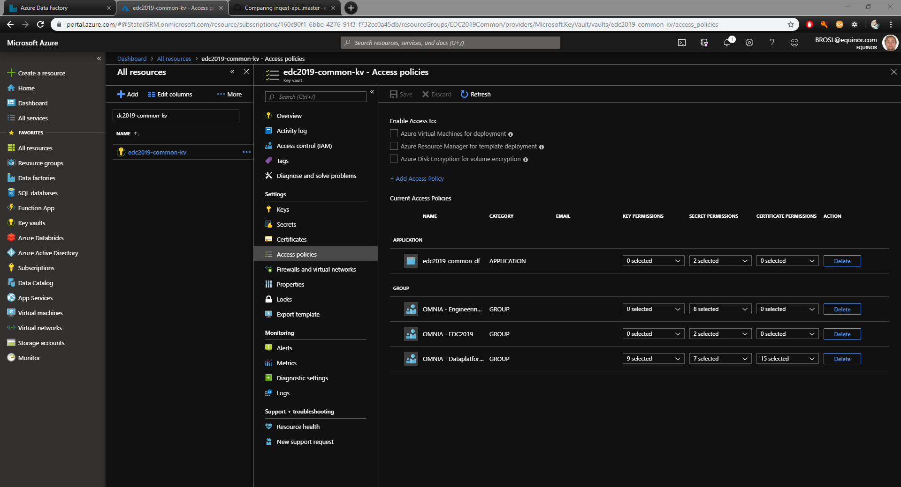
4. In the *Secret permissions* drop-down select *Get* and *List*
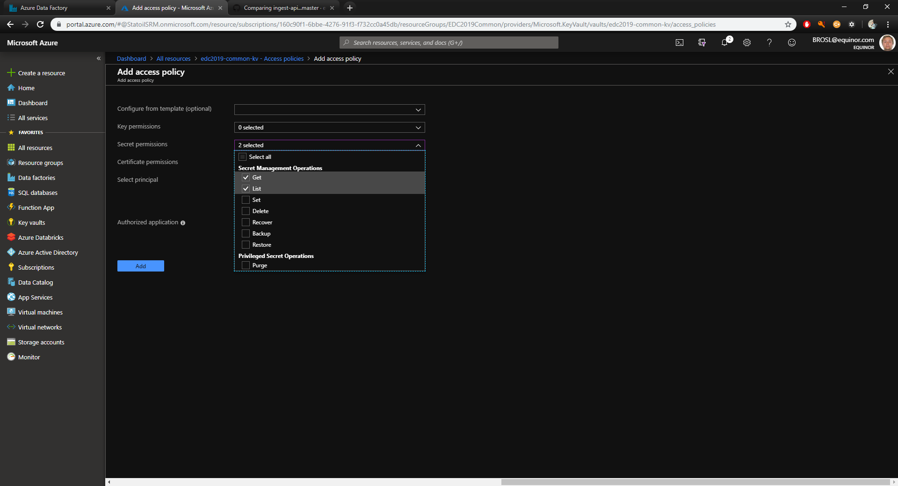
5. Go to select principal and search for *"Your name of Data Factory"*. Click Select.
6. Click *Add*
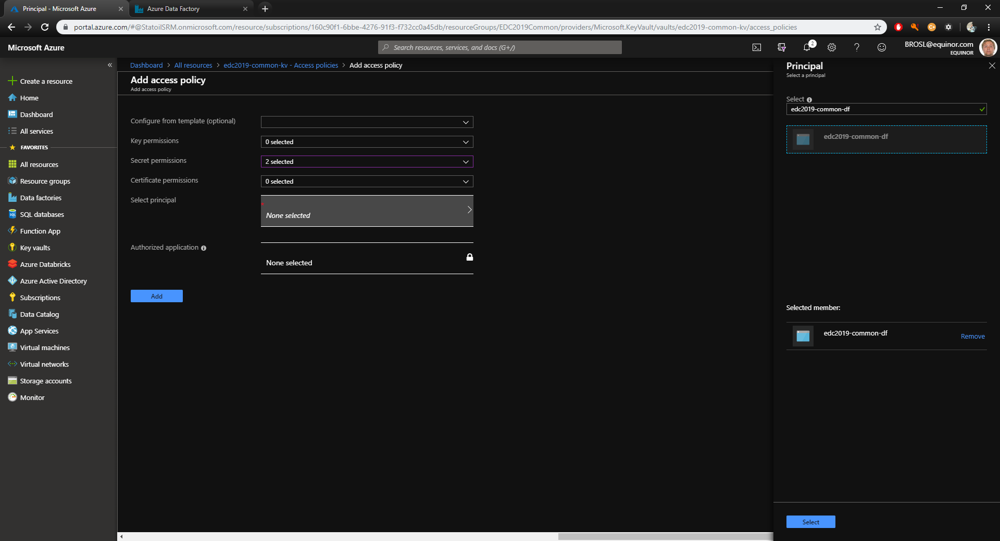

## Data Factory
In this section you will set up a Data Factory pipeline with an Azure function and a copy from Blob Storage to an SQL database. You will need to created Linked Services, in order to establish connection to resources, and Datasets for retrieving data. When these have been set up then you are ready to set up a Data Factory pipeline.

### Linked Services
1. In Data Factory, click on *Connections*, *New* and *Compute*. Select *Azure Function*.
- 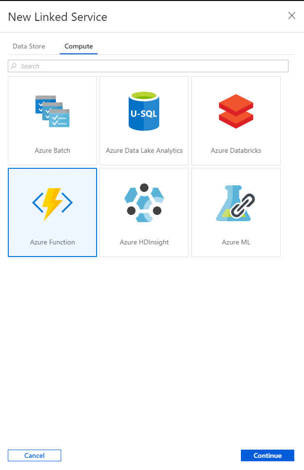
- **Name:** *"Your Azure Function linked service name"*
- **Azure Function App selection method:** From Azure subscription
- **Function App URL:** (factpages-tutorial)https://factpages-tutorial.azurewebsites.net
- Select *Azure Key Vault*
- **AKV linked service:** AKV linked service
- **Secret name:** factpages
- 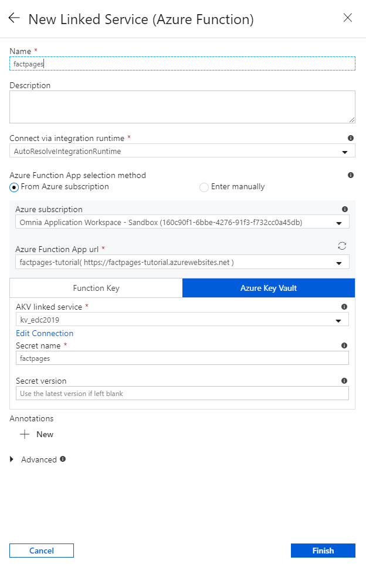

2. Create a linked service for the Azure Blob Storage.
- **Name:** *"Your Storage account linked service name"*
- **Authentication method:** Managed Identity
- **Account selection method:** From Azure subscription
- **Azure Subscription:** Omnia Application Workspace - Sandbox
- **Storage account name:** omniatutorial
- 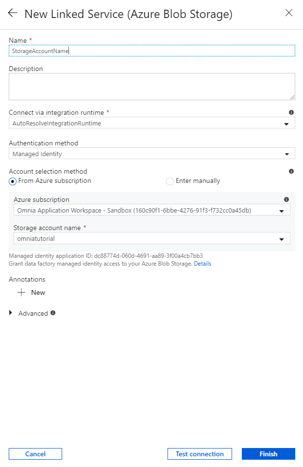

3. Create a linked service for Azure SQL Database. Find database from Azure subscription, server name and database name.
- **Name:** *"Your Azure SQL linked service name"*
- **Account selection method:** From Azure subscription
- **Server name:** edc2019-sql
- **Database:** common
- **Authentication type:** Managed Identity
- 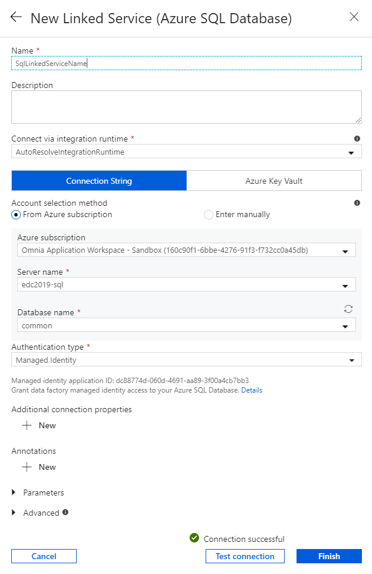

### Datasets
1. Create a Dataset for the Blob Storage. Select linked service from step 2 in the previous section. When promptet for file type, select JSON. Browse for file *wellbore.json*
- 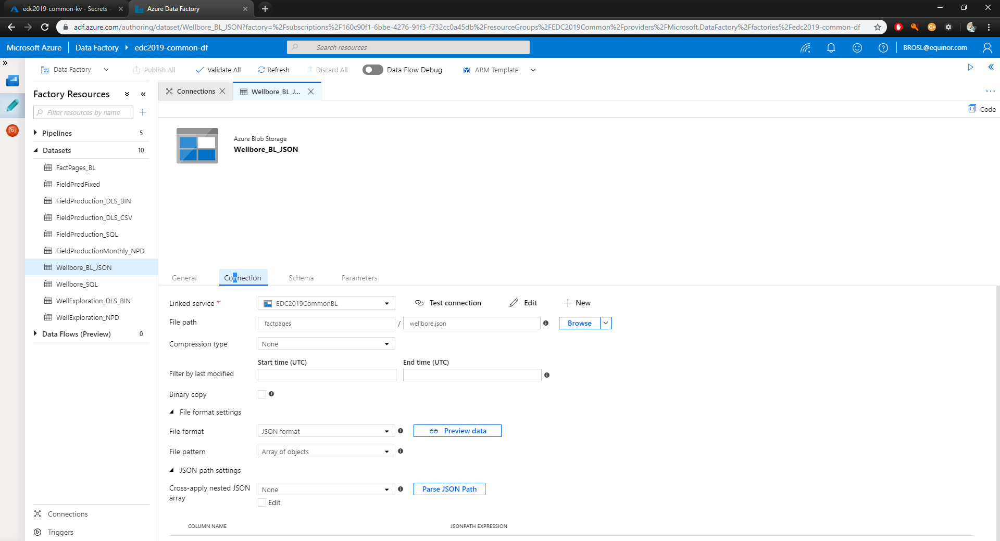
2. Create a Dataset for the SQL table. Select SQL linked service from  step 3 from the previous section. Select the table *dbo.Wellbore* as source. If the table doest not exists in the database you can create the table with this [command](https://github.com/equinor/omnia-tutorial/blob/master/docs/exercises/scripts/wellbore.sql)
- 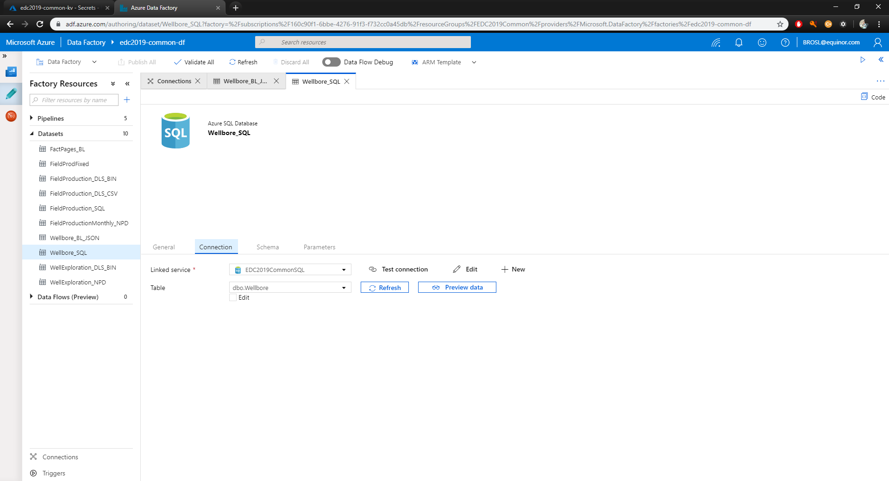

### Pipeline
1. Create a pipeline in Data Factory.
2. Set up an Azure Function activity. Linked service is the linked service from step 1 in the previous section. Set "Ingest" as Function name. Method can be either GET or POST. Create a new header by clicking on New under Headers. Use the following vales:
- **Url:** http://factpages.npd.no/ReportServer?/FactPages/TableView/wellbore_exploration_all&rs:Command=Render&rc:Toolbar=false&rc:Parameters=f&rs:Format=CSV&Top100=false&IpAddress=143.97.2.35&CultureCode=en
- **ContainerName:** factpages
- **FileName:** wellbore.json
- 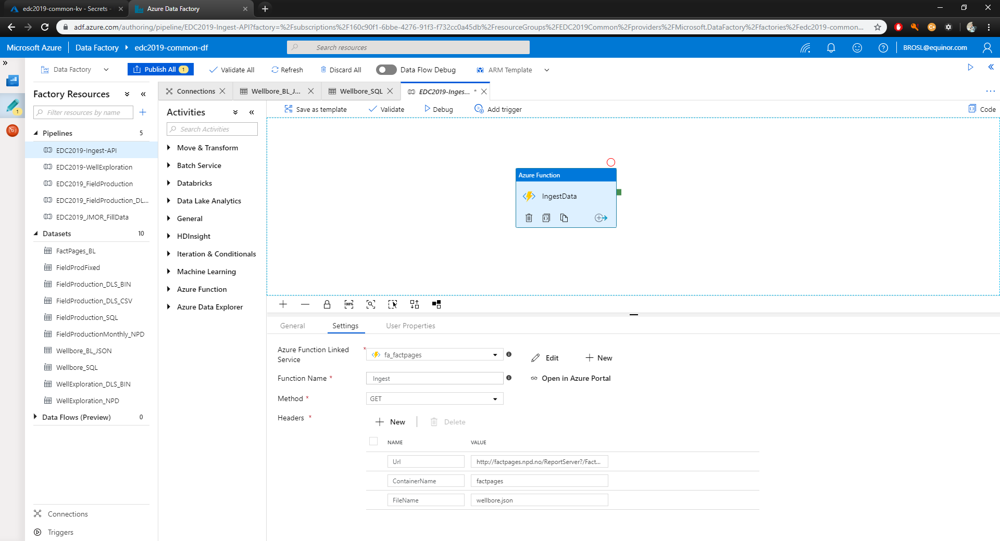
3. Set up a Copy activity. The Source is the Blob Storage Dataset and Sink is the SQL Dataste.
4. In pre-copy script type in the command *DELETE FROM  dbo.Wellbore*
- 
5. Under Mapping, select Import schemas. This will automatically set up column mapping
- 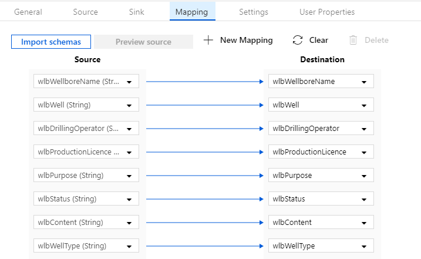
4. Click on the green area on the right hand side of the Azure function activity and drag the green line over to the copy activity. This will controll the data flow and will make sure that the copy activity only starts when the Azure function activity has completed successfully
- 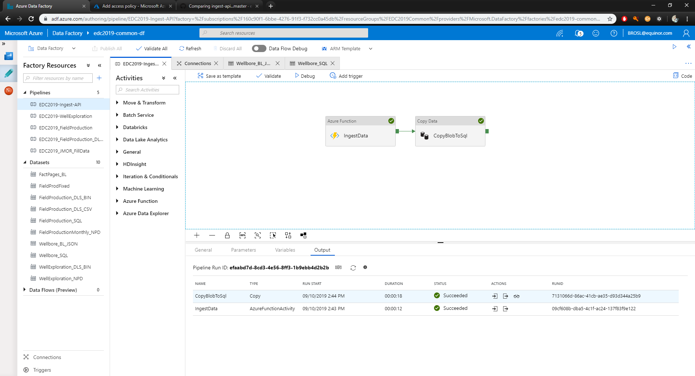
