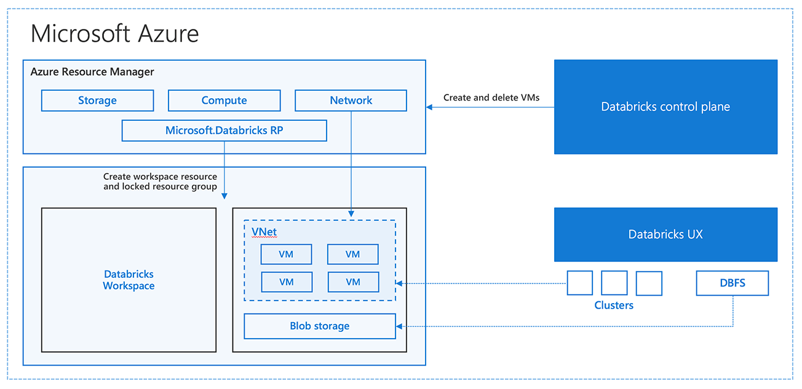
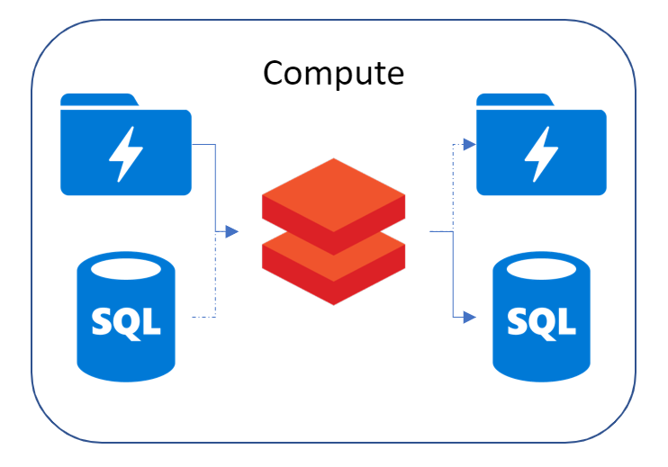

:title: Hands on with Omnia - Compute
:author: Omnia Team
:description: Hands on tutorial with Omnia.
:keywords: omnia, tutorial
:css: main.css

.. header::

    .. image:: images/omnia_icon_black.png
        :width: 100px
        :height: 100px

.. footer::

   Hands on with Omnia, https://github.com/equinor/omnia-tutorial

.. _Hovercraft: http://www.python.org/https://hovercraft.readthedocs.io/

This slide show is written in rst and designed to be generated as an HTML site
using Hovercraft_. See `README.rst <..\..\README.rst>`__ for details on where
you can view an automatically generated version.

You can render this presentation to HTML with the command::

    hovercraft introduction.rst output/compute

And then view the output/compute/index.html file to see how it turned out.

You separate slides with a line that consists of four or more dashes. The
first slide will start at the first such line, or at the first heading. Since
none of the text so far has been a heading, it means that the first slide has
not yet started. As a result, all this text will be ignored in the generated 
output.

TODO - one slide on the below:

----

Compute Basic
=============

* Batch v's Event Driven
* Elasticity
* Cost

.. note::

   * Elasticity: the ability to scale up/down according to workload. eg: worker nodes, cores

   * Cost: compare between setting up a phisical server and using an online service like databricks, in storage, cluster usage and cost

----

Compute Alternatives
====================

.. image:: ./images/compute/compute-alternatives.PNG

*Links*:

`Decision tree for Azure compute services <https://docs.microsoft.com/en-gb/azure/architecture/guide/technology-choices/compute-decision-tree>`__ 

`Criteria for choosing an Azure compute service <https://docs.microsoft.com/en-gb/azure/architecture/guide/technology-choices/compute-comparison>`__ 

.. note::
   * Virtual Machine : old way when think of compute
   * Azure Batch
   * Function Apps : event triggered
   * Container & Kubernetes: 
   * HDInsight: use hive, pig or map reduce jobs
   * Apache Kafka: cover both streaming and computing
   * Stream Analytics: streaming process, need databricks or event hubs to ingest realtime data
   * Azure Databricks
   * links are from Azure Architecture Center

----

Azure Databricks
================
* What is Databricks?

.. image:: ./images/compute/azure-databricks.PNG

.. note::

   * Apache Spark
   * Databricks
   * Enterprise cloud

----

Azure Databricks
================
* Why Spark?

.. image:: ./images/compute/spark.PNG

----

Azure Databricks
================
* Azure Databricks Architecture

*Image from: https://azure.microsoft.com/es-es/blog/a-technical-overview-of-azure-databricks/*

----

Azure Databricks
================

* Demo: How to create cluster/notebook in Azure Databricks?

----

Exercise Overview
=================

Exercise Link: https://github.com/equinor/omnia-tutorial/blob/master/docs/exercises/compute.rst
