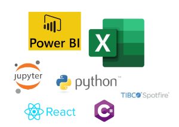

:title: Hands on with Omnia - Consuming API's
:author: Omnia Team
:description: Hands on tutorial with Omnia.
:keywords: omnia, tutorial
:css: main.css

.. header::

    .. image:: images/omnia_icon_black.png
        :width: 100px
        :height: 100px

.. footer::

   Hands on with Omnia, https://github.com/equinor/omnia-tutorial

.. _Hovercraft: http://www.python.org/https://hovercraft.readthedocs.io/

This slide show is written in rst and designed to be generated as an HTML site
using Hovercraft_. See `README.rst <..\..\README.rst>`__ for details on where 
you can view an automatically generated version.

You can render this presentation to HTML with the command::

    hovercraft consume.rst output/consume

And then view the output/consume/index.html file to see how it turned out.

You separate slides with a line that consists of four or more dashes. The
first slide will start at the first such line, or at the first heading. Since
none of the text so far has been a heading, it means that the first slide has
not yet started. As a result, all this text will be ignored in the generated 
output.

----

Consume
=======

* API First
* Security
* Governance
* Data Architecture
* Connection

.. note::

    * API First - How are we accessing the data - API preferred but might not 
      meet all requirements.
    * Security - How does the connection work e.g. embedded password
    * Governance - Distribution / merging of data, need for LRA, maintenance
      of solution
    * Data Architecture - how does the API fit with our specific needs 
      including access patterns. Do we need additional services for speed / 
      performance (e.g. to cache values or reduce the number of queries)
    * Connection risks - latency, transactional, guaranteed delivery, operations and monitoring>

----

Alternatives
============

* Power BI
* Web / Desktop / Mobile App
* Excel
* Jupyter Notebook
* Spotfire
* ...

----

Power BI - Demo
===============

.. note::

    * For getting data use exact same steps as in the Excel-excercise (Power Query-based both of them...)
    
----

Exercise
=================

* Excel
* Python
* Power BI

----

Summary
=======

* Other tools
* Authorisation & Authentication
* Deployment & Sharing
* Legal aspects
* Performance

.. note::

   * *Other tools* - there are many other tools that can also be used.
   * *Authorisation & Authentication* - for simplicity this exercise used an 
     open API with no security. In real world scenarios it is highly likely 
     that you will need to ensure API's are secured.
   * *Deployment & Sharing* - once you have a solution created that consumes data
     from an API you might want to operationalise and share it somehow.
   * *Legal aspects* - if you modify and combine data, you may be changing the 
     security classification and so need to consider possible implications
   * *Performance* - There are different query patterns and also a question 
     about what options are best and where to run compute. We might need 
     additional backend infrastructure to improve frontend user performance.
