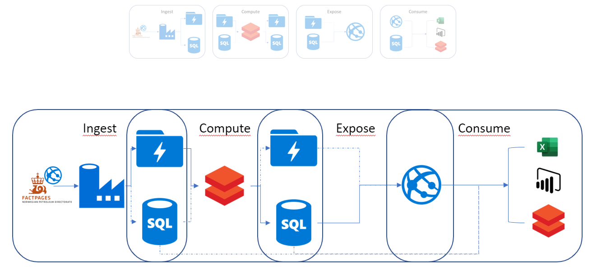

:title: Hands on with Omnia - Closing
:author: Omnia Team
:description: Hands on tutorial with Omnia.
:keywords: omnia, tutorial
:css: main.css

.. header::

    .. image:: images/omnia_icon_black.png
        :width: 100px
        :height: 100px

.. footer::

   Hands on with Omnia, https://github.com/equinor/omnia-tutorial

.. _Hovercraft: http://www.python.org/https://hovercraft.readthedocs.io/

This slide show is written in rst and designed to be generated as an HTML site
using Hovercraft_. See `README.rst <..\..\README.rst>`__ for details on where 
you can view an automatically generated version.

You can render this presentation to HTML with the command::

    hovercraft endnotes.rst output/endnotes

And then view the output/endnotes/index.html file to see how it turned out.

You separate slides with a line that consists of four or more dashes. The
first slide will start at the first such line, or at the first heading. Since
none of the text so far has been a heading, it means that the first slide has
not yet started. As a result, all this text will be ignored in the generated 
output.

----

What we Covered
===============

----

What we Didn't Cover
====================

* DevOps
* Security
* All the different options
* Lifecycle

.. note::

    * Source control, automation of build, testing. Why is this important?
    * Security - Dropped for simplicity, but important to understand and include
    * All the options

      * Ways of working with Azure (SDK, CLI, ARM templates, ...)
      * Different technologies.

    * Operations, monitoring. Also ties in with Devops

----

Next Steps
==========

* Play around - `Portal <https://portal.azure.com/>`__
* Understand Omnia - `Omnia Home <https://omnia.equinor.com>`__
* Read the documentation - `Azure <https://docs.microsoft.com/en-gb/azure/>`__
* Join the community - `Slack <https://equinor.slack.com>`__ | `Yammer <https://yammer.com/statoil.com/>`__

----

THANK YOU 
=========
