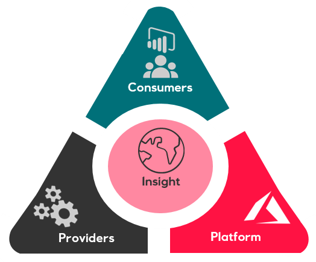
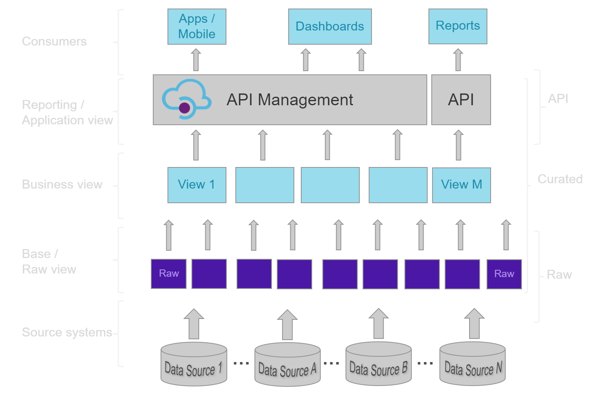
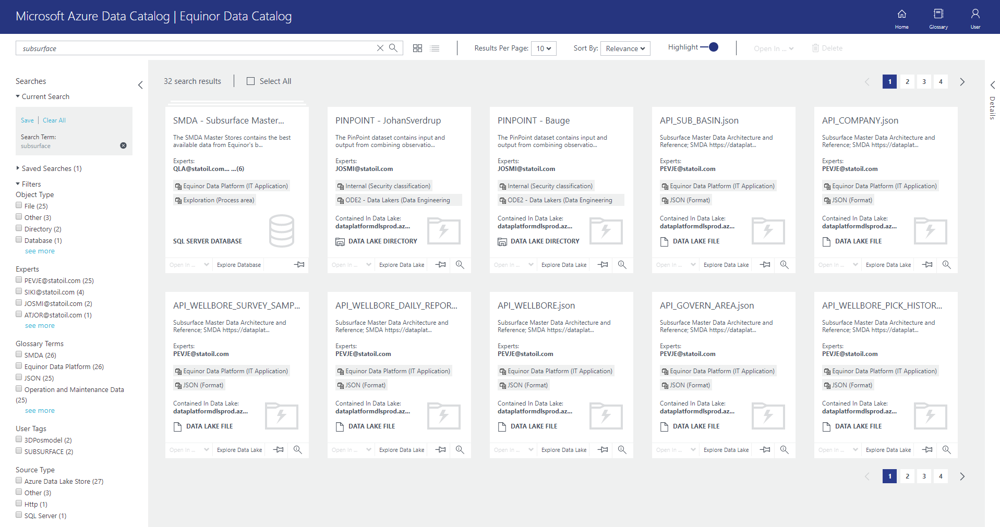
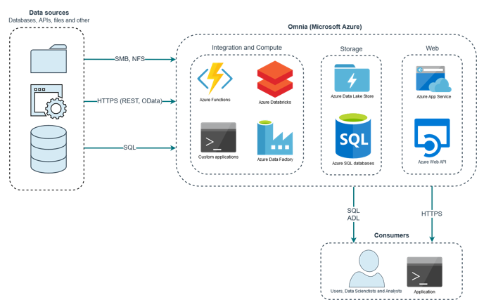
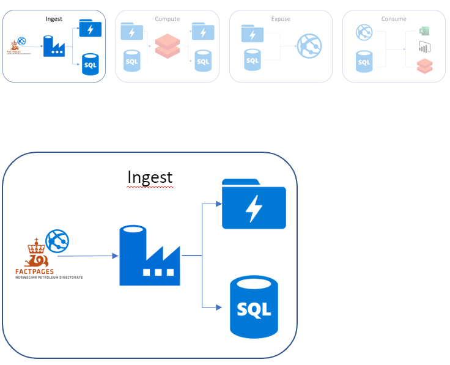

:title: Hands on with Omnia - Ingestion
:author: Omnia Team
:description: Hands on tutorial with Omnia.
:keywords: omnia, tutorial
:css: main.css

.. header::

    .. image:: images/omnia_icon_black.png
        :width: 100px
        :height: 100px

.. footer::

   Hands on with Omnia, https://github.com/equinor/omnia-tutorial

.. _Hovercraft: http://www.python.org/https://hovercraft.readthedocs.io/

This slide show is written in rst and designed to be generated as an HTML site
using Hovercraft_. See `README.rst <..\..\README.rst>`__ for details on where 
you can view an automatically generated version.

You can render this presentation to HTML with the command::

    hovercraft introduction.rst output/ingest

And then view the output/ingest/index.html file to see how it turned out.

You separate slides with a line that consists of four or more dashes. The
first slide will start at the first such line, or at the first heading. Since
none of the text so far has been a heading, it means that the first slide has
not yet started. As a result, all this text will be ignored in the generated 
output.

----

Getting Data into Omnia
=======================

.. note::
    Provider - responsible for:

    * Publishing data to the central data platform
    * The data’s quality
    * Publishing metadata that makes it easy to find and consume the data​
    * Technical ownership of API's

    Consumer - the one using the information.

    We need to move away from scenarios where projects expose and use data without the data owners knowledge.

----

Considerations
==============

* Governance
* Legal
* Technical

.. note::
    Governance

    * Data Classification (open, internal, confidential)
    * Data Architecture
    * Ownership
    * Lineage

    Legal

    * Legal risk assessment (export control, contractual, ...)

    Technical

    * Latency
    * Transactional
    * Guaranteed delivery
    * perations and monitoring

----

Data Architecture
=================

TODO: Replace DB icon with API

.. note::
    Important to differentitate between the different layers

    Raw

    * Type of data - directly from the source as close to the original as possible, - no changes made, no duplicates 
    * Source - Important to show where data comes from - tag with source solution. 
    * Format - No changes with regards to format.  
    * Update frequency - show update frequency, Time stamp from source should be included 
    * Access - Not accessible for all. (Today: Role = Data scientist)
    * Security classification - should have a security classification documented as basis for defining access and roles. 
    * Geography - tag with country for data with restrictions on use because of sanctions, export control, authority reporting and other country specific legislation. 
    * Asset/project - May be important to differentiate on access by asset / projects. 
    * Ownership - All Raw data should have an owner 
    * Naming - source system, ppossibly business context (data areas)

    Transform (Enterprise)

    * Type of data - Data that has been changed e.g. through cleansing, standardisation or interpretation by using transformation models and conversion models.
    * Versioning - not immutable, as it should be possible to recreate earlier versions based on the history of transformation models and raw data. The complete history of transformed data will as such not need to be kept.
    * Quality - A quality stamp linked to confidence factors or approvals is recommended for transformed data, - e.g. "Company Approved versions". Require definition of criteria for quality / confidence e.g. Exploration data availability project. 
    * Lineage - It should be possible to document lineage for transformed data to show changes throughout the data life cycle from source system to transformed.  
    * Format - It should be standard formats for transformed data. 
    * Access - Access to transformed data is by default based on non-App-specific APIs. The API management should reflect the tags and quality of data 
    * Security classification - should have a security classification documented as basis for defining access and roles. 
    * Geography - tag with country for data with restrictions on use because of sanctions, export control, authority reporting and other country specific legislation. 
    * Ownership - All Transformed data should have an owner. Align with common data roles. 
    * Business context - Transformed data should belong to a business context described with a common semantic vocabular and a standard naming convention. 

    Prepared

    * Similar requirements to Transform, but often application specific to meet solution specific needs (access pattern, performance)
    * Data in prepared should be exposed through the enterprise layer also. 

----

Data Catalogue
==============

https://eun-su1.azuredatacatalog.com

.. note:: 
  * Where to look for data
  * Apply for access in access it.
  * All data exposed in Omnia should be in the data catalog (both raw and enterprise)

----

Alternatives
============

* Azure Data Factory​ (recommended)
* Azure Functions​
* Azure Databricks​
* Custom Applications​
* Stream Analytics​
* HD Insight
* IoT Hub

.. note::

    Azure Data Factory​

    * Supports on-premis connectivity 
    * Supported formats: CSV, JSON, AVRO, ORC, Parquet​
    * Supported sources: (S)FTP, SMB, HTTP, Oracle/SQL DB, etc.​

    Azure Functions​

    * Supported formats: Almost any​
    * Supported sources: Almost any​

    Azure Databricks​

    * Supported formats: Almost any​
    * Supported sources: Almost any​

    Custom Applications​

    * Supported formats: Any​
    * Supported sources: Any​

    Streaming data​

    * Stream Analytics​
    * EH​
    * IoT Hub

----

Data Flow
=========

----

Data Factory
============

Info

----

Data Set
========

See draft links in ingest excercises document

----

Exercise
========

----

Summary
=======

* TODO

.. note::

  * TODO
