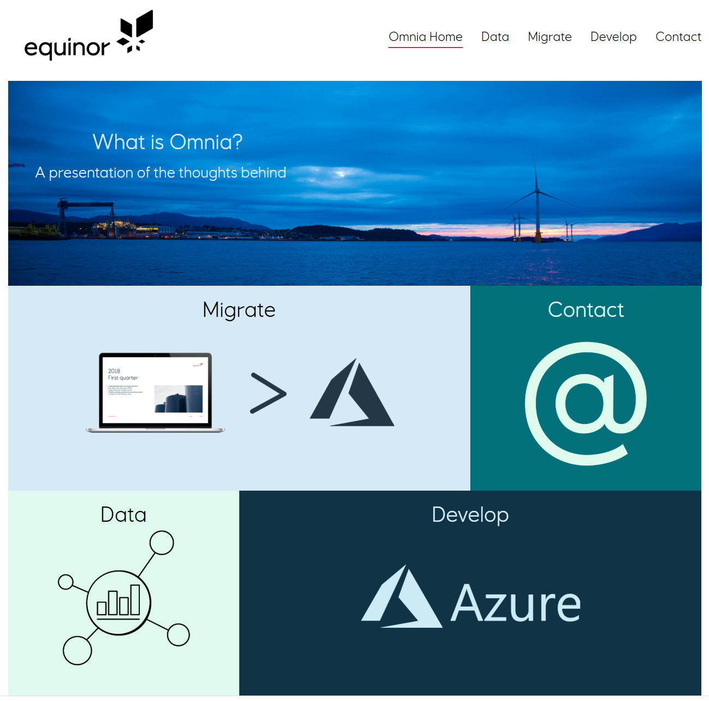
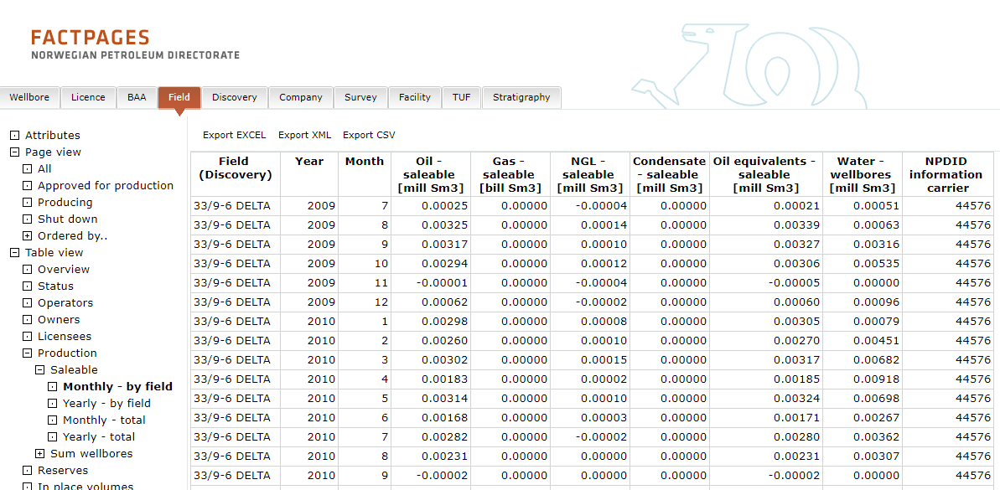
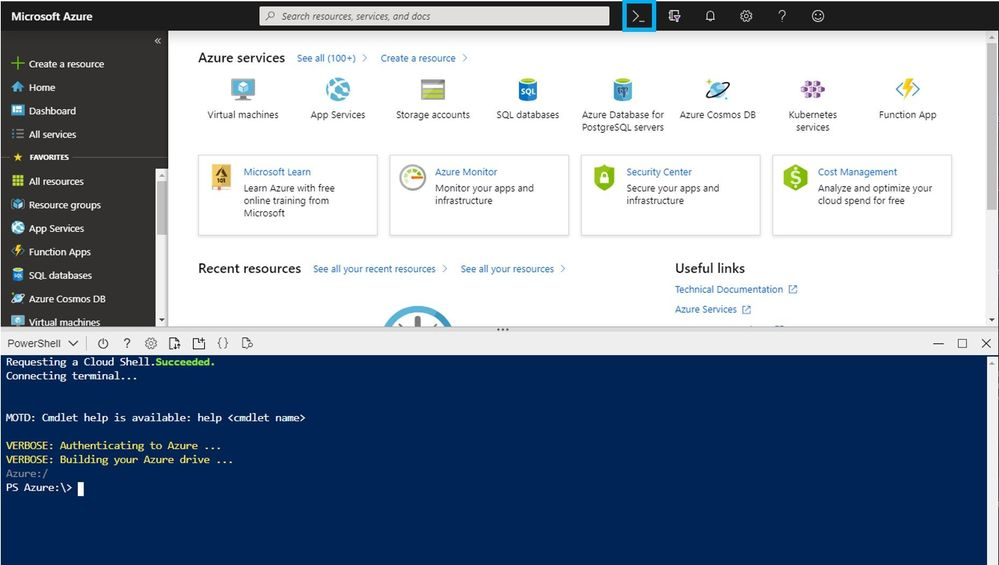

:title: Hands on with Omnia - Introduction
:author: Omnia Team
:description: Hands on tutorial with Omnia.
:keywords: omnia, tutorial
:css: main.css

.. header::

    .. image:: images/omnia_icon_black.png
        :width: 100px
        :height: 100px

.. footer::

   Hands on with Omnia, https://github.com/equinor/omnia-tutorial

.. _Hovercraft: http://www.python.org/https://hovercraft.readthedocs.io/

This slide show is written in rst and designed to be generated as an HTML site
using Hovercraft_. See `README.rst <..\..\README.rst>`__ for details on where 
you can view an automatically generated version.

You can render this presentation to HTML with the command::

    hovercraft introduction.rst output/introduction

And then view the output/introduction/index.html file to see how it turned out.

You separate slides with a line that consists of four or more dashes. The
first slide will start at the first such line, or at the first heading. Since
none of the text so far has been a heading, it means that the first slide has
not yet started. As a result, all this text will be ignored in the generated 
output.

----

Introduction
============

.. image:: ./images/omnia_icon_black.png
  :width: 200px

* A hands on introduction with Omnia
* What are we not covering?
* Signup
* https://github.com/equinor/omnia-tutorial/

.. note::
    | P - A hands on introduction with Omnia
    | O - A better understanding of Omnia
    | W - Better equiped to develop within Equinor's new IT platform
    | E - Who has worked with Omnia? What expectations do people have?
    | R - ?
    
    How: A mixture of presentations and tutorial. We will reference Azure documentation extensively as they need to know how to navigate these pages.

    What we are not covering

    * You will not be an expert after 1 day
    * Every possible scenario - but we will touch on alternatives
    * All the details - this is a high level introduction to set context, we will dig into the details more as we go along. 

    Other 

    * Allowed to leave if not suitable.
    * Signup / provisioning.
    * High level agenda (steps, presentation + exercises). Visit in detail later
    
----

What is Omnia (and why?)
========================

| Omnia home: https://omnia.equinor.com/
| Omnia docs: https://docs.omnia.equinor.com/

.. note::

  * What is Omnia

    * Equinors cloud journey
    * Enabled by certain technology platforms
    * Pillars
      * Sharing - move from silos to common platform. 
      * Responsibility - more possibilities, but requires more responsibility. (e.g. complience with data architecture, API strategy, cost, ...).
      * Process - devops, infra as code, cloud first mindset, EDM

  * Omnia as an Environment

    * Runtime environment + Compute + Storage

    * **Develop Tab** (Runtime) - The basic products (subscription, resourcegroup, networking). Show https://docs.omnia.equinor.com/

      * Omnia classic
      * Omnia applications
      * Standalone

    * **Data Tab** - When does data become a part of the data platform. Will come back to later also.

  We will revisit many of these topics as part of the tutorial.

----

Tutorial scenario
=================

| https://www.npd.no/en/facts/news/Production-figures/
| http://factpages.npd.no/factpages/Default.aspx?culture=en

.. note::

    * NPD holds open data on production from different fields.
    * Create a pipeline to make the data available through Omnia.
    * Case chosen to easily highlight some of the important considerations when building cloud base data pipelines.

----

What we Will Build
==================

.. image:: ./images/architecture-overview.png
    :width: 800px

.. note::

    * Details on choices for each part and omissions are covered as we go.
    * The story is key.
    * Omnia Applications (v's workshop) - subscription / resource group
    * Show github repository and present agenda

----

Working with Azure
==================

.. note::

    * Portal, CLI, Power Shell, Cloud Shell, SDK, ARM templates, DevOps ...
    * For this tutorial everything can be done through the portal. Where possible we will describe and give alternative options that might more closely reflect how you would develop in practice.
