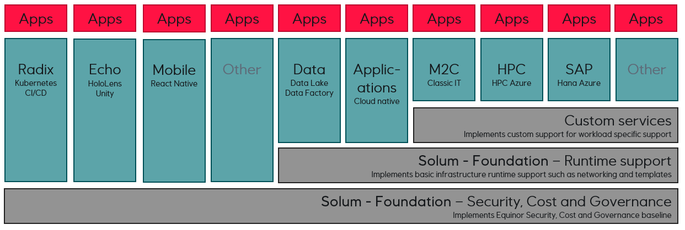

:title: Hands on with Omnia - Introduction
:author: Omnia Team
:description: Hands on tutorial with Omnia.
:keywords: omnia, tutorial
:css: main.css

.. header::

    .. image:: images/omnia_icon_black.png
        :width: 100px
        :height: 100px

.. footer::

   Hands on with Omnia, https://github.com/equinor/omnia-tutorial

.. _Hovercraft: http://www.python.org/https://hovercraft.readthedocs.io/

This slide show is written in rst and designed to be generated as an HTML site
using Hovercraft_. See `README.rst <..\..\README.rst>`__ for details on where 
you can view an automatically generated version.

You can render this presentation to HTML with the command::

    hovercraft introduction.rst output/introduction

And then view the output/introduction/index.html file to see how it turned out.

You separate slides with a line that consists of four or more dashes. The
first slide will start at the first such line, or at the first heading. Since
none of the text so far has been a heading, it means that the first slide has
not yet started. As a result, all this text will be ignored in the generated 
output.

----

Goal and outcome
==========================================

* Goal
* Purpose
    * Hands on introduction with Omnia

* Outcome
* What not covering
* Signup (username)

.. note::
    P - A hands on introduction with Omnia
    O - A better understanding of Omnia
    W - Better equiped to develop within Equinor's new IT platform
    E - Who has worked with Omnia? What expectations do people have?
    R - ?

    * Allowed to leave if not suitable.
    * Signup / provisioning.
    * high level introduction to set context, we will dig into the details more as we go along. 
    
----

What is Omnia (and why?)
==========================================

* Equinors cloud journey
* Enabled by certain technology platforms
* Pillars include:
    * Sharing
    * Responsibility
    * Process
    
Omnia home: https://omniahomewa.azurewebsites.net/
Omnia docs: https://docs.omnia.equinor.com/

.. note::

    * Conceptual idea backed by Azure + ...    
    * Pillars
        * Sharing - move from silos to common platform. 
        * Responsibility - more possibilities, but requires more responsibility. (e.g. complience with data architecture, API strategy, cost, ...).
        * Process - devops, infra as code, cloud first mindset, EDM
    * Show Omnia home, what is Omnia, 

----

Omnia as an Environment
=======================

Runtime environment + Compute + Storage

.. note::

    * Runtime - The basic products (subscription, resourcegroup, networking). Show https://docs.omnia.equinor.com/
       * Omnia classic
       * Omnia applications
       * Standalone
    * Compute + Storage will come back to as part of the tutorial.
    * When does data become a part of the data platform. Will come back to later also.
    * Omnia Applications (v's workshop) - subscription / resource group

    Image is from slide deck at: https://omniahomewa.azurewebsites.net/

----

Tutorial scenario (+ alternatives / limitations)
===============================================================

NPD - show data, architecture diagram (and plots?)

https://www.npd.no/en/facts/news/Production-figures/

https://www.npd.no/en/facts/news/Production-figures/2019/production-figures-july-2019/

----

Working with Azure
==================

Portal, CLI, ARM, DevOps, ...
