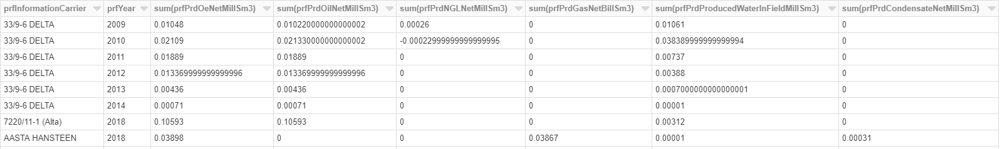

Introduction
============
ETL is a common architecture pattern where you *extract* data from a source 
system, *transform* it and then *load* it into a target.

This tutorial covers the following ETL process for performing compute in 
Azure Databricks:

* Extraction
  
  * Load data from ADLS Gen 2
* Transformation  
  
  * Basic computing
  * Enrich data (dummy GDPR) 
* Loading
  
  * Load transformed data to SQL server for further analysis

In addition the extras section covers other options you can consider.

Prerequisites
-------------

* Access to Azure
* Tutorial onboarding completed

Create a Notebook in Databricks
-------------------------------
* Open Databricks workspace **EDC2019sharedDatabricks** with URL: https://northeurope.azuredatabricks.net/?o=1561392505117079.

  **Note: Don't launch the workspace from Azure Portal. You don't have access 
  there.**

* Sign in using Azure AD.
* After you login, on the upper right area of the web page, click the people
  icon, shown as below:

  .. image:: ./images/peopleicon.PNG
* Accept the invitation from workspace **EDC2019sharedDatabricks**. Make sure
  you are working in this workspace before you continue.
* Find your user folder under **Workspace**, like below:
  
  .. image:: ./images/userfolder.PNG
* Right click on your folder and choose **Create** -> **Notebook**:

  .. image:: ./images/createnotebook.PNG

* Input the name for your new notebook (e.g. 'Compute') and attach the 
  notebook to the running **EDC-HighConcurrency-Shared** cluster we have 
  pre-created for you. Azure Passthrough is enabled on this cluster to
  simplify access to the data lake:

  .. image:: ./images/createnotebook2.PNG

After the notebook is created, you will jump to the notebook page. And you 
can start your databricks notebook from there now!

What we Have Already Done
-------------------------

Some work has already been done to connect the Data Lake Store into Data 
Bricks. This includes:

* We pre-created a Databricks resource for you to use.
* A Service Principal **OmniaEDC2019_DatabricksSPN** has been created and 
  set up to be used to authenticate Databricks with the database. 
  The application ID (client ID) of this Service Principal is 
  "f0d5bd54-9617-491d-afa1-07c8bd4dc5c1".  
* There is a secret created for this Service Principal to be used as a client 
  secret. The secret is stored in the shared key vault **EDC2019KV** with 
  secret name **databricksSpnClientSecret**. The permissions of this client
  have been set up for this module. 
* The connection between the key vault and the Databricks workspace has been
  set up with a secret scope **edc_key_vault_scope** in Databricks. 
* The **tenant ID** of Equinor is "3aa4a235-b6e2-48d5-9195-7fcf05b459b0".

Extract
----------
Extract data from ADLS Gen 2
^^^^^^^^^^^^^^^^^^^^^^^^^^^^
In this step, you need to load a .csv file as a dataframe from a folder in the datalake.

The source file is stored in file system **dls** in Data Lake **edc2019dls**. If you have not completed previous parts of this tutorial you may access the file from the path **data/open/npd.no/field_production/field_production_monthly.csv** otherwise it will have been copied to your user folder by Data Factory at **/user/<your-short-name>/field_production_monthly.csv**. Be sure to update paths where necessary below.

Reference Databricks documentation `Authenticate to Azure Data Lake Storage with your Azure Active Directory Credentials <https://docs.azuredatabricks.net/spark/latest/data-sources/azure/adls-passthrough.html>`_. Use the code under the section *Read and write Azure Data Lake Storage using credential passthrough* to load the .csv file from the datalake as a dataframe.

Solution:

.. code:: python

      df = spark.read.csv("abfss://dls@edc2019dls.dfs.core.windows.net/user/<your-short-name>/*.csv", header='true').collect()
      df = spark.createDataFrame(df)
      display(df)

Transformation
--------------
Basic Computing
^^^^^^^^^^^^^^^
In this step, you will do some basic compute on the dataframe you get from 
the steps above. 

For each Information Carrier and each year, we will calculate the sum of the 
columns:

* prfPrdOilNetMillSm3  
* prfPrdGasNetBillSm3
* prfPrdNGLNetMillSm3
* prfPrdCondensateNetMillSm3
* prfPrdOeNetMillSm3
* prfPrdProducedWaterInFieldMillSm3

You will typically want to enter code for each new step into a new cell within
the notebook both for clarity and to save re-running previous steps.

Add the following to a new cell in your notebook and run the cell:

.. code:: python

      # Convert columns to the correct data types
      df_2 = df.select(df.prfInformationCarrier.cast("string"), df.prfYear.cast("int"), df.prfPrdOilNetMillSm3.cast("double"), df.prfPrdGasNetBillSm3.cast("double"), df.prfPrdNGLNetMillSm3.cast("double"), df.prfPrdCondensateNetMillSm3.cast("double"), df.prfPrdOeNetMillSm3.cast("double"), df.prfPrdProducedWaterInFieldMillSm3.cast("double"))
      display(df_2)

      # Aggregate
      df_3 = df_2.orderBy('prfInformationCarrier').groupBy('prfInformationCarrier','prfYear').agg({'prfPrdOilNetMillSm3':'sum', 'prfPrdGasNetBillSm3':'sum', 'prfPrdNGLNetMillSm3':'sum', 'prfPrdCondensateNetMillSm3':'sum', 'prfPrdOeNetMillSm3':'sum', 'prfPrdProducedWaterInFieldMillSm3':'sum'})
      display(df_3)

The output dataframe should look like below:

Enrich data (dummy GDPR)
^^^^^^^^^^^^^^^^^^^^^^^^
In this step, you will add a column to the dataframe you get in the last step.
The the purpose of this tutorial, this can be any dummy data. This column will
be treated as GDPR data in the next module. 

Add the following to a new cell in your notebook and run the cell:

.. code:: python

      df_4 = df_3.select('*', (df_3.prfYear + 300).alias('GDPRColumn'))
      display(df_4)

Load
----
In this step, the latest dataframe will be stored into a table in the SQL 
database you created in module **Ingest**. 

First we need to setup the connection in a secure way before loading the data
into the target database.

Setup Connection to SQL server
^^^^^^^^^^^^^^^^^^^^^^^^^^^^^^

Reference `Connect Azure Databricks to SQL Database & Azure SQL Data Warehouse using a Service Principal <https://thedataguy.blog/connect-azure-databricks-to-sql-database-azure-sql-data-warehouse-using-a-service-principal/>`_ to understand how to use client credentials to authenticate against SQL server from databricks.

We need to set the pre-created service principal 
**OmniaEDC2019_DatabricksSPN** as a user to your database with **db_owner** 
role. 

To do this you will need to locate your SQL Database in the Azure portal and
using Query Editor run the following SQL query:

.. code:: sql

      CREATE USER [OmniaEDC2019_DatabricksSPN] FROM  EXTERNAL PROVIDER WITH DEFAULT_SCHEMA=[dbo];

      EXEC sp_addrolemember N'db_owner', N'OmniaEDC2019_DatabricksSPN';

We can now use this service principal to connect to the database. To avoid
storing passwords in our code, we will get the client secret that has already 
been stored into an Azure Key Vault. 
  
Reference the section **Use the secrets in a notebook** in `Azure Databricks Documentation <https://docs.azuredatabricks.net/user-guide/secrets/example-secret-workflow.html#use-the-secrets-in-a-notebook>`_.
  
Add the following to a new cell in your notebook and run the cell:

.. code:: python

    client_secret = dbutils.secrets.get(scope = "edc_key_vault_scope", key = "DatabricksSpnClientSecret")

Now we will use this client secret to get an access token that we can use
to authenticate against SQL server with client credentials. 

The example code in `Connect Azure Databricks to SQL Database & Azure SQL Data Warehouse using a Service Principal <https://thedataguy.blog/connect-azure-databricks-to-sql-database-azure-sql-data-warehouse-using-a-service-principal/>`_ is written in Scala. You need to rewrite it in python.

Add the following to a new cell in your notebook and run the cell:

.. code:: python

      import adal
      authority_host_uri = 'https://login.windows.net'
      tenant = '3aa4a235-b6e2-48d5-9195-7fcf05b459b0'
      authority_uri = authority_host_uri + '/' + tenant
      resource_uri = 'https://database.windows.net/'
      client_id = 'f0d5bd54-9617-491d-afa1-07c8bd4dc5c1'

      context = adal.AuthenticationContext(authority_uri, api_version=None)
      mgmt_token = context.acquire_token_with_client_credentials(resource_uri, client_id, client_secret)
      token = mgmt_token['accessToken']
      print(mgmt_token)

Load transformed data to SQL server for further analysis
^^^^^^^^^^^^^^^^^^^^^^^^^^^^^^^^^^^^^^^^^^^^^^^^^^^^^^^^
Finally we automatically cerate a table named 
**dbo.TransformedFieldProduction** in the SQL database and write the dataframe
from the last step into this table. 

Add the following to a new cell in your notebook and run the cell:
  
**Be sure to replace <your-sql-server-name> with the name of your Azure 
SQL Server. This should be in the format edc2019-<short name>.**

.. code:: python

      df_4.write.format('jdbc').options(
            url="jdbc:sqlserver://<your-sql-server-name>.database.windows.net:1433",
            databaseName="Common",
            driver="com.microsoft.sqlserver.jdbc.SQLServerDriver",
            dbtable="dbo.TransformedFieldProduction",
            encrypt="true",
            hostNameInCertificate = "*.database.windows.net",
            trustServerCertificate = "false",
            accessToken=token).mode('append').save()

If you go back to your SQL Database in the Azure portal and using Query Editor
you can verify the transformed data is uploaded.

Optional Extras
---------------

The following optional steps will let you get more experience with using
DataBricks. You should create new notebooks for each of these exercises.

If you have trouble, the solutions are available in *solution/compute_solution.py* - The solutions are listed based on task number. Can be run in different cells in Azure databricks notebooks.

Extract - Read Data From Datalake Using Client Credentials With Mounting
^^^^^^^^^^^^^^^^^^^^^^^^^^^^^^^^^^^^^^^^^^^^^^^^^^^^^^^^^^^^^^^^^^^^^^^^
Create a new notebook to redo step **Get Data From Datalake Gen 2** but instead of using Azure Passthrough, reference Databricks documentation `Azure Data Lake Storage Gen 2 <https://docs.databricks.com/spark/latest/data-sources/azure/azure-datalake-gen2.html>`_ to mount targeted data to databricks with client credentials.

**Note: Choose cluster "EDC-Standard-Shared" to run the notebook. Azure Passthrough is not enabled on this cluster.**

Solution:
  
.. code:: python

  clientId = 'f0d5bd54-9617-491d-afa1-07c8bd4dc5c1'

  # Get client secret of service principal from key vault
  clientSecret = dbutils.secrets.get(scope = "edc_key_vault_scope", key = "DatabricksSpnClientSecret")

  # only mount once
  configs = {"fs.azure.account.auth.type": "OAuth",
      "fs.azure.account.oauth.provider.type": "org.apache.hadoop.fs.azurebfs.oauth2.ClientCredsTokenProvider",
      "fs.azure.account.oauth2.client.id": clientId,
      "fs.azure.account.oauth2.client.secret": clientSecret,
      "fs.azure.account.oauth2.client.endpoint": "https://login.microsoftonline.com/3aa4a235-b6e2-48d5-9195-7fcf05b459b0/oauth2/token",
      "fs.azure.createRemoteFileSystemDuringInitialization": "true"}

  dbutils.fs.mount(
  source = "abfss://dls@edc2019dls.dfs.core.windows.net/data/open/npd.no/field_production/",
  mount_point = "/mnt/edc2019",
  extra_configs = configs)

  df = spark.read.format('csv').options(
  header='true', inferschema='false').load("/mnt/edc2019/*.csv")
  display(df)

Extract - Read Data From Datalake Directly Using Client Credentials
^^^^^^^^^^^^^^^^^^^^^^^^^^^^^^^^^^^^^^^^^^^^^^^^^^^^^^^^^^^^^^^^^^^
Create a new notebook to redo step **Get Data From Datalake Gen 2** but reference Databricks documentation `Azure Data Lake Storage Gen 2 <https://docs.databricks.com/spark/latest/data-sources/azure/azure-datalake-gen2.html>`_ to access data in datalake directly with client credentials.

**Note: Choose cluster "EDC-Standard-Shared" to run the notebook. Azure Passthrough is not enabled on this cluster.**

Solution:
  
.. code:: python

      clientId = 'f0d5bd54-9617-491d-afa1-07c8bd4dc5c1'
      # Get client secret of service principal from key vault
      clientSecret = dbutils.secrets.get(scope = "edc_key_vault_scope", key = "DatabricksSpnClientSecret")

      # set up spark session to connect to datalake with client credentials
      spark.conf.set("fs.azure.account.auth.type.edc2019dls.dfs.core.windows.net", "OAuth")
      spark.conf.set("fs.azure.account.oauth.provider.type.edc2019dls.dfs.core.windows.net", "org.apache.hadoop.fs.azurebfs.oauth2.ClientCredsTokenProvider")
      spark.conf.set("fs.azure.account.oauth2.client.id.edc2019dls.dfs.core.windows.net", clientId)
      spark.conf.set("fs.azure.account.oauth2.client.secret.edc2019dls.dfs.core.windows.net", clientSecret)
      spark.conf.set("fs.azure.account.oauth2.client.endpoint.edc2019dls.dfs.core.windows.net", "https://login.microsoftonline.com/3aa4a235-b6e2-48d5-9195-7fcf05b459b0/oauth2/token")

      df = spark.read.format('csv').options(
      header='true', inferschema='false').load("abfss://dls@edc2019dls.dfs.core.windows.net/data/open/npd.no/field_production/*.csv")
      display(df)

Extract - Read Data From SQL Database using Client Credentials
^^^^^^^^^^^^^^^^^^^^^^^^^^^^^^^^^^^^^^^^^^^^^^^^^^^^^^^^^^^^^^
Create a new notebook and reference `Connect Azure Databricks to SQL Database & Azure SQL Data Warehouse using a Service Principal <https://thedataguy.blog/connect-azure-databricks-to-sql-database-azure-sql-data-warehouse-using-a-service-principal/>`_ to use client credentials to read the table you created in step **Store Data To a SQL Table**.

Solution:

**Be sure to replace <your-sql-server-name> with the name of your Azure 
SQL Server. This should be in the format edc2019-<short name>.**

.. code:: python

      import adal
      authority_host_uri = 'https://login.windows.net'
      tenant = '3aa4a235-b6e2-48d5-9195-7fcf05b459b0'
      authority_uri = authority_host_uri + '/' + tenant
      resource_uri = 'https://database.windows.net/'
      client_id = 'f0d5bd54-9617-491d-afa1-07c8bd4dc5c1'
      client_secret = dbutils.secrets.get(scope = "edc_key_vault_scope", key = "DatabricksSpnClientSecret")

      context = adal.AuthenticationContext(authority_uri, api_version=None)
      mgmt_token = context.acquire_token_with_client_credentials(resource_uri, client_id, client_secret)
      token = mgmt_token['accessToken']

      df = spark.read.format('jdbc').options(
            url="jdbc:sqlserver://<your-sql-server-name>.database.windows.net:1433",
            databaseName="Common",
            driver="com.microsoft.sqlserver.jdbc.SQLServerDriver",
            dbtable="dbo.FieldProduction",
            encrypt="true",
            hostNameInCertificate = "*.database.windows.net",
            trustServerCertificate = "false",
            accessToken=token).load()
      display(df)

Load - Load Data Into SQL Database With Username And Password
^^^^^^^^^^^^^^^^^^^^^^^^^^^^^^^^^^^^^^^^^^^^^^^^^^^^^^^^^^^^^
Redo step **Store Data To a SQL Table**. Instead of using service 
principal **OmniaEDC2019_DatabricksSPN** to connect to SQL database, use 
the username and password you created in module **Ingest** to connect from 
databricks to your database. 

**Note that this is not best practice as we need to store passwords in the 
code.**

Solution:
  
.. code:: python

      df_4.write.format('jdbc').options(
            url='jdbc:sqlserver://<your-sql-server-name>.database.windows.net:1433;database=<your-sql-database-name>',
            driver='com.microsoft.sqlserver.jdbc.SQLServerDriver',
            dbtable='dbo.FieldProduction',
            user='<your-sql-server-username>',
            password='<your-sql-server-password>').mode('append').save()

Summary
-------

In this tutorial, we went through different ways to authenticate datalake gen 2 and SQL server. We also did some basic computing upon the dataframe we got. Our focus in this module is to show you how the connections between Azure Databricks and Azure Storage work. Thus, instead of doing computing with python, we put more effort on authentication and connection.  

If you managed to complete all tasks, you should be able to read from / write to datalake / SQL database with different authentication methods listed below:

* Read from datalake gen 2 using Azure Passthrough
* Read from datalake gen 2 using client credentials with/without mounting data
* Read from SQL database using client credentials
* Write to datalake gen 2 using Azure Passthrough
* Write to SQL database using client credentials
* Write to SQL database using username and password

In the interest of time and simplicity, the following points have been omitted from this tutorial although should / must be considered when building production ready solutions:

* Automation and DevOps
* Create client, store client secret in key vault, set up client permissions
* Source Control (Github)

.. note::

    * Content copied from presentation summary
