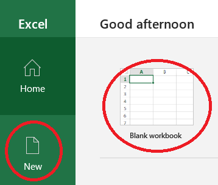

Consuming Data Through API's
============================
This part of the tutorial covers how you might consume data from an API hosted
in Omnia (or elsewhere). You might want this data to include in an application
as part of a visualisation, for furthar analytics and more. As discussed in 
the `expose exercises <expose.rst>`_. API's are the preferred way to expose 
data within Equinor.

There are many possibilities when consuming API's. We cover a number of 
these including Microsoft Excel, Power BI and using python code. You are free 
to try whatever of these options you like.

Prerequisites
-------------

* If you have not completed the API module then you can connect to an already 
  prepared API for this part, as mentioned in the below samples. If you have 
  your own API then just substitute this.
* You can select which of the options you want to try so only need the tools 
  for those parts. More details follow in the different sections.

Using Microsoft Excel
---------------------
Excel is one of the most widely used tools in Equinor and installed by default
on every computer. You can do a lot of things in Excel including connecting to
data sources, and importing and playing around with data in various ways. 

This simple walk through will show you how to connect to the exposed REST API
made in the previous part to fetch production data into a simple table in Excel. 

We do not take it any further, because once the data is in Excel you have tons
of possibilitites for data analysis, massaging, visualization and so on, and 
that part you probably know better than us.

We will do this visually by clicking around in the user interface, but of 
course you can also program this in an Excel module later if you like.

* Open MS Excel 

* Create a new file, an empty workbook

* Add the REST API as a data source.
 
 .. image:: ./images/add_data_source.png

* You should enter the URL of your API created in the previous step.

  Note: If you did not complete the previous part then you may use this that
  of the completed scenario: 
  
  https://edc2019-common.azurewebsites.net/production-data/between-dates?fromYear=2010&toYear=2015&fromMonth=1&toMonth=12

  It will retrieve production data from January to December 2010 to 2015. 

  The entire API is explained here in the `Swagger API definition <https://edc2019-common.azurewebsites.net/swagger/index.html>`_.

* When prompted we will connect anonymously. Other options are provided for 
  connecting with secured services.

* The data has been retrieved now in JSON and are listed as records. 
  Convert them to a table. Use default conversion settings and click OK

* Expand the JSON records to Excel table columns

* Use the default of all columns and click OK

* Convert the data-type for the oil and gas to be of the decimal-type

* Close the data source setup and load data into Excel

There we are, finished. All the data returned from the servcie is now in an
Excel table ready to be played with. 
  
Remember to save your workbook. 

The API data connection is also saved for you to reuse/refresh later. To 
refresh the data use the refresh button under the Data menu. Under the 
Data menu you will also find options for modifying the query and connection
if needed.

Consuming an API from Python
----------------------------

Most programming languages provide easy support for consuming API's and Python
is no exception. We will use the pandas library to collect the json format 
data from our API and matplotlib to create a simple plot of the results.

As in the compute exercise we will use Databricks as our runtime environment, 
although you can run the same code locally if you have python setup, in 
`Azure notebooks <https://notebooks.azure.com/>`_ or any other python 
environment.

* As in the `compute <compute.rst>`_ section create a new notebook within your
  workspace named *consume-from-api*

* In the first cell add the following code to query the API: 

   .. code:: python

      import pandas as pd
     
      # specify the url - swap the below (solution url) with your custom one from the expose exercise.
      api_url = 'https://edc2019-common.azurewebsites.net/production-data/between-dates?fromYear=2010&toYear=2015&fromMonth=1&toMonth=12'
     
      # Call the api and use pandas to convert the returned json into a dataframe
      df_production_data = pd.read_json(api_url)

* Create a new cell with the following code to display a summary of the 
  returned data: 

   .. code:: python

      df_production_data.head(10)

* Attach a cluster to run the notebook as shown below and then chose 
  *Run All*.

  .. image:: ./images/python-attach-cluster.png

  You should see that the notebook is run and data submitted.

* We will now create a plot. First create a transformed dataset to ease with
  plotting by grouping on the columns we want to use on the one axis and then 
  filtering so we only keep the oil column for the value axis.

  We then plot the values.

   .. code:: python

      import matplotlib.pyplot as plt

      fig, ax = plt.subplots(figsize=(12,16))

      df_plot = df_production_data.groupby(['year', 'wellbore']).sum().unstack()['oil']
      df_plot.plot(title ="Yearly Oil Production per Wellbore", ax=ax)
      plt.legend(fontsize="x-small", loc='upper right')

  Note: if running this in Databricks then you need to also add the following line directly after the above to show the plot:

   .. code:: python

      ...
      display(fig)

A completed notebook is provided at https://github.com/equinor/omnia-tutorial/blob/master/exercises/consume/solution/consume-from-api.ipynb.

This notebook can be viewed online in github, run locally, in the cloud or imported directly into DataBricks.

Consuming an API from PowerBI
-----------------------------

To run this part of the tutorial you will need Power BI desktop `installed <https://powerbi.microsoft.com/en-us/downloads/>`__
. Use the advanced download options for direct download to avoid 
installing through Microsoft Store). For this you need elevated installer, 
elevated privileges or developer profile for your laptop. 
Alternatively you need to apply for PowerBI in access-it and download from Equinor Applications.

Getting data into PowerBI is similar as with Excel as both use power query to
import data.

* Open PowerBI 

* From the startup screen, or home tab chose the option *Get data* followed
  by *Other->Web* followed by *Connect*.
  
* You will now be in a set of dialog boxes that mirror those above in the 
  Excel section for importing data that you can follow to have the data 
  available in Power BI.

* To verify the data is loaded you can click the *data view*.

  .. image:: ./images/powerbi-table.png

* Moving back to the *report view* we will add a simple graph.

  * Click on the *line chart* icon under *Visualisations* to add a new line 
    chart.
  * Drag fields across to *Axis*, *Legend* and *Values* as shown below.
  * Change the aggregation of the values to *Sum* from the drop down.

  .. image:: ./images/powerbi-report.png
    :width: 800px

You now have a very basic report completed.

Feel free to play around with other options to improve the display, show other
values or add filtering or other functionality.

Summary
-------

We have shown how to consume an API in several tools. There are however 
several points that we haven't covered in the interest of time:

* *Other tools* - there are many other tools that can also be used.
* *Authorisation & Authentication* - for simplicity this exercise used an 
  open API with no security. In real world scenarios it is highly likely 
  that you will need to ensure API's are secured.
* *Deployment & Sharing* - once you have a solution created that consumes data
  from an API you might want to operationalise and share it somehow.
* *Legal aspects* - if you modify and combine data, you may be changing the 
  security classification and so need to consider possible implications
* *Performance* - There are different query patterns and also a question 
  about what options are best and where to run compute. We might need 
  additional backend infrastructure to improve frontend user performance.

.. note::

    * Content copied from presentation summary
