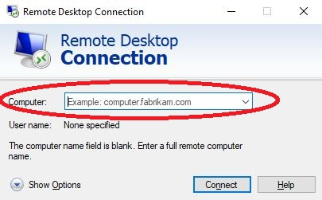

How to connect to Azure Virtual Machine using RDP
=================================================

* Open **Remote Desktop Connection** on your laptop.

Input the IP address you got from the email as remote computer name. Click Connect.

* Login with credentials

**DO NOT** look at your camera if you get to the window above. Click **More choices**.

Choose **Use a different account**. And input the username and password you got in the same email, like below. **You need to add domain name statoil_net in from of the username you got.**

After you hit OK, you will get the prompt window like below:

Click Yes and you will be connected to your virtual machine.

