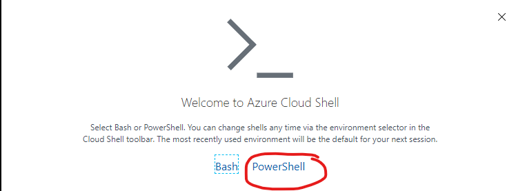
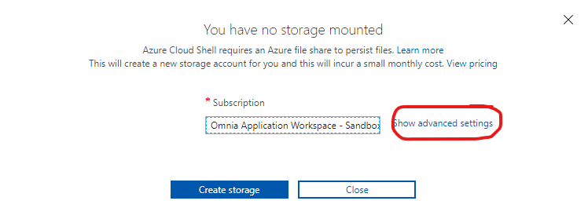
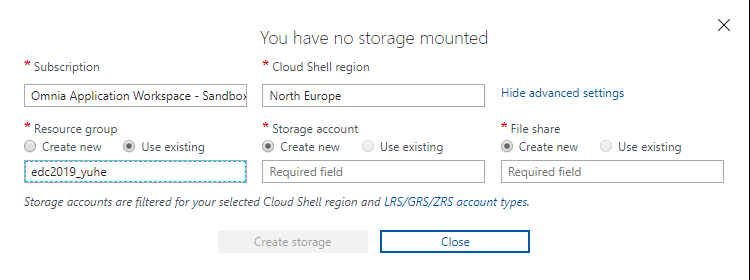

Introduction
============
This part of the tutorial covers how to expose a SQL Server database-table as an API.

This module is quite code-heavy and would typically involve having some toolsets pre-installed, like Visual Studio or Visual Studio Code. 
The exercise will explain how to use these tools, but we also have a variant that uses no-pre installed applications.


Word of warning
---------------

Doing this without the installed tools is cumbersome and inefficient, so...:

.. image:: ./images/dont-panic.jpg

Prerequisites
-------------

This module needs three things:
    - the runtime coding-environment
        - your local machine/laptop
        - virtual machine
        - fully through the portal-experience with Azure CLI
    - the data that the API will expose
        - either your own set of data from the Ingest-module
        - or the pre-defined data in the common shared SQL Server we have provided
    - the app service that will host the API (as mentioned above this has already been provided to you)

Setting up
==========

Database Access
---------------

Make sure that the web api is connected with the database using MSI. This is done by the setup scripts, and should be in place. To check this:
    - Locate the app service in your resource group in the `Azure Portal <https://portal.azure.com>`_  (Hint: search for "edc2019-\<shortname\>-app"
    - In the list on the left under the title `Settings`, click the field called "Identity",
    - Status should be toggled to  "On",
    - If it is "Off", toggle it "On", and press save. This enables the MSI for your app.
    - If it was "Off" contact one of the assistants to get the MSI added to the proper AD-group.

If you are NOT using Visual Studio or Visual Studio Code
--------------------------------------------------------

If you havent used and configured Cloud Shell previously you will need to do that now:
- Azure Storage Account - Choose the powershell-variant


          
- Azure Storage Account - Choose advanced settings



- Use the following settings for advanced setup:
    - Subscription: "Omnia Application Workspace - Sandbox"
    - Cloud Shell region: Noth Europe
    - Resource group: "Use existing" --> edc2019\_\<shortname\>
    - Storage account: "Create new" --> your choice of name, all lowercase and no special characters, e.g. mystorage
    - File share: "Create new" --> your choice of name, all lowercase and no special characters, e.g. myfileshare


   
- For some general information about Azure cloud shell
    - [How to use Azure Cloud Shell](https://docs.microsoft.com/en-us/azure/cloud-shell/quickstart-powershell)
    - [Persist files in Azure Cloud Shell](https://docs.microsoft.com/en-us/azure/cloud-shell/persisting-shell-storage)
    - [How to upload files from local computer](https://docs.microsoft.com/en-us/azure/cloud-shell/using-the-shell-window#upload-and-download-files)

Getting the code
----------------

Locally using Visual Studio Code or Visual Studio 17/19:

- If you don't have Git installed, go to `Git <https://git-scm.com/downloads>`_, and download the appropriate version.
- To verify the installation, open a powershell prompt and type "git", this should display a list of git commands
- With git installed, navigate to a folder where you want to download the git repository, example "C:\Code".
- Run the command "git clone https://github.com/equinor/omnia-tutorial.git"
- If you are prompted with a login, enter your credentials.
-  The multi-factor authentication might mess up the login, to fix this:
    -  Navigate to `GitHub <https://github.com/>`_ and login in
    - Find the account meny on the top right
    - Go to "settings"
    - Go to "Developer Settings"
    - Go to "Personal access tokens" and press "Generate new token" on the right.
    - Select the "repo" permissions
    - When the token has been generated it will display as a long string of character, something like "c26abfb14015d35c19fb4f2b0ba529de2b4f48fa", copy this to a text document.
    - Go back to the powershell prompt from earlier, and re-run the command "git clone https://github.com/equinor/omnia-tutorial.git"
    - Enter your username
    - Copy and paste in the token string instead of you password, this should start the download.

In the Azure CLI using VSCode:

- Open up a cloud shell prompt `here <https://shell.azure.com/>`__
- Run the command "cd", this should move you to the "/$home/\<shortname\>" folder
- Run the command "git clone https://github.com/equinor/omnia-tutorial.git"
- If you are prompted with a login, enter your credentials.
- The multi-factor authentication might mess up the login, to fix this:
    -  Navigate to `GitHub <https://github.com/>`_ and login in
    - Find the account meny on the top right
    - Go to "settings"
    - Go to "Developer Settings"
    - Go to "Personal access tokens" and press "Generate new token" on the right.
    - Select the "repo" permissions
    - When the token has been generated it will display as a long string of character, something like "c26abfb14015d35c19fb4f2b0ba529de2b4f48fa", copy this to a text document.
    - Go back to the powershell prompt from earlier, and re-run the command "git clone https://github.com/equinor/omnia-tutorial.git"
    - Enter your username
    - Copy and paste in the token string instead of you password, this should start the download.

Opening up the project
----------------------

Using Visual Studio 17/19:
    - Navigate to the folder where you cloned down the github repository, navigate to the folder "omnia-tutorial\exercises\expose\starter\EDC-API"
    - Double click on "EDC-API-skeleton.sln"
    - If you are prompted to select program to open the file with, select Visual Studio 17/19.
    - This should open a Visual Studio 17/19 window
    - On one of the sides, there should be a "Solution Explorer" containing all the files in the project
    - If the "Solution Explorer" isn't there, press "Ctrl-Alt-L" and it should appear. If not, navigate to "View" in the top and select "Solution Explorer".
Using Visual Studio Code:
    - Open up Visual Studio Code
    - Click "File" in the top left, and select "Open Folder"
    - Navigate to "omnia-tutorial\exercises\expose\" and select the folder "starter" and click "Select Folder"
    - This should open the file structure in the "Explorer" on the left, if not open it by pressing `Ctrl-Shift-E`, or press the icon in the top left.
Using VSCode in Azure CLI:
    - In the cloud shell prompt. navigate to the folder "/home/\<shortname\>/\<yourfolder\>/omnia-tutorial/exercises/expose/starter/EDC-API"
    - Enter "code EDC-API-skeleton"
    - This should open a VSCode view with the correct folder open

Connecting to the data
----------------------
As previously mentioned we have two scenarios
    - you completed the Ingest-module and therefore have personal SQL Server with the required data
    - or you did not...

**IF YOU HAVE COMPLETED THE PREVIOUS TASKS AND WANT TO USE YOUR OWN DATA SOURCE:**

- Given that you have opened the solution, described in the previous step, open the file called `appsettings.json`
- Update the `ConnectionString` in `appsettings.json` with the connection string for your database. 
- The connection string is on the following format: 
    - `Server=tcp:<database url>,1433;Initial Catalog=<database name>;Persist Security Info=False;MultipleActiveResultSets=False;Encrypt=True;TrustServerCertificate=False;`
    - Example:
    - `Server=tcp:edc-api-track.database.windows.net,1433;Initial Catalog=common;Persist Security Info=False;MultipleActiveResultSets=False;Encrypt=True;TrustServerCertificate=False;`
    - To find the URL, navigate to your resouce group in the `Azure Portal <portal.azure.com>`__, open up your `SQL database`. The URL should be located in the top right under `Server name`.
    
    .. note:: 
       The connection string does NOT contain any username/password, this is handled by the MSI.

- Then we have to grant the MSI access in the database:
- Navigate to your resouce group in the `Azure Portal <portal.azure.com>`__ and locate your `SQL database`.
- In the list on the left, navigate to `Query editor (preview)`, and connect using `Active Directory authentication`. *(The login might fail, retry it a few times before contacting one of us)*.
- This should open a query editor, enter the following commands, **updated with your values**: 
    - `CREATE USER [<app name>] FROM  EXTERNAL PROVIDER  WITH DEFAULT_SCHEMA=[dbo]`
    - `GRANT SELECT, INSERT, UPDATE, DELETE ON SCHEMA :: [dbo] TO [<app name>]`
        

**IF YOU HAVE NOT COMPLETED THE PREVIOUS TASKS AND WANT TO USE OUR DATA SOURCE:**

- Given that you have opened the solution, described in the previous step, open the file called "appsettings.json"
- Update the `ConnectionString` in `appsettings.json` with the connection string for our database. The connection string is on the following format: 
    - "`Server=tcp:edc2019-sql.database.windows.net,1433;Initial Catalog=common;Persist Security Info=False;MultipleActiveResultSets=False;Encrypt=True;TrustServerCertificate=False;`"
    - If you don't get access, please contact one of us.

    .. note:: 
       We only give read access to our database. All endpoints with creates/updates/deletes will then fail, but the logic should still be in place. This is to ensure that someone doesn't break the database for all the rest.

Implementing the code-changes
-----------------------------

We have configured `Entity Framework Core <https://docs.microsoft.com/en-us/ef/core/>`_ for the project. EF is a Object-relational mapper that converts between objects in the code, and tables in the database. This allows us to access data without writing SQL statements. We have configured the project such that the database can be accesses through the `CommonDbContext` class. This class is already injected into both controllers.

Examples:

- Retrieving all production data entries: 
    `var productionDatas = _context.ProductionData.Tolist()`
- Adding new entry: 
    `_context.ProductionData.Add(new ProductionData {})`
- Updating existing entry: 
    `_context.ProductionData.Update(productionDataObject)`
- Retrieving a single entry based on some criteria: 
    `var productionData = _context.ProductionData.FirstOrDefault( pd => pd.Wellbore == "Some wellbore")`
- Retrieving a list of entries matching some criteria: 
    `var productionDatasList = _context.ProductionData.Where( pd => pd.Wellbore == "Some wellbore").ToList()`
    
We have preconfigured Swashbuckle in the project, giving access to a documentation page. If you want to test your API, simply run the API locally.
    - In Visual Studio 17/19, simply hit `F5` and the page should be available at `https://localhost:44373/swagger`. If the window doesn't appear, find the base URL in the Visual studio `Output` window, and add `/swagger`.
    - In Visual Studio Code, use `dotnet build` to build your solution, and `dotnet run` to start the API. The default URL is typically `localhost:5001`, and the page should be available at `localhost:5001/swagger`.

.. note:: 
   If you at any point in the code feel stuck, it is allowed to look at the reference implementation in "omnia-tutorial\exercises\expose\solution\EDC-API".

**1. ProductionDatasController**
''''''''''''''''''''''''''''''''

In the solution explorer, under the folder `Controllers` you should find the `ProductionDatasController`. This controller should implement the most common functionality for any API; Create, Read, Update, and Delete (CRUD). Typically CRUD is implemented on a per-table/view basis.

Since we are in the web API domain, all results from the API has to be associated with a HTTP response. This means, we never return a list of objects directly, return a `200 Ok` response that contains the list of objects.

> Example:
> C#
> var entries = _context.ProductionData.ToList();
> return Ok(entries);

`ASP.NET Core <https://docs.microsoft.com/en-us/aspnet/core/?view=aspnetcore-2.2>`_ natively supports: `Ok()`, `BadRequest()`, `NotFound()`, `Unauthorized`, `Forbid()`, `NoContent()`, and many more.


**1.1 Read**
............

Implement the controller methods:
- `GetProductionData()`
    - Should return a list containing the entire `ProductionData` table.
- `GetProductionData(int id)`
    - Should return a single entry in the `ProductionData` table, correpsonding to the ID.
    - *NB: Appropriately handle non-existing entry.*

**1.2 Create**
..............

Implement the controller method `PostProductionData(ProductionDataRequest request)`
- Take `ProductionDataRequest` object and create a new `ProductionData` object
- Insert the new `ProductionData` object in the table.
- *NB: Can't create an existing entry.*

**1.3 Update**
..............

Implemented the controller method `PutProductionData(int id, ProductionData productionData)`
- Update an entry in the database using the `Update` functionality of Entity Framework
- *NB: Make sure to handle concurrent updates.*

**1.4 Delete**
..............

Implement the controller method `DeleteProductionData(int id)`
- Delete an entry in the database based on its' ID
- Should return the deleted entry
- *NB: Can't delete an entry that doesn't exist.*

**2. AggregatesController**
'''''''''''''''''''''''''''

All these methods calculate properties for all the wellbores.

**2.1 Calculate sum of Oil & Gas between 2 dates**
..................................................

Implemented the controller methods:
- `GetOilBetweenDates(int? fromYear, int? toYear, int? fromMonth, int? toMonth)`
    - Takes in 2 dates, as a year-month pair, and calculates the total amount of Oil production in the interval sorted by wellbores.
    - Should return a list of wellbores and their total amount of Oil
- `GetGasBetweenDates(int? fromYear, int? toYear, int? fromMonth, int? toMonth)`
    - Takes in 2 dates, as a year-month pair, and calculates the total amount of Gas production in the interval.
    - Should return a list of wellbores and their total amount of Gas

> Be sure to preprocess the input properly

**2.2 Calculate average Oil and Gas between 2 dates**
.....................................................

Implemented the controller methods:
- `GetOilAvgBetweenDates(int? fromYear, int? toYear, int? fromMonth, int? toMonth)`
    - Takes in 2 dates, as a year-month pair, and calculates the average amount of Oil production in the interval sorted by wellbores.
    - Should return a list of wellbores and their average amount of Oil
- `GetGasAvgBetweenDates(int? fromYear, int? toYear, int? fromMonth, int? toMonth)`
    - Takes in 2 dates, as a year-month pair, and calculates the average amount of Gas production in the interval.
    - Should return a list of wellbores and their average amount of Gas

> Be sure to preprocess the input properly


**2.3 Find the number of wellbore records between 2 dates**
...........................................................

Implement the method `GetWellboreRecordsBetweenDates(int? fromYear, int? toYear, int? fromMonth, int? toMonth)`:
- Should return a list of wellbores and the amount of records each wellbore has for the given period.

> Be sure to preprocess the input properly

**3. Moving to Azure**
''''''''''''''''''''''

In a traditional setup deployments to Azure should be done using some DevOps tools, like Azure DevOps. However, for the sake of brevity we will publish the code directly.

`Visual Studio <https://docs.microsoft.com/en-us/dotnet/azure/dotnet-quickstart-vs?view=azure-dotnet#deploying-the-application-as-an-azure-web-app>`__
......................................................................................................................................................
- Right click the api project in the solution explorer
- Select `Publish..`
- Select `App Service` and then check of `Select Existing` and hit `Publish`
- Give the app a logical name
- Select the subscription `Omnia Application Workspace - Sandbox` and `edc2019_<shortname>`
- Select the app service `edc2019-<shortname>app` and hit `Ok`

After a while a new window will open with the API

`Visual Studio Code <https://docs.microsoft.com/en-us/aspnet/core/tutorials/publish-to-azure-webapp-using-vscode?view=aspnetcore-2.2#generate-the-deployment-package-locally>`__
................................................................................................................................................................................

- Install the `Azure App Service` extension
- Open Visual Studio Code terminal
- Use the following command to generate a Release package to a sub folder called publish:
    - `dotnet publish -c Release -o ./publish`
- A new publish folder will be created under the project structure
- Right click the `publish` folder and select `Deploy to Web App...`, this might prompt for login
- Select the subscription the existing Web App resides
- Select the Web App from the list
- Visual Studio Code will ask you if you want to overwrite the existing content. Click `Deploy` to confirm

VSCode in Azure CLI
...................

- Run the command `Set-AzContext "Omnia Application Workspace - Sandbox"` 
- Navigate to the folder with the with the solution.
    - Typically `/home/<your-name>/code/omnia-tutorial/src/Api/EDC-API-skeleton`
- Run `dotnet publish -c Release`, this creates the project in the `publish` folder.
    - Typically `/home/<your-name>/code/omnia-tutorial/src/Api/EDC-API-skeleton/EDC-API/bin/Release/netcoreapp2.2/publish/`
- Create .zip file of the project:
    - Create a reference to the publish folder: `$publishFolder = "<path-to-folder>"`, this is the same folder from the last step.
    - Create variable in the CLI: `$publishZip = "publish.zip"`
    - Create the zip: 

      ```ps1
      if(Test-path $publishZip) {Remove-item $publishZip}
      Add-Type -assembly "system.io.compression.filesystem"
      [io.compression.zipfile]::CreateFromDirectory($publishFolder, $publishZip)
      ```
    - Run the following block to deploy the zip file:
    ```ps1
    Publish-AzWebapp -ResourceGroupName "edc2019_<your-shortname>" -Name "edc2019-<your-shortname>-app" -ArchivePath $publishZip
    ```
- The deployment might take a few seconds
- It should produce output like the table below if the deployment was successful:

=========================== ========    ======================== ====================================================== =============
Name                        State       ResourceGroup            EnabledHostNames                                       Location 
=========================== ========    ======================== ====================================================== =============
edc2019-"your-shortname"app Running     edc2019_"your-shortname" {"edc2019-"your-hortname"app.azurewebsites.net", ...   North Europe 
=========================== ========    ======================== ====================================================== =============

- Navigate to `edc2019-'your-hortname'app.azurewebsites.net/swagger/index.html` to verify that the API is running as it should.

**4. Open API Specification**

As mentioned earlier, we have enabled [Swashbuckle](https://github.com/domaindrivendev/Swashbuckle.AspNetCore) for the project. Swashbuckle is a open-source framework that auto generates a Open API Specification file based on the source code.

Open API Specification comes in various versions, with version 2.0 being popularised under the name `Swagger`. The newest verion of OAP is 3.0, and it is quickly catching up with `Swagger`.

A API specification file has some interesting use-cases;
- There are various tools for various programming languages that can auto-generate a client library based on a spec file.
- It can supplement API documentation, making the API easier to understand.
- It can be used to publish an API in Azure API Management (APIM).

**5. Azure API Management**

In order to get an API exposed on the api.equinor.com domain, the API has to be published in Equinors Azure API Management instance. There are many reasons why you maybe want to do this;
- Sharing APIs with both internal and external partners in a good manner
- Connectivity between On-prem and cloud solutions are easier with APIM


API Management have various ways of publishing an API, however, it has been decided that publishing should be done using Open API Specification files. This is simply because generating a OpenAPI specification is relatively easy, and importing and publishing such a file in APIM is trivial.

What we Didn't Cover
--------------------

In the interest of time and simplicity, the following points have been omitted from this tutorial although should / must be considered when building production ready solutions:

* Authorisation & Authentication
* Deployment & Sharing
* Legal aspects
* Performance
* Sharing
* Data Catalog

.. note::

    * Content copied from presentation summary
