Introduction
============
This tutorial covers the following steps:

* Create an Azure Data Factory Pipeline to Copy data from an HTTP endpoint 
  (NPD) into Data Lake Storage Gen2
* Using Storage Explorer
* Create an Azure SQL Server, 
* Create an Azure SQL Database.
* Create an Azure Data Factory Pipeline to Copy data from Data Lake to SQL 
  Database

Prerequisites
-------------

* Access to Azure
* Tutorial onboarding completed

Information about the Data
--------------------------

We will use public data available from NPD. From the following page you can browse all NPD data: 

http://factpages.npd.no/factpages/

For this exercise we will use the downloadable production csv file from :

http://factpages.npd.no/ReportServer?/FactPages/TableView/field_production_monthly&rs:Command=Render&rc:Toolbar=false&rc:Parameters=f&rs:Format=CSV&Top100=false&IpAddress=143.97.2.35&CultureCode=en

Getting started
---------------

A Data Factory resource has been pre created for you to use. To access this you need to locate the data factory resource in the Azure portal

* Log into http://portal.azure.com 
* Locate the data factory in your resource group either using search (e.g. 
  *edc2019* or *<short name>*) or browsing *all resources*
* In the Overview section of the Data Factory resource, click 
  *Author & Monitor* to open the Data Factory editor.

Data Factory
------------

A data factory has a few concepts that it is useful to be aware of. You will typically create *pipelines* which provide a logical grouping of activities that together perform a task. The activities in a pipeline define actions to perform on your data such as copying or transformation.

*Linked services* provide reusable connections to different data sources. Linked services are much like connection strings, which define the connection information needed for Data Factory to connect to external resources.

A *dataset* is a named view of data that simply points or references the data you want to use in your activities as inputs and outputs. Datasets identify data within different data stores, such as tables, files, folders, and documents.

*Linked services* can be setup as *sources* or *sinks* from where you gather or send data respectively. 

More information is available at: Reference Azure Data factory documentation: https://docs.microsoft.com/en-us/azure/data-factory/

Ingest into Azure Data Lake Storage Gen2
----------------------------------------

With your Data Factory open you should see a *get started* page.

There are different ways to setup a pipeline including from scratch, from existing templates, and the *Copy Data* wizard. In this exercise we will setup from scratch, so select the *Create pipeline* button to launch the Author tool:

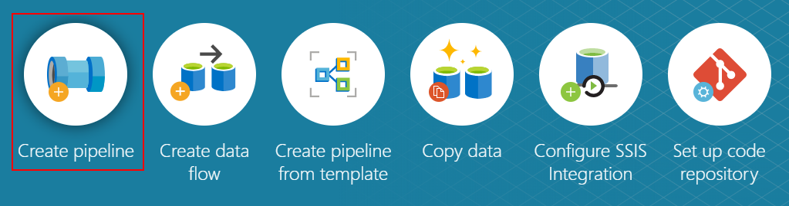

In the Activities toolbox, expand Move & Transform. Drag the Copy Data activity from the Activities toolbox to the pipeline designer surface. You can also search for activities in the Activities toolbox. 

Give the activity a meaningful name such as *Copy_NPD_Data*.

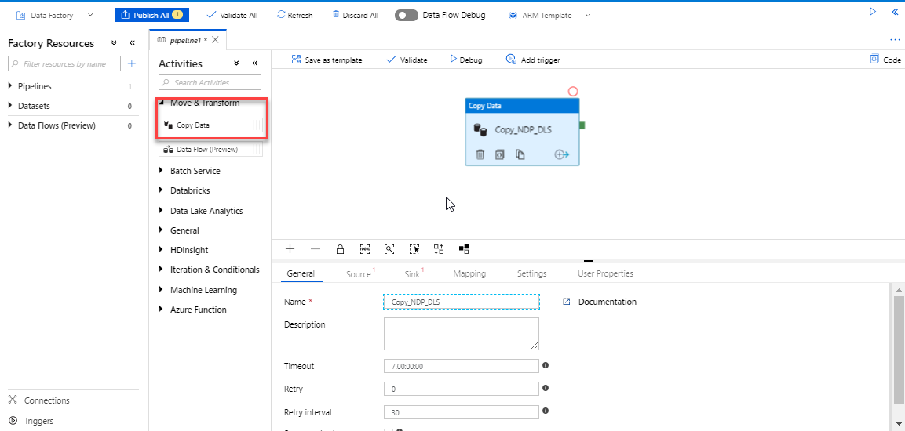

To setup where the *Copy Data* activity will fetch data from, switch to the *Source* tab in the *settings*, and select new dataset

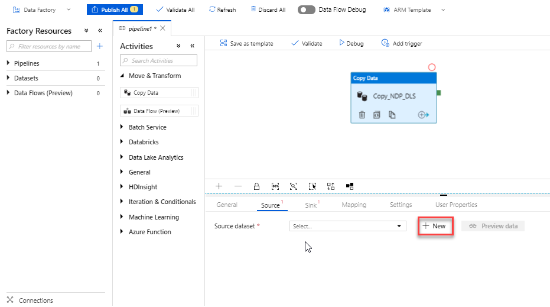

Browse, or search and select the HTTP type.

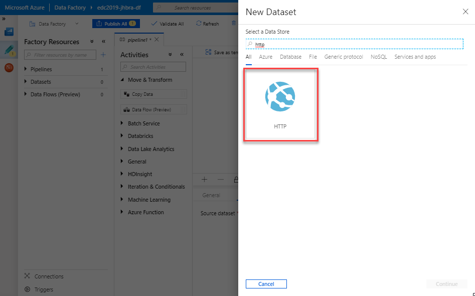

Even though the source is a CSV file (DelimitedText), we will just do a straight copy of the file so select the *Binary* option.

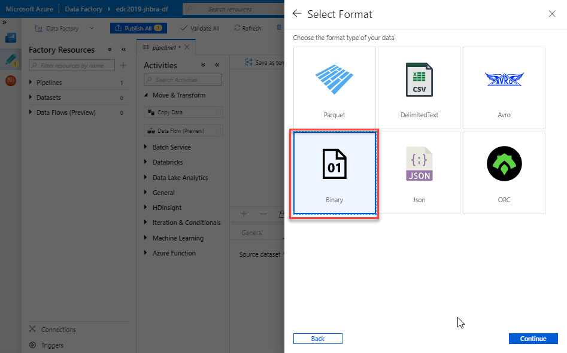

TODO: Verify naming best practices with DE team for data sets, sources and sinks!

In the source dataset *Set Properties* window that pops up use the name FieldProductionMonthly_NPD and from the *Linked service* dropdown select new to create a new linked service to link to the NDP Factpages website.

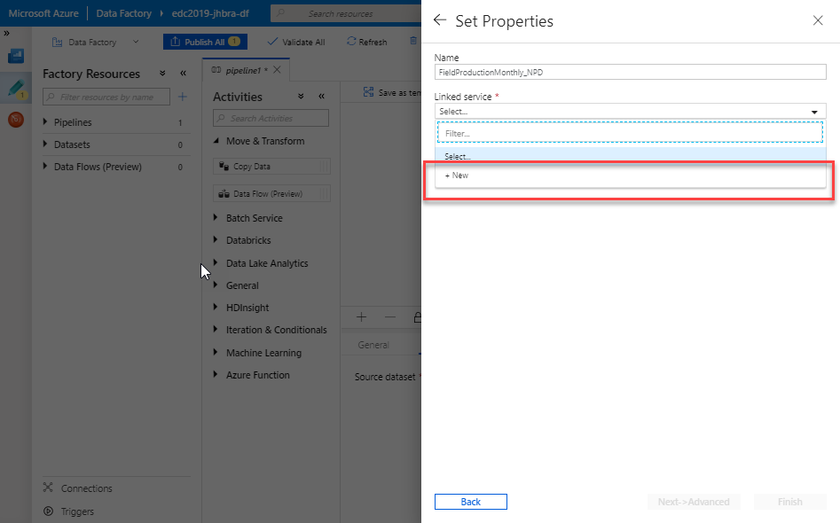

Use the following values when configuring the linked service:

* Name: *NPD FactPages*
* Base URL: *http://factpages.npd.no*
* Authentication type: *Anonymous*

And click *Finish* to create it.

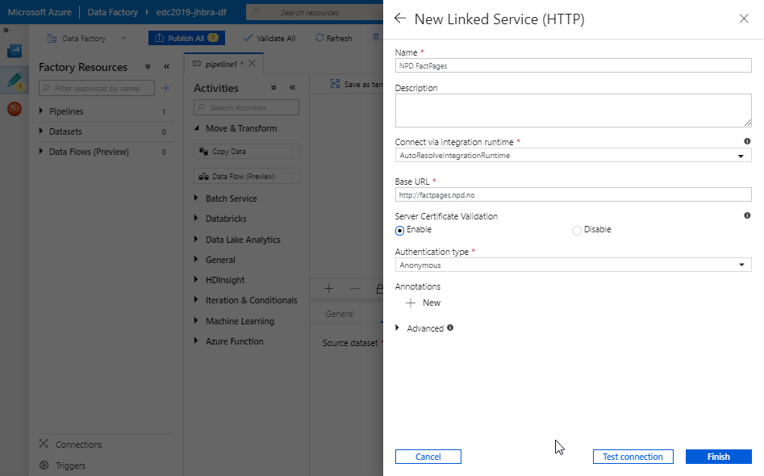

To finish setting up the source, add the *Relative URL* below that targets the production report we want to download then click *Finish*

ReportServer?/FactPages/TableView/field_production_monthly&rs:Command=Render&rc:Toolbar=false&rc:Parameters=f&rs:Format=CSV&Top100=false&IpAddress=143.97.2.35&CultureCode=en

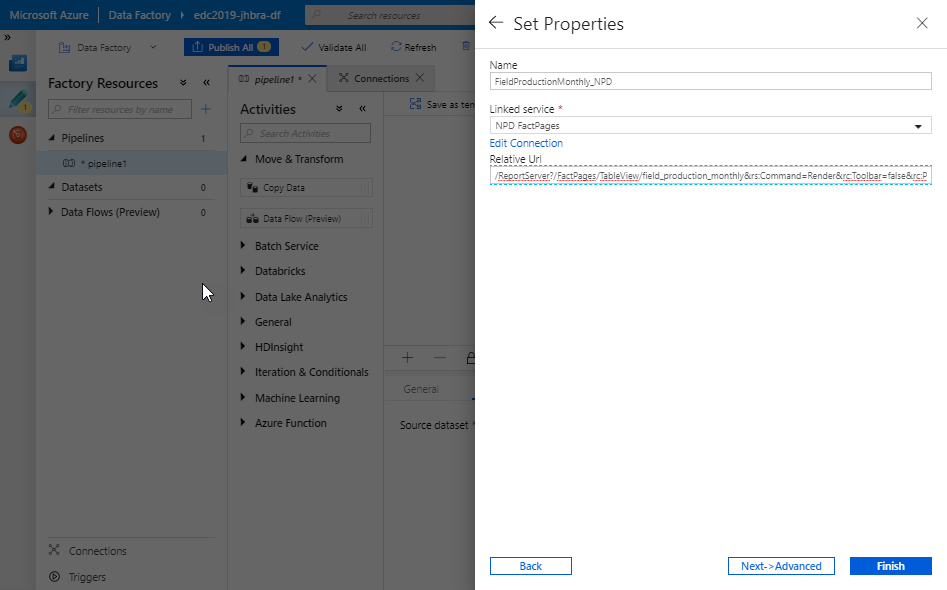

Similarly we need to setup the output or *sink* of the Copy Data activity. Switch to the *Sink* tab in the *Copy Data* activities settings, and select *New* to create a new Dataset

Browse, or search and select the Azure Data Lake Storage Gen2 type.

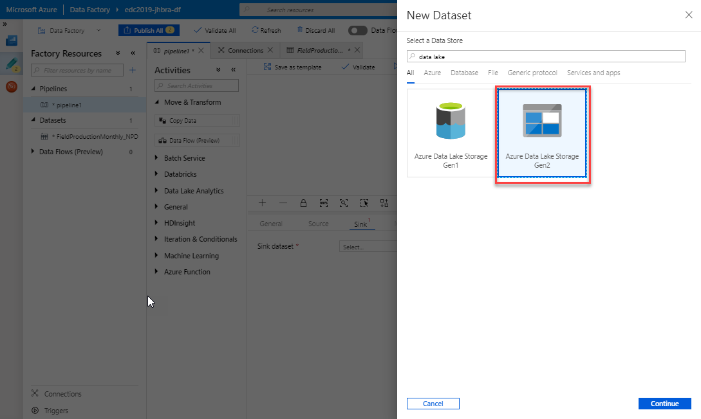

Again as we will do a straight copy, select the *Binary* option.

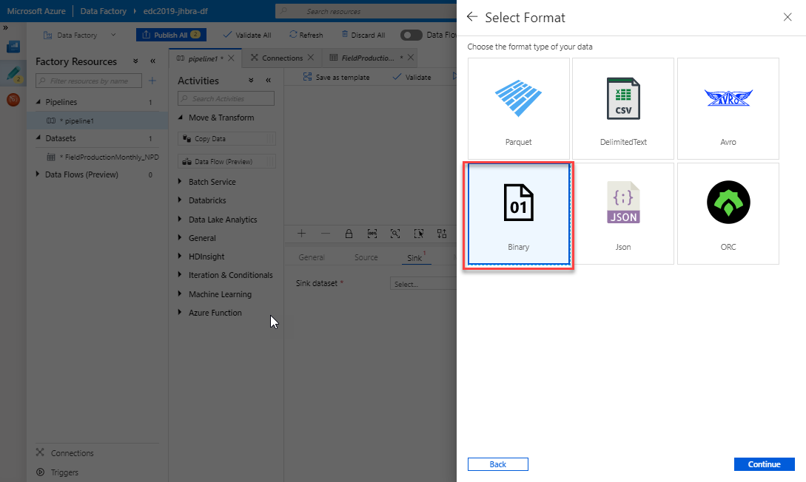

In the sink dataset *Set Properties* window that pops up use the name FieldProductionMonthly_DLS and from the *Linked service* dropdown select new to create a new linked service to link to link to the Data Lake Store with the following properties:

* Name: *EDC2019CommonDLS*
* Authentication method: *Managed identity*
* Account selection method: *As per the image below*

Test the connection and click *Finish* to create the new lined service.

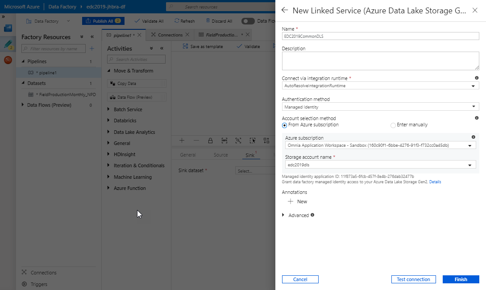

Back in the sink dataset *Set Properties* window, set the relative file path for your destination file in the Data Lake Store. We have created user specific folders so this path will have 3 parts:

1. Container - *dls*
2. Directory - *user/<shortname>* (replace <shortname> with your shortname)
3. File - *field_production_monthly.csv*

You can also use the browse button to fill *Container* and *Directory*, but must enter *File** manually as this won't exist from before.

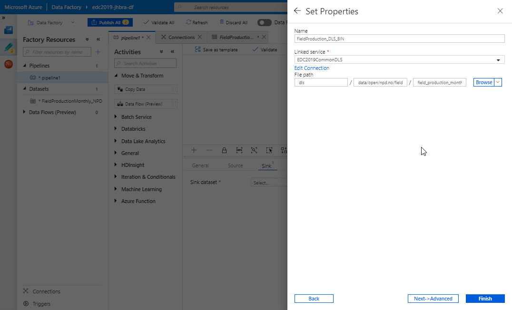

Click *Finish* to set the properties and you now have a basic pipeline ready. Do a test-run of your newly created pipeline

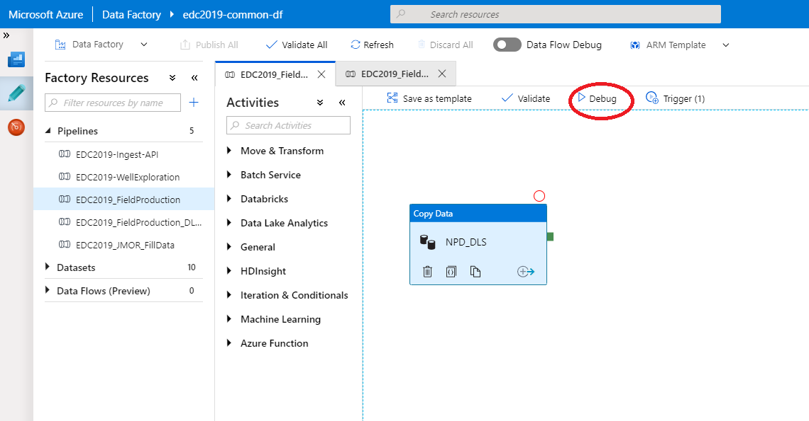

Check status of the run and you should see after a short while it changes to *Succeeded*.

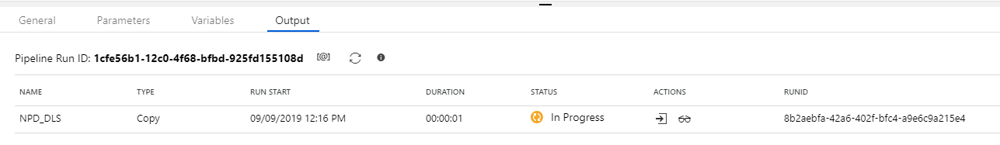

As a final step we will save our changes by clicking *Publish All*. This TODO: What does this do?

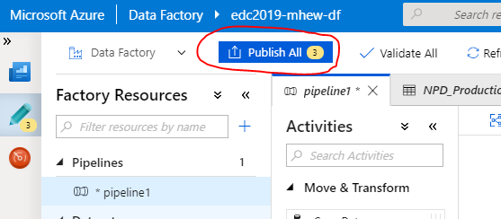

Verify the Ingested File in dls
-------------------------------

The Data Lake Store we copied to is a seperate (shared) resource that has been pre created. We can access this resource to view the uploaded file.

There are many ways to access files in Data Lake store including through code, using command line tools, through the Azure Portal and more.

To browse through the Azure portal, you first need to find the Data Lake resource similar to as we did previously to locate the Data Factory. This is called *edc2019dls* (hint: use search).

With the Data Lake Store selected, you can use the *Storage Explorer* link to browse the file structure.

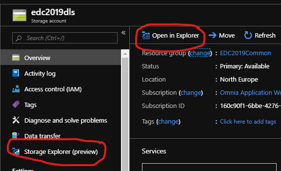

The web based "Storage Explorer (Preview)" provides a built in explorer within the Azure Portal. You can browse to teh target folder you used above to verify your file has been created. Double clicking on the actual file will download it to your computer, from here you can view the file in your favorite csv-application.

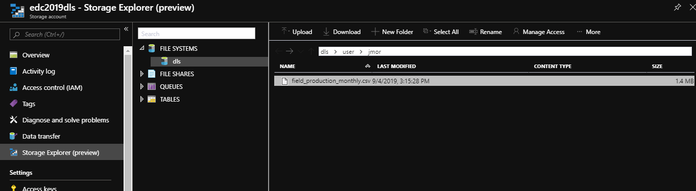

If you work with Azure you may want to install the [Azure Storage Explorer](https://azure.microsoft.com/en-us/features/storage-explorer/) that is a cross-platform (windows, linux and macOS) client to connect to and work with Azure Storage Accounts.

Ingest from Azure Datalake Store into Azure SQL Database
--------------------------------------------------------

In this step, you will first create an Azure SQL Server and Azure SQL 
Database. Azure SQL Server gives a runtime environment and Azure SQL 
Database gives database instances within this. 

Back in the Azure Portal, select *All services* from the left menu, then 
type Azure SQL in the search box. 

(Optional) Select the star next to Azure SQL to favorite it and add it as 
an item in the left-hand navigation for quick access.

Click on the *Azure SQL* service in the results list. This will show a list
of Azure SQL resources. We will add a new one so click *+ Add* to open
the Select SQL deployment option page. 

You are presented with different options of what you can create. For
additional information about the different services selecting the 
corresponding *Show details* button.

We will use a serverless option so select *SQL Databases* and 
*Create* with the default *Single Database* option selected.

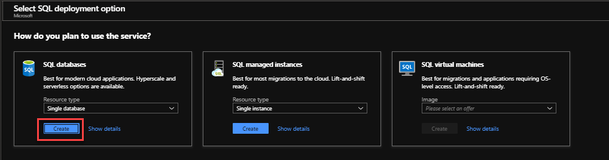

Enter the database configuration details, ensuring the following:

* Check that the subscription is *Omnia Application Workspace - Sandbox*
  and select your own resource group edc2019_<shortname>
* Enter database name as *Common*
* Click *Create new* under the *Select a server* option. 

  * Provide a uniqe Server name using consistent naming e.g. 
    edc2019-<shortname>
  * Enter a custom password under the create server dialog as shown below. 
  * Location should be *North Europe*
  * Be sure to check the box *Allow Azure services to access server* so that
    Datafactory (and other services) can access the database.
  * Click *OK*

* Under *Compute & Storage* select *Configure database* and chose the *Basic*
  option as we only have minimal requirements performance wise. 

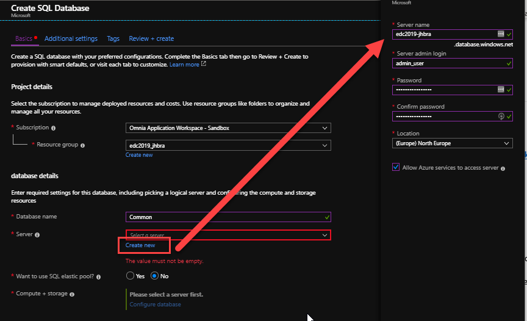

Click *Review + create* to create the database followed by *Create* after you 
have reviewed the settings.

Once the database is created locate / search to find the created SQL Server 
(not the SQL database within it) so we can add Firewall details to access 
any databases remotely. In the SQL Server links select the *Firewalls and
virtual networks* link to modify the firewall

As we will copy data by using the Azure Data Factory integration runtime, 
we need to ensure the Azure SQL Server firewall is open so that Azure 
services can access the server. This is done by ensuring the *Allow access
to Azure services* option is set to *ON*.

We will open for other needed addresses too as shown in the image below.
For access from the Equinor internal network the IP address 143.97.2.35 
should be added.

Save your changes.

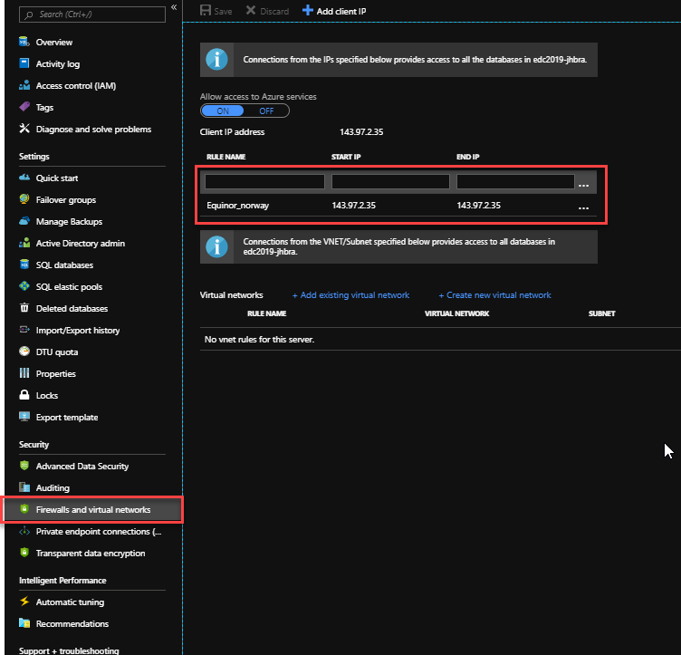

To enable single sign-on for login simplicity when working with the database,
go to the SQL Server *Active Directory admin* link, and add your @equinor 
user as admin. This will simplify access to the database.

Be sure to click *Save*.

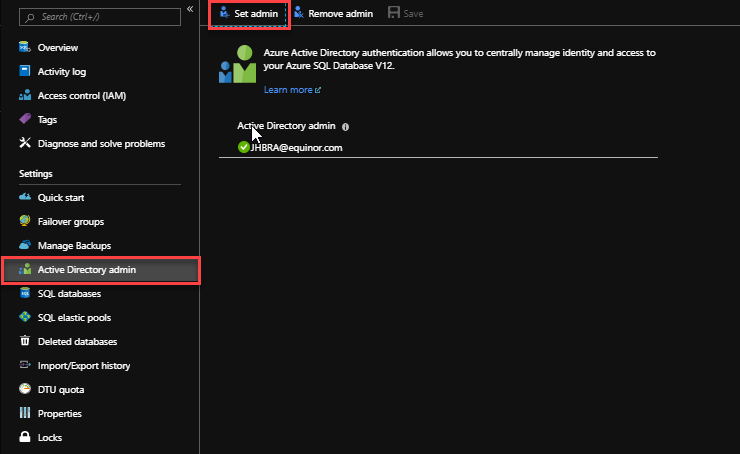

Go to the SQL Database resource itself and select the Query Editor link.

Create a table and user by entering and running the below SQL in the query
editor. Be sure to swap out *NameOfDatafactory* in the SQL code below with 
the actual name of your data factory e.g. edc2019-<shortname>-df

.. code-block:: sql

    CREATE TABLE [dbo].[ProductionData](
        [Wellbore] [varchar](50) NOT NULL,
        [Year] [int] NOT NULL,
        [Month] [int] NOT NULL,
        [Oil] [decimal](15, 5) NOT NULL,
        [Gas] [decimal](15, 5) NOT NULL,
        [Id] [int] IDENTITY(1,1) NOT NULL
    ) ON [PRIMARY]
    GO

    CREATE USER [NameOfDatafactory] FROM EXTERNAL PROVIDER
    GRANT SELECT, INSERT, UPDATE, DELETE, EXECUTE, ALTER ON schema::dbo TO [NameOfDatafactory]

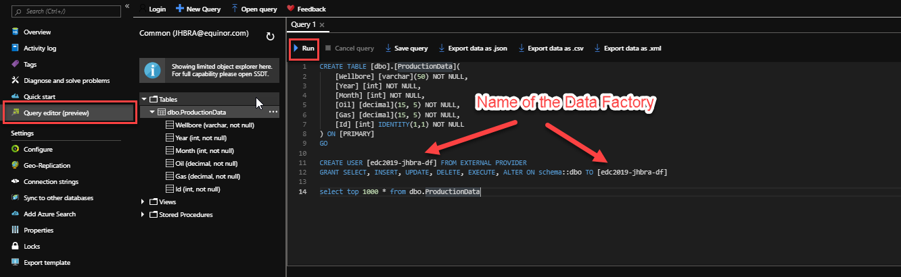

Copy data from Azure Datalake Store to Azure SQL Database
---------------------------------------------------------

Go back to DataFactory.

Create a new pipeline that we will use to copy data from Azure Datalake Store to Azure SQL Database

In the Activities toolbox, expand Move & Transform. Drag the Copy Data activity from the Activities toolbox to the pipeline designer surface. You can also search for activities in the Activities toolbox.

Switch to the Source tab in the copy activity settings, and select new dataset. 

This time we will copy from the Datalake, but using DelimitedText so we can write to the different database columns. We will also reuse the *EDC2019CommonDLS* linked service that we created earlier.

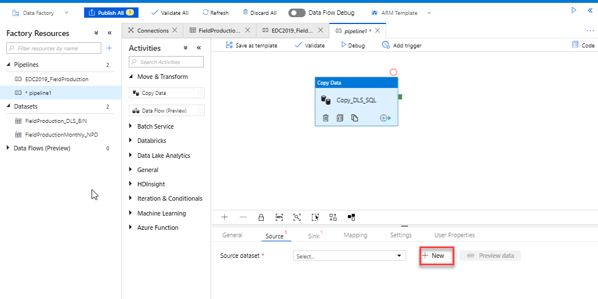

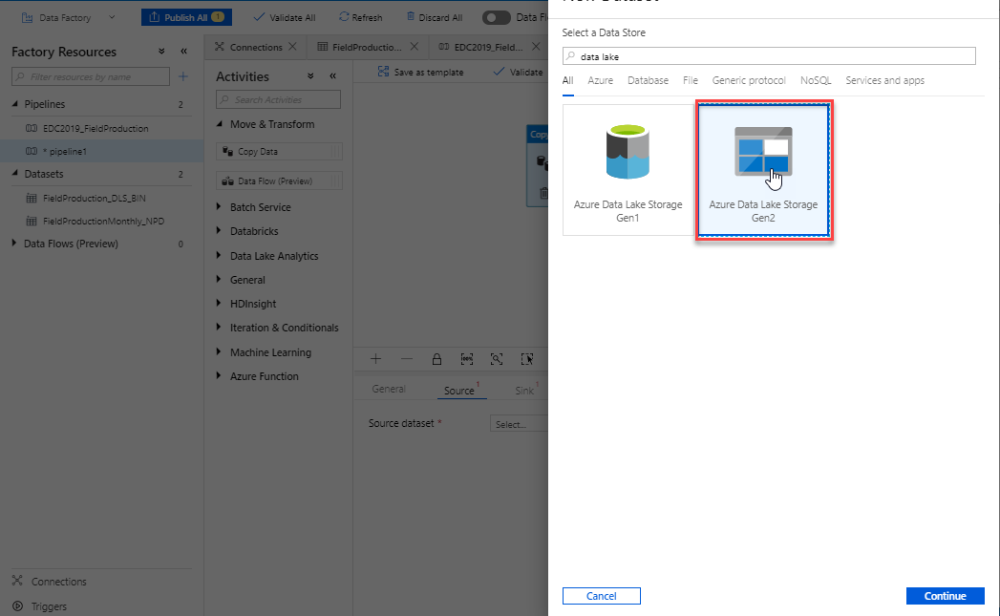
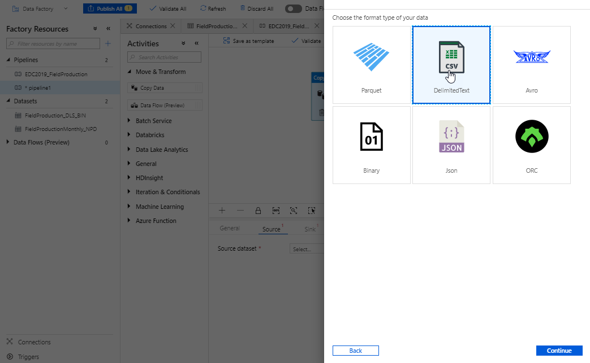

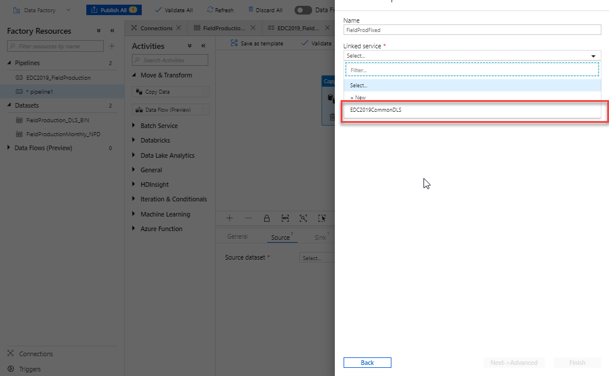

Add the file path to the Datalake store. Be sure also to select the option *First Row as Header*.

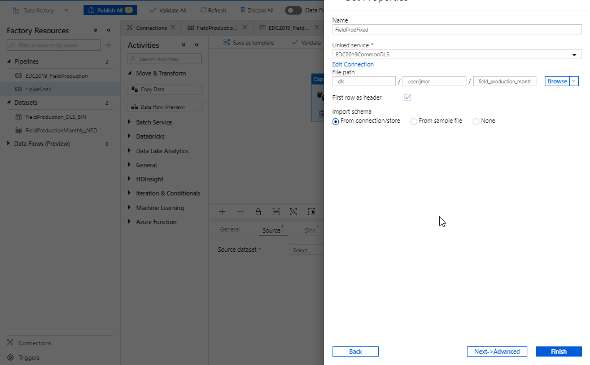

Switch to the Sink tab in the copy activity settings, and select new dataset 
then *Azure SQL Database*.

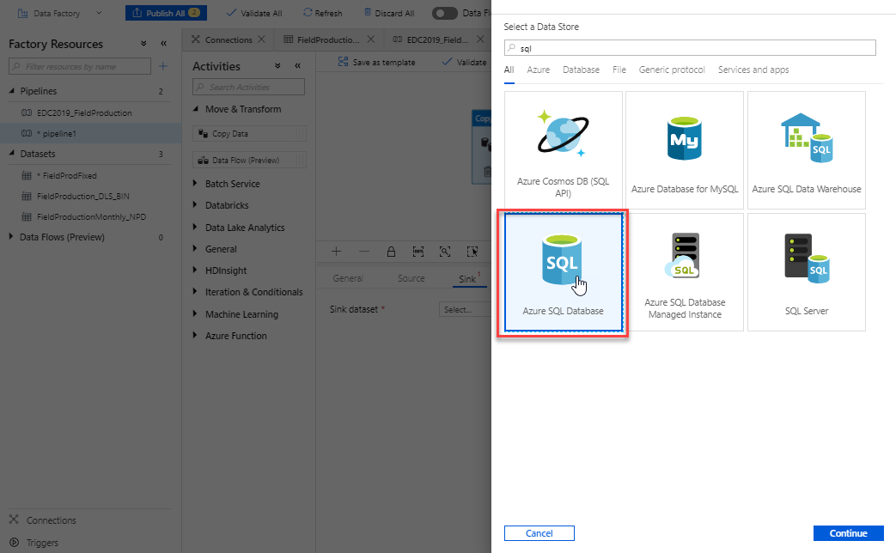

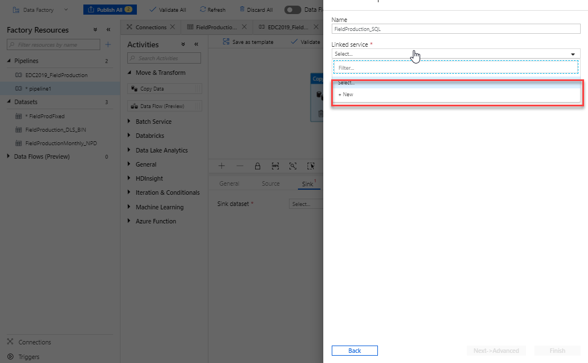

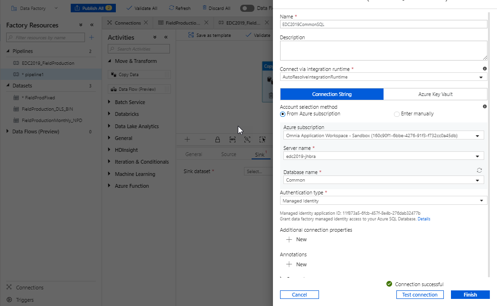

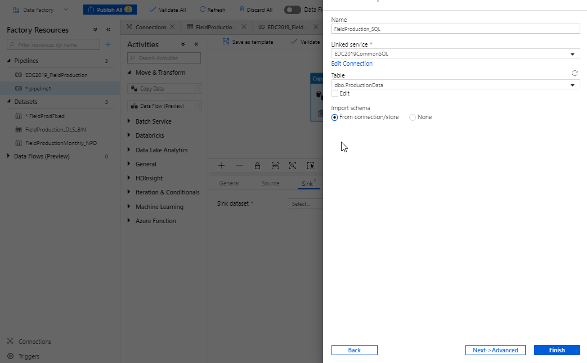

Swith to the Mapping tab, and click Import Schemas

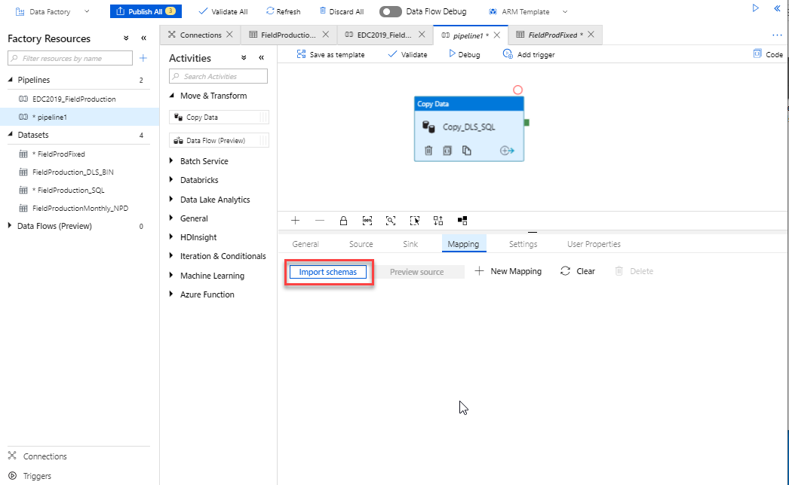

Map the columns as shown below and then remove the mapping to the ID column. 
This is an Idenntity column in the database.

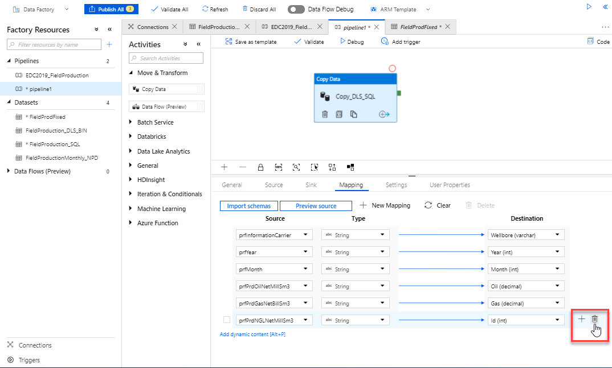

When you download the CSV file from NPD, the file contains a new line in the 
end of the file. The Datafactory will handle this as a record and give an 
error. To ignore this error, add "Skip incompatible rows"

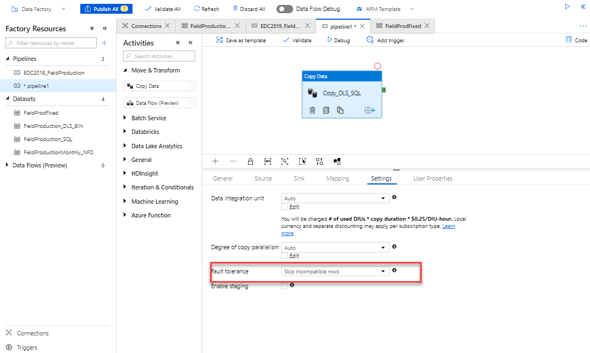

Trigger the pipeline using the *Debug* button. 

You can verify the output by going back to the database query editor and running the following SQL to see if data has been loaded into our table.

.. code-block:: sql

    SELECT * FROM [dbo].[ProductionData]

Summary
-------

We have shown how to copy data using Data Bricks and create certain 
infrastruvture. There are however several points that we haven't covered in 
the interest of time:

* Automation and DevOps
* Monitoring
* Triggering & Scheduling Jobs

.. note::

    * Content copied from presentation summary
