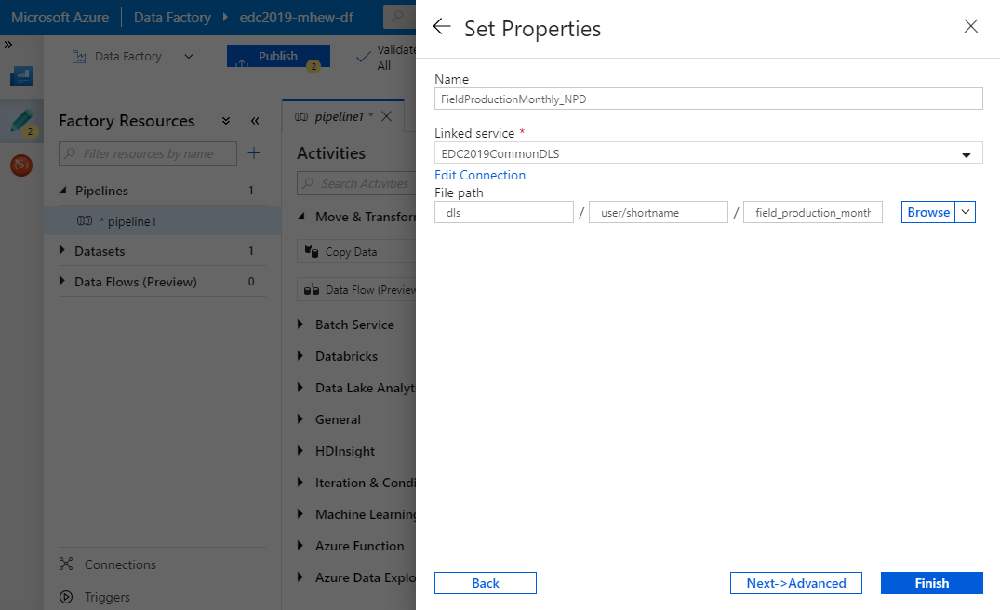

Introduction
============
This tutorial covers the following steps:

* Creating an Azure Data Factory Pipeline to copy data from an HTTP endpoint (NPD) into Data Lake Storage Gen2
* Using Azure Storage Explorer
* Creating an Azure SQL Server
* Creating an Azure SQL Database
* Creating an Azure Data Factory Pipeline to copy data from the Data Lake Store to an SQL 
  Database

Prerequisites
-------------

* Access to Azure
* Tutorial onboarding completion

Information About the Data
--------------------------

We will use public data available from NPD. From the following page you can browse all NPD data:

http://factpages.npd.no/factpages/

For this exercise we will use the production CSV file downloadable from:

https://factpages.npd.no/ReportServer_npdpublic?/FactPages/TableView/field_production_monthly&rs:Command=Render&rc:Toolbar=false&rc:Parameters=f&rs:Format=CSV&Top100=false&IpAddress=143.97.2.129&CultureCode=en

Getting started
---------------

A Data Factory resource has been pre-created for you to use. To access this, you need to locate the Data Factory resource in the Azure Portal:

* Log in to http://portal.azure.com
* Locate the Data Factory in your resource group either using search (e.g. *omnia-tutorial* or *{your_short_name}*) or browsing *All resources*
* In the Overview section of the Data Factory resource, click *Author & Monitor* to open the Data Factory editor.

Data Factory
------------

A Data Factory has a few concepts are useful to be aware of.

*Pipelines* provide a logical grouping of activities that together perform a task.

*Activities* in a pipeline define actions to perform on your data such as copying or transformation. Activities operate on datasets.

*Datasets* are named views of data that point to the data you want to use in your activities as inputs and outputs. Datasets identify data within different data stores, such as tables, files, folders, and documents. Datasets use connections defined by linked services.

*Linked services* provide reusable connections to different data sources. 
Linked services are much like connection strings, which define the connection
information needed for a Data Factory to connect to external resources.
*Linked services* can be setup as *sources* or *sinks* from where you gather or send data respectively.

*Data flows* are visually designed data transformations.

More information is available at https://docs.microsoft.com/en-us/azure/data-factory/

Ingest data into Azure Data Lake Storage Gen2
---------------------------------------------

In this part we will create a very simple pipeline to copy data, however Data Factory can include more advanced logic and transformations, including calling other components.

With your Data Factory open you should see a *Get started* page.

There are different ways to setup a pipeline including from scratch, from existing templates, and the *Copy Data* wizard. In this exercise we will setup a pipeline from scratch, so click the *Create pipeline* button to launch the *Author* tool:

In the Activities toolbox, expand Move & Transform. Drag the Copy Data activity from the Activities toolbox to the pipeline designer area. You can also search for activities in the Activities toolbox.

| Give the activity a meaningful name such as *Copy_NPD_Data*.
| More information on naming: https://docs.omnia.equinor.com/services/apim/overview/namingconventions/
| Also https://dataplatformwiki.azurewebsites.net/develop/namingconventions (older but more complete)

.. image:: images/2_Copy_Activity.png

To setup where the *Copy Data* activity will fetch data from, switch to the *Source* tab in the *settings*, and select new dataset.

.. image:: images/3_new_dataset.png

Browse, or search for and select the HTTP type.

Even though the source is a CSV file (DelimitedText), we will just do a straight copy of the file, so select the *Binary* option.

.. image:: images/5_new_binary.png

In the source dataset *Set Properties* window that pops up, use the name FieldProductionMonthly_NPD and from the *Linked service* dropdown select *New* to create a new linked service to connect to the NDP Factpages website.

.. image:: images/6_new_linkedservice_http.png

Use the following values when configuring the linked service:

* Name: *NPD FactPages*
* Base URL: *http://factpages.npd.no*
* Authentication type: *Anonymous*

Click *Finish* to create it.

.. image:: images/7_new_linkedservicehttp2.png

To finish setting up the source, add the *Relative URL* below that targets the production report we want to download then click *Create*

``ReportServer_npdpublic?/FactPages/TableView/field_production_monthly&rs:Command=Render&rc:Toolbar=false&rc:Parameters=f&rs:Format=CSV&Top100=false&IpAddress=143.97.2.129&CultureCode=en``

Similarly we need to setup the output or *sink* of the Copy Data activity. Switch to the *Sink* tab in the *Copy Data* activities settings, and select *New* to create a new Dataset

Browse, or search and select the Azure Data Lake Storage Gen2 type.

.. image:: images/9_sink_new_dls_dataset.png

Again as we will do a straight copy, select the *Binary* option.

.. image:: images/10_new_binary.png

In the sink dataset *Set Properties* window that pops up, use the name FieldProductionMonthly_DLS and from the *Linked service* dropdown select *New* to create a new linked service to connect to the Data Lake Store with the following properties:

* Name: *OmniaTutorialDLS*
* Authentication method: *Managed identity*
* Account selection method: *From Azure Subscription*
* Azure Subscription: *Omnia Application Workspace - Sandbox*
* Storage account name: *omniatutorialdls*

Test the connection and click *Create* to create the new lined service.

Back in the sink dataset *Set Properties* window, set the relative file path for your destination file in the Data Lake Store. We have created user specific folders so this path will have 3 parts:

1. Container - *dls*
2. Directory - *user/<shortname>* (replace <shortname> with your shortname)
3. File - *field_production_monthly.csv*

You can also use the browse button to fill *Container* and *Directory*, but must enter *File** manually as this won't exist from before.

Click *OK* to set the properties and you now have a basic pipeline ready. Do a test-run of your newly created pipeline.

.. image:: images/test-pipeline.png

Check status of the run and you should see after a short while it changes to *Succeeded*.

.. image:: images/test-run.png

As a final step we will save all our changes by clicking *Publish All*.

Verify the Ingested File in DLS
-------------------------------

The Data Lake Store we copied to is a seperate (shared) resource that has been pre-created. We can access this resource to view the uploaded file.

There are many ways to access files in Data Lake store including through code, using command line tools, through the Azure Portal and more.

To browse through the Azure portal, you first need to find the Data Lake resource, similar to as we did previously to locate the Data Factory. This is called *omniatutorialdls* (hint: use search).

With the Data Lake Store selected, you can use the *Storage Explorer* link to browse the file structure.

.. image:: images/storage-explorer.png

The web based "Storage Explorer (Preview)" provides a built in explorer within the Azure Portal. You can navigate to the target folder you used above to verify your file has been created. Double clicking on the actual file will download it to your computer, from here you can view the file in your favorite CSV editor.

.. image:: images/storage-explorer-view-file.png

If you work with Azure, you may want to install the [Azure Storage Explorer](https://azure.microsoft.com/en-us/features/storage-explorer/) that is a cross-platform (Windows, Linux and MacOS) client to connect to and work with Azure Storage Accounts.

Ingest from Azure Data Lake Store into Azure SQL Database
---------------------------------------------------------

In this step, you will first create an Azure SQL Server and Azure SQL Database. Azure SQL Server gives a runtime environment and Azure SQL Database gives database instances within this.

Back in the Azure Portal, select *All services* from the left menu, then type Azure SQL in the search box.

(Optional) Select the star next to Azure SQL to favorite it and add it as an item in the left-hand navigation for quick access.

Click on the *Azure SQL* service in the results list. This will show a list of Azure SQL resources. We will add a new one so click *+ Add* to open the Select SQL deployment option page.

You are presented with different options of what you can create. For additional information about the different services selecting the corresponding *Show details* button.

We will use a serverless option so select *SQL Databases* and *Create* with the default *Single Database* option selected.

Enter the database configuration details, ensuring the following:

* Check that the subscription is *Omnia Application Workspace - Sandbox*
  and select your own resource group *omnia-tutorial-{shortname}*
* Enter database name as *Common*
* Click *Create new* under the *Select a server* option.

  * Provide a uniqe Server name using consistent naming e.g.
    omnia-tutorial-{shortname}
  * Enter a custom password under the create server dialog as shown below.
  * Location should be *North Europe*
  * Click *OK*

* Under *Compute & Storage* select *Configure database* and chose the *Basic*
  option as we only have minimal requirements performance wise. If you look at
  the pricing estimation you will see a difference between approximately 30 
  NOK for the basic option v's ~2500 NOK for the standard offering. This is
  just one example of how important it is to have a correct cost focus and
  understand what our needs are and what we are actually provisioning costs.

Click *Review + create* to create the database followed by *Create* after you have reviewed the settings.

This will create both a server 

Once the database is created locate / search to find the created SQL Server (not the SQL database within it) so we can add Firewall details to access any databases remotely. In the SQL Server links select the *Firewalls and
virtual networks* link to modify the firewall.

As we will copy data by using the Azure Data Factory integration runtime, we need to ensure the Azure SQL Server firewall is open so that Azure services can access the server. This is done by ensuring the *Allow access to Azure services* option is set to *ON*.

Click the *Add client ip* button to add access to your current external IP address. 
For access from the Equinor internal network the IP address *143.97.2.35* should be added.

Save your changes.

.. image:: images/SQL/3_set_firewall.png

To enable single sign-on for login simplicity when working with the database,
go to the SQL Server *Active Directory admin* link, and add your @equinor 
user as admin. This will simplify access to the database.

Be sure to click *Save*.

.. image:: images/SQL/4_set_AD_admin.png

Go to the SQL Database resource itself and select the Query Editor link.

Create a table and user by entering and running the below SQL in the query
editor. Be sure to swap out *NameOfDatafactory* in the SQL code below with 
the actual name of your data factory e.g. omnia-tutorial-<shortname>-df

.. code-block:: sql

    CREATE TABLE [dbo].[ProductionData](
        [Wellbore] [varchar](200) NOT NULL,
        [Year] [int] NOT NULL,
        [Month] [int] NOT NULL,
        [Oil] [decimal](15, 5) NOT NULL,
        [Gas] [decimal](15, 5) NOT NULL,
        [Id] [int] IDENTITY(1,1) NOT NULL
    ) ON [PRIMARY]
    GO

    CREATE USER [NameOfDatafactory] FROM EXTERNAL PROVIDER
    GRANT SELECT, INSERT, UPDATE, DELETE, EXECUTE, ALTER ON schema::dbo TO [NameOfDatafactory]

.. image:: images/SQL/5_Create_table_user.png

Copy data from Azure Datalake Store to Azure SQL Database
---------------------------------------------------------

Go back to DataFactory.

Create a new pipeline that we will use to copy data from Azure Datalake Store to Azure SQL Database

In the Activities toolbox, expand Move & Transform. Drag the Copy Data activity from the Activities toolbox to the pipeline designer surface. You can also search for activities in the Activities toolbox.

Switch to the Source tab in the copy activity settings, and select new dataset. 

This time we will copy from the Datalake, but using DelimitedText so we can write to the different database columns. We will also reuse the linked service that we created earlier.

.. image:: images/SQL/1_new_dataset_dls.png

.. image:: images/SQL/2_new_dataset_dls2.png

.. image:: images/SQL/4_linkedservice_dls.png

Add the file path to the Datalake store. Be sure also to select the option *First Row as Header* and Import schema from *connection/store*.

.. image:: images/SQL/5_set_property.png

Switch to the Sink tab in the copy activity settings, and select new dataset 
then *Azure SQL Database*.

.. image:: images/SQL/6_new_dataset_sql.png

.. image:: images/SQL/7_new_linkedservice_sql.png

.. image:: images/SQL/8_new_linkedservice_sql2.png

Swith to the Mapping tab, and click Import Schemas

.. image:: images/SQL/10_Mapping.png

Map the columns as shown below and then remove the mapping to the ID column. 
This is an Identity column in the database.

.. image:: images/SQL/11_Mapping2.png

When you download the CSV file from NPD, the file contains a new line in the 
end of the file. The Datafactory will handle this as a record and give an 
error. To ignore this error, add "Skip incompatible rows"

.. image:: images/SQL/12_Settings.png

Trigger the pipeline using the *Debug* button. 

You can verify the output by going back to the database query editor and running the following SQL to see if data has been loaded into our table.

.. code-block:: sql

    SELECT * FROM [dbo].[ProductionData]

Additional Exercise
-------------------

There is an additional `ingestion exercise <ingest_api.md>`_ that you can work
through that uses Azure Functions to ingest data from a REST service to Blob
storage, followed by Data Factory to copy the data to SQL Server. 

Summary
-------

We have shown how to copy data using Data Bricks and create certain 
infrastruvture. There are however several points that we haven't covered in 
the interest of time:

* Automation and DevOps
* Triggering & Scheduling Jobs
* Data Catalog
* Monitoring

.. note::

    * Content copied from presentation summary
