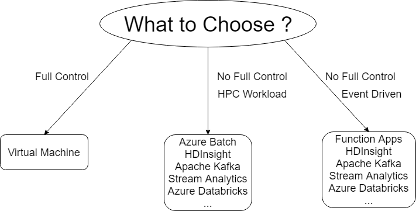
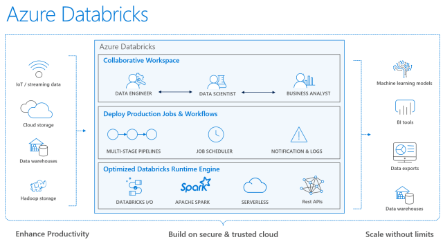
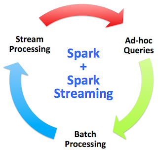
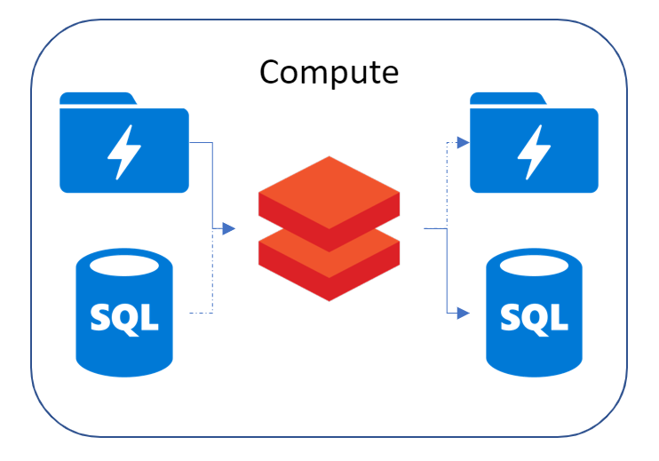

:title: Hands on with Omnia - Compute
:author: Omnia Team
:description: Hands on tutorial with Omnia.
:keywords: omnia, tutorial
:css: main.css

.. header::

    .. image:: images/omnia_icon_black.png
        :width: 100px
        :height: 100px

.. footer::

   Hands on with Omnia, https://github.com/equinor/omnia-tutorial

.. _Hovercraft: http://www.python.org/https://hovercraft.readthedocs.io/

This slide show is written in rst and designed to be generated as an HTML site
using Hovercraft_. See `README.rst <..\..\README.rst>`__ for details on where
you can view an automatically generated version.

You can render this presentation to HTML with the command::

    hovercraft introduction.rst output/compute

And then view the output/compute/index.html file to see how it turned out.

You separate slides with a line that consists of four or more dashes. The
first slide will start at the first such line, or at the first heading. Since
none of the text so far has been a heading, it means that the first slide has
not yet started. As a result, all this text will be ignored in the generated 
output.

----

Compute Introduction
====================

* Why Compute?
* Where
* Batch v's Event Driven
* Elasticity
* Cost considerations

.. note::

   * *Why Compute* - Compute for processing data (cleaning, transformation, ...)
   * *Where* - on ingest, triggered, scheduled, on expose, client side
   * *Batch v's Event Driven* - Different ways of triggering compute
   * *Elasticity* - the ability to scale up/down according to workload. eg: worker nodes, cores
   * *Cost* - Compare between setting up a phisical server and using an online service like databricks, in storage, cluster usage and cost

----

Compute Options
===============

*Links*:

`Decision tree for Azure compute services <https://docs.microsoft.com/en-gb/azure/architecture/guide/technology-choices/compute-decision-tree>`__ 

`Criteria for choosing an Azure compute service <https://docs.microsoft.com/en-gb/azure/architecture/guide/technology-choices/compute-comparison>`__ 

.. note::
   * links are from Azure Architecture Center

----

Azure Databricks
================
* What is Databricks?

*Image Source: https://www.jamesserra.com/archive/2017/11/what-is-azure-databricks/*

.. note::

   * Apache Spark + databricks + enterprise cloud
   * Input can be stream data/any storage, like sql, blob, s3
   * output can be storage, visualization, machine learning pipelines...

----

Azure Databricks
================
* Why Spark?

*Image Source: http://quant36.rssing.com/chan-11018997/all_p2.html*

.. note::
   * only spark supports all the three
   * explain a little about these three
   * spark is good: 
       * spark is fast because RAM & distributed framework, 
       * expensive because RAM. 
   * consider other options based on your data. You don't have to use Spark.
                    

----

Azure Databricks
================

* Demo: How to create cluster/notebook in Azure Databricks?

----

Exercise Overview
=================

Exercise Link: https://github.com/equinor/omnia-tutorial/blob/master/docs/exercises/compute.rst

----

Summary
-------

In the interest of time and simplicity, the following points have been omitted from this tutorial although should / must be considered when building production ready solutions:

* Automation and DevOps
* Create client, store client secret in key vault, set up client permissions
* Source Control (Github)
