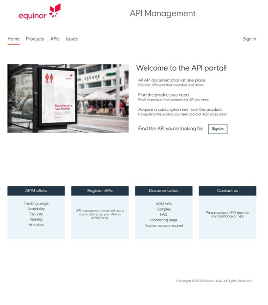

:title: Hands on with Omnia - Exposing Data
:author: Omnia Team
:description: Hands on tutorial with Omnia.
:keywords: omnia, tutorial
:css: main.css

.. header::

    .. image:: images/omnia_icon_black.png
        :width: 100px
        :height: 100px

.. footer::

   Hands on with Omnia, https://github.com/equinor/omnia-tutorial

.. _Hovercraft: http://www.python.org/https://hovercraft.readthedocs.io/

This slide show is written in rst and designed to be generated as an HTML site
using Hovercraft_. See `README.rst <..\..\README.rst>`__ for details on where 
you can view an automatically generated version.

You can render this presentation to HTML with the command::

    hovercraft expose.rst output/expose

And then view the output/expose/index.html file to see how it turned out.

You separate slides with a line that consists of four or more dashes. The
first slide will start at the first such line, or at the first heading. Since
none of the text so far has been a heading, it means that the first slide has
not yet started. As a result, all this text will be ignored in the generated 
output.

----

Exposing Data
=============

* Patterns
* Alternatives (API First)
* Governance
* Security

.. note::
  * *Patterns* - big data analytics, streaming, API (size, frequency, latency,
    query pattern)
  * *Alternatives* - Depend on usage pattern. API, dls, blob, (db view)...
  * *Governance* - Classification, LRA, Ownership
  * *Security* - Authentication, Authorisation, Encryption

----

Data Catalogue
==============

https://eun-su1.azuredatacatalog.com/#/home

.. note:: 
  * Where to look for data
  * Apply for access in access it.

----

API's
=====

* What is it
* Why do we use it
* API Management
* API Strategy & Naming:
  https://github.com/equinor/api-strategy

.. note::
  * What is it?

    * Architectural design to abstract away the specific implementation of certain parts
  * Why do we use it?

    * Decoupling logic, making the solution more flexible.
    * Increases re-usability of components
  * API Management (APIM)

    * Helps organizations publish APIs to external, partner, and internal developers to unlock the potential of their data and services
    * Contains following components; API gateway, Developer portal, Azure portal
    * API gateway; endpoint for API calls, routes them to backend, verifies API keys & other credentials, enforces usage quotas and rate limits
    * Developer portal; web presence for developers, read API documentation, try API via interactive console, subscribe to API keys, access analytics
    * Azure portal; define and import API schema, package API into products, setup policies, access insight from analytics, manage users

----

Representational State Transfer (REST)
======================================

* Client-Server Architecture
* Statelessness
* Cacheability
* Layered System
* Uniform Interface:

  * Resource Identification in Requests
  * Resource Manipulation through representations
  * Self-descriptive messages
  * Hypermedia as the engine of application state

.. note::
  Client-Server Architecture

  * Separation of concerns. Separating the user interface from the data storage
  * Improves portability and scalability
  * Allow for independent evolvement of the components

  Statelessness:

  * No client context is stored on the server between requests. Each request from any client contains enough info to process the request.

  Cacheability:

  * Responses must implicitly or explicitly define themselves as cacheable, to prevent stale data reaching the client.
  * Important to do properly, to increase scalability and performance.

  Layered System

  * A client should not have to care what server it is talking to
  * Enables load balancing, shared caches, added security layers etc.
  * Distribute a client call to many backends

  Uniform Interface:

  * Resource identification in request:

    * Individual resources are identified in requests, example using URIs.
    * Resources are conceptually separate from their representation, i.e can return HTML, XML, or JSON.
  * Resource manipulation through representation:

    * When a client holds a representation of a resource, including any attached metadata,
    * It as enough information to modify or delete the resource
  * Self-descriptive messages

    * Each message include enough information to describe how to process the message
    * Example, which parser to invoke specified by a media type
  * Hypermedia as the engine for application state(HATEOAS)

    * Having accessed an initial URI for the REST application,
    * A REST client should be able to use server-provided links dynamically to discover all available actions and resources needed.

----

Open API Specification
======================

.. list-table:: 
   :widths: 25 25

   * - OAS2.0: Swagger

       * JSON or YAML
       * Info
       * Host & schemes
       * Paths
       * Parameters
       * Responses
       * Input and output models
       * Authentication       
     - |openapi2| 

.. note::

  V2: Swagger

  * Started as a open-source software framework
  * Has a large collection of tools that help developers design, build, document and consume RESTful web services.
  * JSON or YAML
  * Info
  * Host & schemes
  * Paths
  * Parameters
  * Responses
  * Input and output models
  * Authentication

----

Open API Specification
======================

.. list-table:: 
   :widths: 25 25

   * - OAS3.0:

       * Simplified structure
       * Content negotiation
       * Form data can now contain objects and arrays
       * Enhanced security definitions
       * Updated Parameter types
       * Improved Examples
       * Support for describing callbacks
     - |openapi3| 

.. note::

  V3:

  * Simplified structure
  * Content negotiation
  * Form data can now contain objects and arrays
  * Enhanced security definitions
  * Updated Parameter types
  * Improved Examples
  * Support for describing callbacks

----

Azure API Management
====================

Main components:

* API Gateway
* Developer Portal
* Azure Portal

.. note::

  API gateway is the endpoint that

  * Accepts API calls and routes them to your backends.
  * Verifies API keys, JWT tokens, certificates, and other credentials.
  * Enforces usage quotas and rate limits.
  * Transforms your API on the fly without code modifications.
  * Caches backend responses where set up.
  * Logs call metadata for analytics purposes

  Developer Portal serves as the main web presence for developers, where you can

  * Discover APIs
  * Read documentation and test APIs
  * Subscribe to get API keys
  * Access analytics on your own usage
  * Publish your own APIs for other to discover

----

Azure API Management
====================

https://api.equinor.com

----

API Hosting Alternatives
========================

* Omnia Radix
* Azure Functions
* Azure App Service
* Azure Kubernetes Service / Azure Container Instances
* (Storage)

.. note::
  * Radix - Simplified hosting of Docker containers. Includes automatic build, deploy,..
  * Azure Functions - Serverless (explain what serverless is) hosting of API's and applications
  * Azure App Service - Hosting of code / Docker containers
  * Azure Kubernetes Service / Azure Container Instances - Hosting of containers in managed scalable infrastructure.
  * V2 Storage - Static web hosting of open content so not for API's
  
  **Do not use Virtual Machines!**

----

Azure App Service
=================

* Service for hosting HTTP-based websites, web applications and API's
* Can deploy docker images
* Can run & test locally
* Auto scale out
* Configurable authentication / authorisation
* Management & Monitoring
* ...

----

Excercise
=========

Part 1:

* Use the provided skeleton code and implement the API

Part 2:

* Implement the Aggregates controller

----

Summary
=======

* Authorisation & Authentication
* Deployment & Sharing
* Legal aspects
* Performance
* Sharing
* Data Catalog
* Publishing in APIM

.. note::

   * *Authorisation & Authentication* - for simplicity this exercise used an 
     open API with no security. In real world scenarios it is highly likely 
     that you will need to ensure API's are secured.
   * *Deployment & Sharing* - once you have a solution created that exposes data
     through an API you might want to operationalise and share it somehow.
   * *Legal aspects* - if you modify and combine data, you may be changing the 
     security classification and so need to consider possible implications
   * *Performance* - There are different query patterns and also a question 
     about what options are best and where to run compute. We might need 
     additional backend infrastructure to improve API performance.
   * *Sharing* - when consuming and curating existing data you are suddenly a producer as well. Consider if your value-added work should be shared.
   * *Data Catalog* - To be a part of the Data Platform, we should datasets to Data Catalog.
   * *Publishing in APIM* - Should be published in APIM.
