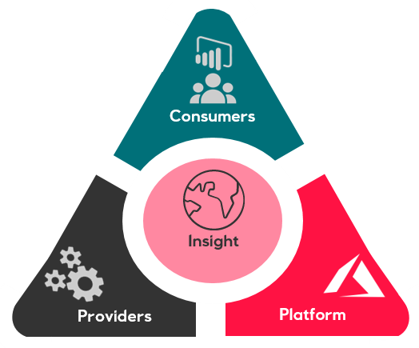
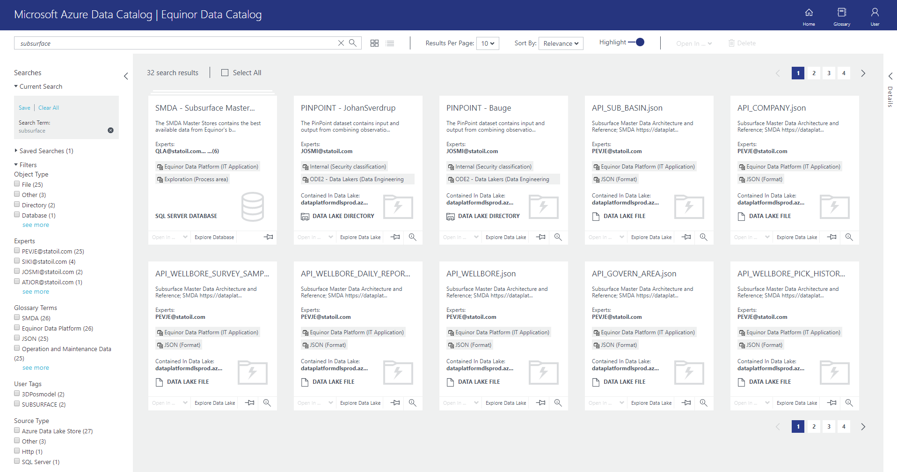
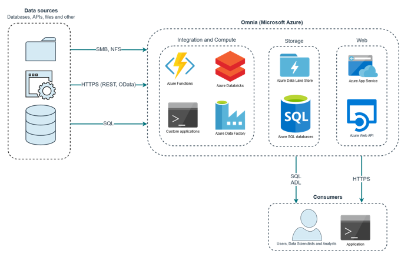
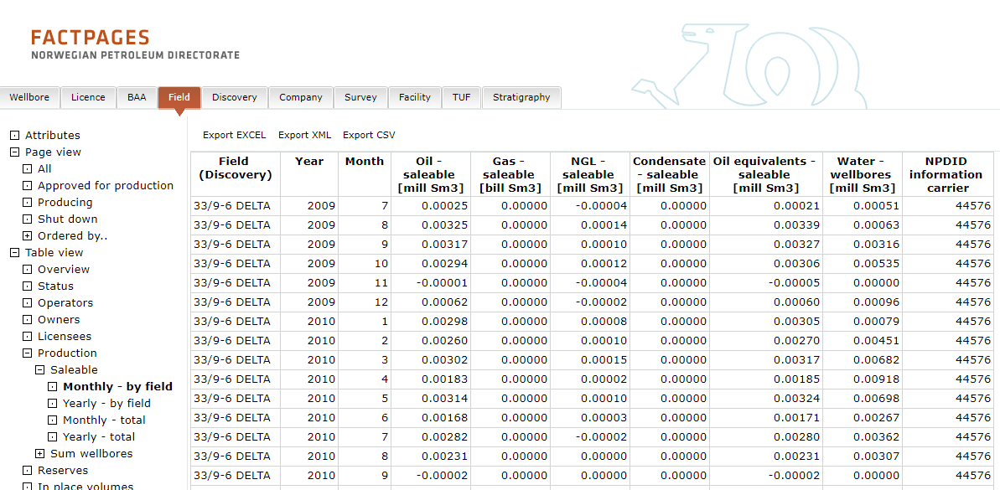
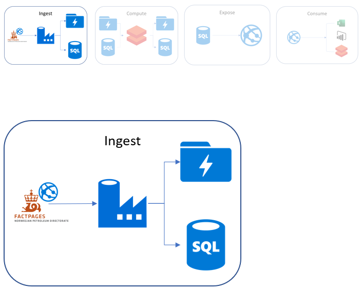

:title: Hands on with Omnia - Ingestion
:author: Omnia Team
:description: Hands on tutorial with Omnia.
:keywords: omnia, tutorial
:css: main.css

.. header::

    .. image:: images/omnia_icon_black.png
        :width: 100px
        :height: 100px

.. footer::

   Hands on with Omnia, https://github.com/equinor/omnia-tutorial

.. _Hovercraft: http://www.python.org/https://hovercraft.readthedocs.io/

This slide show is written in rst and designed to be generated as an HTML site
using Hovercraft_. See `README.rst <..\..\README.rst>`__ for details on where 
you can view an automatically generated version.

You can render this presentation to HTML with the command::

    hovercraft introduction.rst output/ingest

And then view the output/ingest/index.html file to see how it turned out.

You separate slides with a line that consists of four or more dashes. The
first slide will start at the first such line, or at the first heading. Since
none of the text so far has been a heading, it means that the first slide has
not yet started. As a result, all this text will be ignored in the generated 
output.

----

Getting Data into Omnia
=======================

.. note::
    Provider - responsible for:

    * Publishing data to the central data platform
    * The data’s quality
    * Publishing metadata that makes it easy to find and consume the data​
    * Technical ownership of API's

    Consumer - the one using the information.

    We need to move away from scenarios where projects expose and use data without the data owners knowledge.

----

Considerations
==============

* Governance
* Legal
* Technical

.. note::
    Governance

    * Data Classification (open, internal, confidential)
    * Data Architecture
    * Ownership
    * Lineage

    Legal

    * Legal risk assessment (export control, contractual, ...)

    Technical

    * Push v's Pull
    * Latency
    * Transactional
    * Guaranteed delivery
    * Operations and monitoring
    * Copy Data v's Connect (reference existing data source)
    * Different technology options for realising the above

      * Cost
      * V1 v's V2 v's V3 generation of products and corresponding maturity.

----

Data Catalogue
==============

https://eun-su1.azuredatacatalog.com

.. note:: 
  * Where to look for data
  * Apply for access in access it.
  * All data exposed in Omnia should be in the data catalog (both raw and enterprise)

----

Storage Alternatives
====================

* Azure Data Lake Store
* Azure Blob Storage
* Relational Databases
* NoSQL Databases
* Timeseries Databases

.. note:: 

  * Before doing ingest we need somewhere to put the data
  * Temporary e.g. queues / Service Bus v's persistant
  * Many different options for different needs
  * Datalake the concept v's datalake the technology.

  Types

  * Azure Data Lake Store
  * Azure Blob Storage (Tiers: Hot, Cool, Archive)
  * Relational Databases (Azure SQL Database, PostgreSQL, MySQL)
  * NoSQL Databases (Cosmos DB, Azure Table Storage)
  * Timeseries Databases (Time Series Insights, Self-Hosted Solutions)

----

Ingest Alternatives
===================

* Azure Data Factory​ (recommended)
* Azure Functions​
* Azure Databricks​
* Stream Analytics​
* HD Insight
* IoT Hub
* Custom Applications​

.. note::

    Azure Data Factory​

    * Supports on-premis connectivity 
    * Supported formats: CSV, JSON, AVRO, ORC, Parquet​
    * Supported sources: (S)FTP, SMB, HTTP, Oracle/SQL DB, etc.​

    Azure Functions​

    * Supported formats: Almost any​
    * Supported sources: Almost any​

    Azure Databricks​

    * Supported formats: Almost any​
    * Supported sources: Almost any​

    Custom Applications​

    * Supported formats: Any​
    * Supported sources: Any​

    Streaming data​

    * Stream Analytics​
    * EH​
    * IoT Hub

----

Data Flow
=========

----

Data Factory
============

.. image:: images/ingest/datafactory-workflow.png
  :width: 800px

* Cloud-based data integration service
* Orchestrate and automate data movement and transformation
* Create and schedule data-driven workflows (pipelines)
* Ingest data from disparate data stores

.. note::

  We are focusing on "Connect and Collect"

  Azure Data Factory is a cloud-based data integration service that allows you to create data-driven workflows in the cloud for orchestrating and automating data movement and data transformation. Using Azure Data Factory, you can create and schedule data-driven workflows (called pipelines) that can ingest data from disparate data stores. It can process and transform the data by using compute services such as Azure Databricks, Azure Function and others.

----

Data Set
========

| https://www.npd.no/en/facts/news/Production-figures/
| http://factpages.npd.no/factpages/Default.aspx?culture=en

.. note::

    * NPD holds open data on production from different fields.
    * Create a pipeline to make the data available through Omnia.
    * Case chosen to easily highlight some of the important considerations when building cloud base data pipelines.

----

Exercise
========

----

Summary
=======

* Automation & DevOps
* Triggering & Scheduling Jobs
* Other Tools
* Data Catalog
* Monitoring

.. note::

   * *Automation & Devops* - Github, automation and devops. Also operationalising.
   * *Triggering & Scheduling Jobs* - How to trigger and schedule Data Factory jobs
   * *Other tools* - there are many other tools that can also be used.
   * *Data Catalog* - To be a part of the Data Platform, we should datasets to Data Catalog.
   * *Monitoring* - How to know if things go wrong (e.g. source unavailable).
