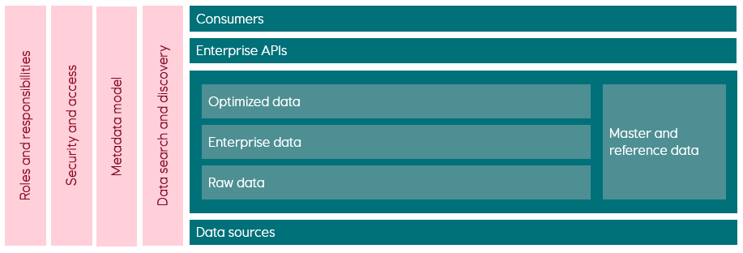
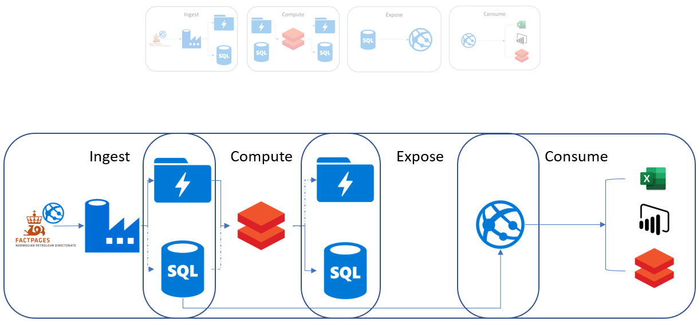

:title: Hands on with Omnia - Introduction
:author: Omnia Team
:description: Hands on tutorial with Omnia.
:keywords: omnia, tutorial
:css: main.css

.. header::

    .. image:: images/omnia_icon_black.png
        :width: 100px
        :height: 100px

.. footer::

   Hands on with Omnia, https://github.com/equinor/omnia-tutorial

.. _Hovercraft: http://www.python.org/https://hovercraft.readthedocs.io/

This slide show is written in rst and designed to be generated as an HTML site
using Hovercraft_. See `README.rst <..\..\README.rst>`__ for details on where 
you can view an automatically generated version.

You can render this presentation to HTML with the command::

    hovercraft introduction.rst output/introduction

And then view the output/introduction/index.html file to see how it turned out.

You separate slides with a line that consists of four or more dashes. The
first slide will start at the first such line, or at the first heading. Since
none of the text so far has been a heading, it means that the first slide has
not yet started. As a result, all this text will be ignored in the generated 
output.

----

Introduction
============

* A hands on introduction with Omnia
* What are we not covering?
* Signup
* #omnia on `Slack <http://equinor.slack.com>`__
* OMNIA on `Yammer <https://www.yammer.com/statoil.com/#/threads/inGroup?type=in_group&feedId=10658772>`__
* https://github.com/equinor/omnia-tutorial/

.. note::
    A hands on introduction with Omnia

    * They will get a better understanding of what Omnia is and how to use it so they are better equiped to develop within Equinor's new IT platform    
    * How: A mixture of presentations and tutorial. We will reference Azure documentation extensively as they need to know how to navigate these pages.    
    * A lot of material to get through, but we focus on the most important points so don't panic if you can't complete something.
    * Difference from MS course - focus on implementation and Equinor focus. Supplement with MS courses for tech deep dive.

    What we are not covering

    * You will not be an expert after 1 day
    * Every possible scenario - but we will touch on alternatives
    * All the details - this is a high level introduction to set context, we will dig into the details more as we go along. 

    Signup

    * Pre created resources.
    * Destroy after 1? week
    * Apply for *Data Developer* role in in AccessIT to get access to the 
      Omnia *sandbox* environment (*VanDamme*) 

    Other 

    * Allowed to leave if not suitable.
    * Signup / provisioning. 
    * Ask questions via Slack 
    * Show high level agenda (steps, presentation + exercises). Visit in detail later
    
----

What is Omnia (and why?)
========================

| Omnia home: https://omnia.equinor.com/
| Omnia docs: https://docs.omnia.equinor.com/

.. note::

  * What is Omnia

    * Equinors cloud journey
    * Enabled by certain technology platforms
    * Pillars
      * Sharing - move from silos to common platform. 
      * Responsibility - more possibilities, but requires more responsibility. (e.g. complience with data architecture, API strategy, cost, ...).
      * Process - devops, infra as code, cloud first mindset, EDM

  * Omnia as an Environment

    * Runtime environment + Compute + Storage

    * **Develop Tab** (Runtime) - The basic products (subscription, resourcegroup, networking). Show https://docs.omnia.equinor.com/

      * Omnia classic
      * Omnia applications
      * Standalone
      * Sandbox - for personal training - not for testing!

    * **Data Tab** - When does data become a part of the data platform. Will come back to later also.

  We will revisit many of these topics as part of the tutorial.

----

Data Architecture
=================

.. note::
    Important to differentitate between the different layers

    Raw

    * Type of data - directly from the source as close to the original as possible, - no changes made, no duplicates 
    * Source - Important to show where data comes from - tag with source solution. 
    * Format - No changes with regards to format.  
    * Update frequency - show update frequency, Time stamp from source should be included 
    * Security classification - should have a security classification documented as basis for defining access and roles. 
    * Ownership - All Raw data should have an owner 
    * Naming - source system, ppossibly business context (data areas)

    * Access - Not accessible for all. (Today: Role = Data scientist)
    * Geography - tag with country for data with restrictions on use because of sanctions, export control, authority reporting and other country specific legislation. 
    * Asset/project - May be important to differentiate on access by asset / projects. 

    Transform (Enterprise)

    * Type of data - Data that has been changed e.g. through cleansing, standardisation or interpretation by using transformation models and conversion models.
    * Versioning - not immutable, as it should be possible to recreate earlier versions based on the history of transformation models and raw data. The complete history of transformed data will as such not need to be kept.
    * Quality - A quality stamp linked to confidence factors or approvals is recommended for transformed data, - e.g. "Company Approved versions". Require definition of criteria for quality / confidence e.g. Exploration data availability project. 
    * Lineage - It should be possible to document lineage for transformed data to show changes throughout the data life cycle from source system to transformed.  
    * Format - It should be standard formats for transformed data. 
    * Access - Access to transformed data is by default based on non-App-specific APIs. The API management should reflect the tags and quality of data 
    * Security classification - should have a security classification documented as basis for defining access and roles. 
    * Geography - tag with country for data with restrictions on use because of sanctions, export control, authority reporting and other country specific legislation. 
    * Ownership - All Transformed data should have an owner. Align with common data roles. 
    * Business context - Transformed data should belong to a business context described with a common semantic vocabular and a standard naming convention. 

    Prepared

    * Similar requirements to Transform, but often application specific to meet solution specific needs (access pattern, performance)
    * Data in prepared should be exposed through the enterprise layer also. 

----

What we Will Build
==================

.. note::

    * Details on choices for each part and omissions are covered as we go.
    * The story is key.
    * Explain how this relates to data architecture
    * Show github repository and present agenda
    * Exercises to introduce concepts. Fine if they don't complete anything as we have clear interfaces between each part and completed end points you can reference if you don't get yours completed.

----

Subscriptions and all That
==========================

.. note::

  Some common concepts that they will encounter

  * Resources are what you create in Azure e.g. Database, Storage, Azure Functions, Virtual Machine
  * Many different containers for 'putting things in'.

    * Resource Group - container for grouping resources.
    * Equinor Tennant - top level 1 for company (so far).

  Used for:
  
  * Policies
  * Grouping
  * Billing

  How this relates to this workshop and what we have created - Omnia Applications (v's workshop) - subscription / resource group

----

Working with Azure
==================

.. image:: images/introduction/portal.jpg

https://portal.azure.com

.. note::

    * Many ways of working:
    
      * Portal
      * Command Line Interface (CLI)
      * Power Shell 
      * Cloud Shell
      * Software Developer Kit (SDK)
      * Infrastructure as code - Azure Resource Manager (ARM) templates
      * DevOps 
      * ...

    * For this tutorial everything can be done through the portal. Where possible we will describe and give alternative options that might more closely reflect how you would develop in practice.
    * Demo of portal.azure.com
    
      * Create resource
      * All resources button
      * Search
      * Show example for browsing to data factory (main links - overview, access, ...)
      * Cloud shell (e.g. 'az group list'). They will use this later in the exercises
      * Show onboarding script (https://github.com/equinor/omnia-tutorial/blob/master/src/onboarding/onboard.ps1)
